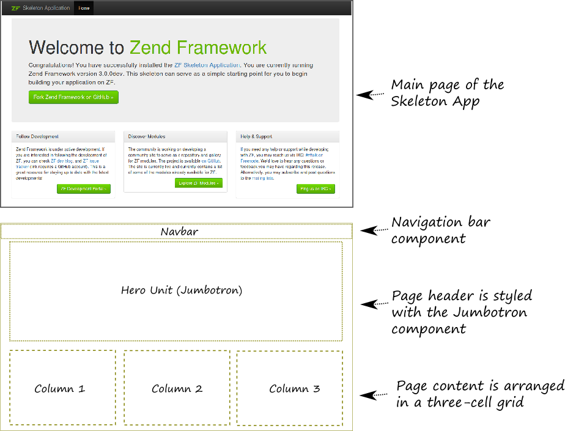
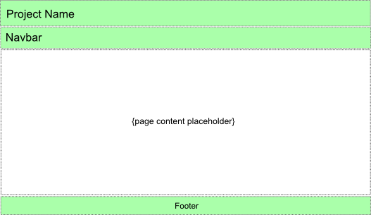
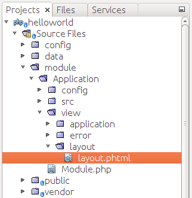
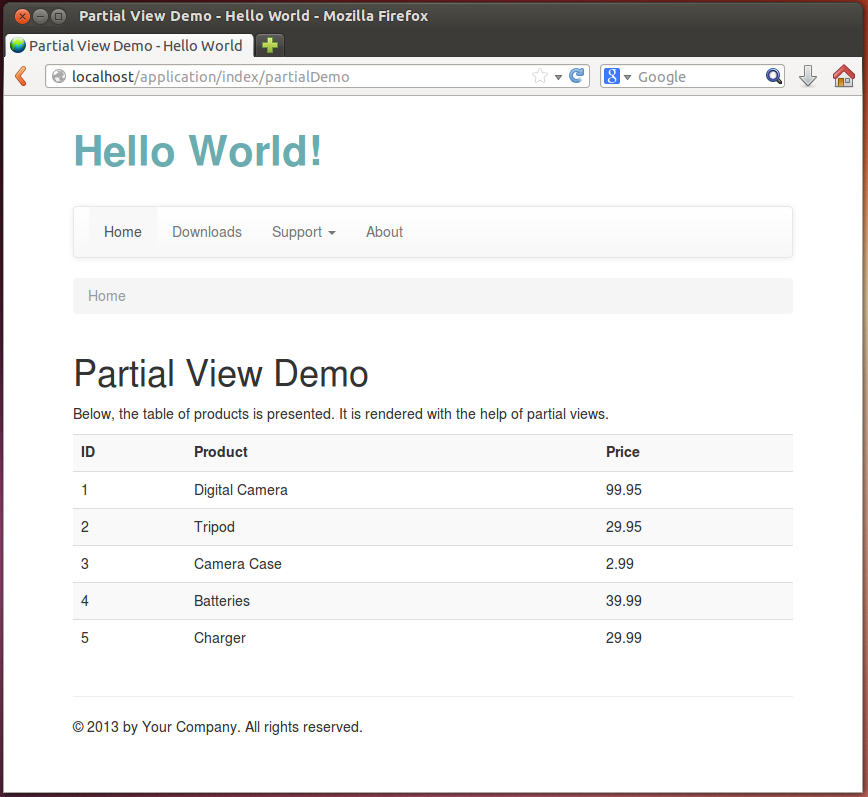
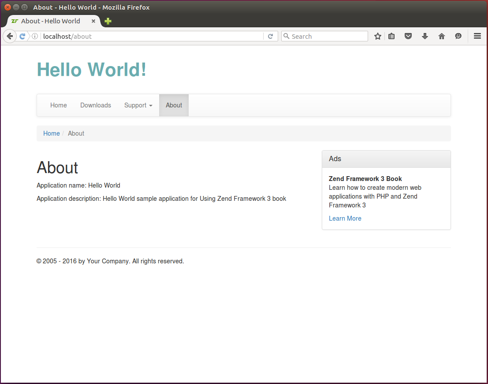
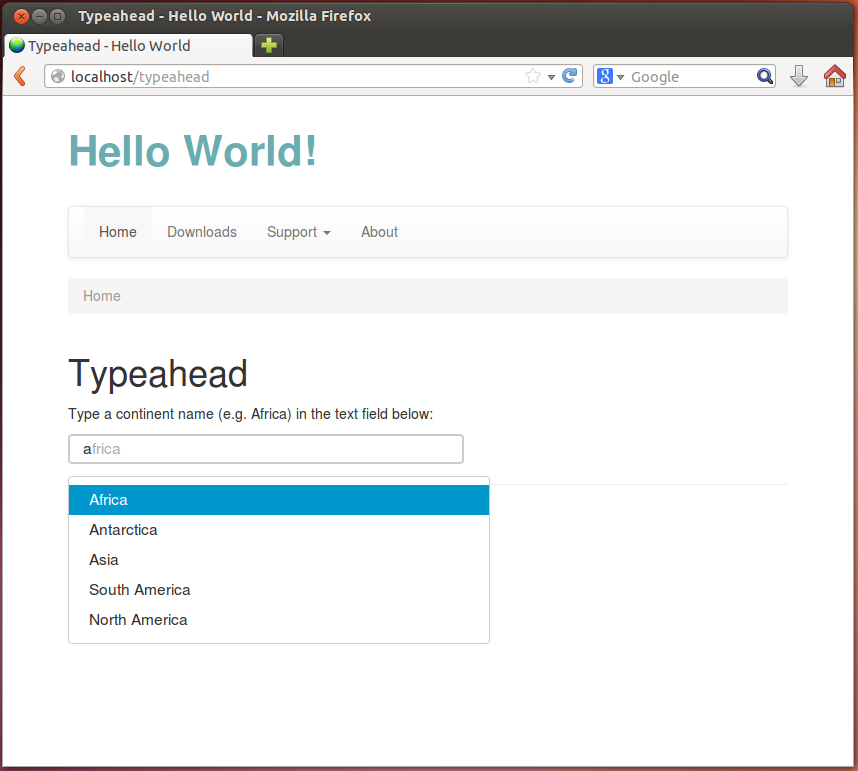
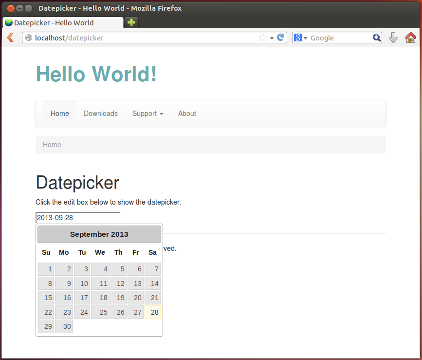
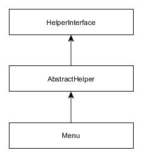
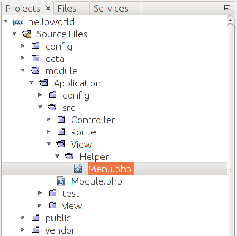
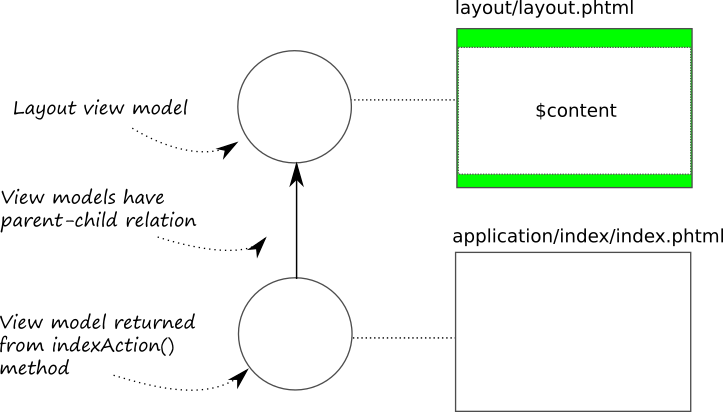

# Page Appearance and Layout

In this chapter you will learn how to make your web pages attractive and
professionally looking with the help of Twitter Bootstrap CSS Framework and
how to position elements on a page using Laminas layout mechanism. You'll also
become familiar with common view helpers allowing for composing web pages
of reusable parts. If you are new to Twitter Bootstrap, it is also recommended
that you refer to [Appendix C. Introduction to Twitter Bootstrap](#bootstrap) for advanced description of Bootstrap
capabilities.

Laminas components covered in this chapter:

| *Component*                    | *Description*                                                 |
|--------------------------------|---------------------------------------------------------------|
| @`Laminas\Mvc`                     | Support of MVC pattern. Implements base controller classes, controller plugins, etc. |
| @`Laminas\View`                    | Implements the functionality for variable containers, rendering a web page and common view helpers. |

## About CSS Stylesheets and Twitter Bootstrap

In a laminas-based web site, for defining the visual appearance and style of the web pages,
CSS stylesheets are utilized. These CSS [^css] files are typically stored in
*APP_DIR/public/css* directory.

[^css]: If you are new to CSS, please refer to the excellent W3Schools CSS tutorial
        by visiting [this link](http://www.w3schools.com/).

Because the CSS rules may be rather complex and require laborious adjustment and
the skills of a designer, they can be separated in a "library" (framework). Analogous
to PHP frameworks, CSS frameworks allow for code reusability.

Today, several CSS frameworks exist on the market, and one of them is
[Twitter Bootstrap](http://getbootstrap.com/) (or shortly, the Bootstrap).
Originally designed at Twitter to unify the appearance of
their own web tools, Bootstrap has became a popular CSS framework, allowing to make
your web site professionally looking and visually appealing, even if you don't have
advanced designer skills and without the need of creating basic CSS rules (but, of course
you can define your own custom CSS rules on top of Bootstrap to customize your site's
appearance). Bootstrap is freely distributed under the
[Apache License v.2.0](http://www.apache.org/licenses/LICENSE-2.0.html).

> Twitter Bootstrap is shipped with Laminas Skeleton Application, so you
> can use it out of the box. Alternatively, you can download the newest
> version of Bootstrap from the project's [official page](http://getbootstrap.com/).
> At the moment of writing this book, the latest version is v.3.x.

Generally, the Bootstrap does the following things:

* It provides the *CSS reset* that is a style sheet defining styles for all possible
  HTML elements. This ensures your web site will look the same way in all web browsers.

* It provides the *base CSS rules* that define style of typography (headings
  and text), tables, forms, buttons, images and so on.

* It defines the *grid system*. The grid system allows to arrange elements
  on your web page in a grid-like structure. For example, look at the
  Skeleton Application's main page (figure 6.1), where we have the grid
  consisting of three columns.

* It defines useful *web interface components* like dropdown menus, navigation
  bars, breadcrumbs, pagination and so on. For example, on the skeleton app's
  main page, there is the navigation bar component at the top, and the header
  (also called the Hero Unit or Jumbotron) component below the navbar. These components
  are very handy on any web site.

* In includes the *JavaScript extensions* that allow to make Bootstrap-provided
  interface components more interactive. For example, JavaScript is used to animate
  dropdown menus and display "modal dialogs".

> If you are new to Twitter Bootstrap, it is recommended that you refer to
> [Appendix C. Introduction to Twitter Bootstrap](#bootstrap), where you can find more information about using
> Twitter Bootstrap and its components.

## Page Layout in Laminas Framework

Pages of your web site typically have some common structure that can be shared among them.
For example, a typical page has the `<!DOCTYPE>` declaration to identify the HTML document,
and the `<head>` and `<body>` elements:

~~~html
<!DOCTYPE html>
<html lang="en">
  <head>
    <title>Welcome</title>
    <!-- Include metas, stylesheets and scripts here -->
  </head>
  <body>
    <!-- Include page content here -->
  </body>
</html>
~~~

The `<head>` element contains the page title text, meta information
and references to included stylesheets and scripts. The `<body>` element
contains the content of the page, like the logo image, the navigation bar,
the page text, and the footer with copyright information.

In Laminas Framework, you define this common structure with the "master" view
template called the *layout*. The layout "decorates" other view templates.

The layout template typically has a *placeholder* in which Laminas
puts the content specific to a particular page (see figure 6.2 for example).

In the Skeleton Application, the default layout template file is called *layout.phtml*
and is located inside of the *view/layout* directory in *Application* module's
directory (see figure 6.3 for example).

Let's look at the *layout.phtml* template file in more details.
Below, the complete contents of the file is presented:

~~~php
<?= $this->doctype() ?>

<html lang="en">
  <head>
    <meta charset="utf-8">
    <?= $this->headTitle('ZF Skeleton Application')
             ->setSeparator(' - ')->setAutoEscape(false) ?>

    <?= $this->headMeta()
          ->appendName('viewport', 'width=device-width, initial-scale=1.0')
          ->appendHttpEquiv('X-UA-Compatible', 'IE=edge')
    ?>

    <!-- Le styles -->
    <?= $this->headLink(['rel' => 'shortcut icon', 'type' => 'image/vnd.microsoft.icon',
                         'href' => $this->basePath() . '/img/favicon.ico'])
        ->prependStylesheet($this->basePath('css/style.css'))
        ->prependStylesheet($this->basePath('css/bootstrap-theme.min.css'))
        ->prependStylesheet($this->basePath('css/bootstrap.min.css'))
    ?>

    <!-- Scripts -->
    <?= $this->headScript()
        ->prependFile($this->basePath('js/bootstrap.min.js'))
        ->prependFile($this->basePath('js/jquery-2.2.4.min.js'))
    ?>
    </head>
    <body>
      <nav class="navbar navbar-inverse navbar-fixed-top" role="navigation">
        

          

            <button type="button" class="navbar-toggle" data-toggle="collapse"
                    data-target=".navbar-collapse">
              
              
              
            </button>
            <a class="navbar-brand" href="<?php echo $this->url('home') ?>">
              basePath('img/zf-logo.png') ?>"
                   alt="Laminas Framework <?= \Application\Module::VERSION ?>"/>
                   &nbsp;Skeleton Application
            </a>
          

          

            <ul class="nav navbar-nav">
              <li class="active">
                <a href="<?= $this->url('home') ?>">Home</a>
              </li>
            </ul>
          

        

      </nav>
      

        <?= $this->content; ?>
        

        <footer>
          
&copy; 2005 - <?= date('Y') ?> by Laminas Technologies Ltd.
            All rights reserved.
          

        </footer>
      

      <?= $this->inlineScript() ?>
  </body>
</html>
~~~

You can see that the *layout.phtml* file (as a usual view template) consists of HTML
tags mixed with PHP code fragments. When the template is being rendered, Laminas evaluates
the inline PHP fragments and generates resulting HTML page visible to site users.

Line 1 above generates the `<!DOCTYPE>` [^doctype] declaration of the HTML page
with the @`Doctype` view helper.

[^doctype]: The `<!DOCTYPE>` declaration goes first in the HTML document,
            before the `<html>` tag. The declaration provides an instruction to the web
            browser about what version of HTML the page is written in (in our web site, we use
            HTML5-conformant document type declaration).

Line 3 defines the `<html>` element representing the root of the HTML document.
The `<html>` tag is followed by the `<head>` tag (line 4), which typically
contains a title for the document, and can include other information like scripts,
CSS styles and meta information.

In line 5, the `<meta>` tag provides the browser with a hint that the document
is encoded using UTF-8 [^utf8] character encoding.

[^utf8]: The UTF-8 allows to encode any character in any alphabet around the
         world, that's why it is recommended for encoding the web pages.

In line 6, we have the @`HeadTitle` view helper that allows to define the title for the
page ("ZF Skeleton Application"). The title will be displayed in the web browser's caption.
The `setSeparator()` method is used to define the separator character for the compound page
titles[^compound]; the `setAutoEscape()` method enhances the security by escaping unsafe characters from
the page title.

[^compound]: A "compound" page title consists of two parts: the first part ("ZF Skeleton Application")
             is defined by the layout, and the second part - defined by a particular page - is
             prepended to the first one. For example, for the *About* page of your site you will have
             the "About - ZF Skeleton Application", and for the *Documentation* page you will have
             something like "Documentation - ZF Skeleton Application".

In line 9, the @`HeadMeta` view helper allows to define the `<meta name="viewport">`
tag containing meta information for the web browser to control layout on different display
devices, including mobile browsers. The `width` property controls the size of the
viewport, while the `initial-scale` property controls the zoom level when the page
is loaded. This makes the web page layout "responsive" to device viewport size.

In line 15, the @`HeadLink` view helper allows to define the `<link>` tags.
With the `<link>` tags, you typically define the "favicon" for the page
(located in `APP_DATA/public/img/favicon.ico` file)
and the CSS stylesheets.

In lines 17-19, the stylesheets common to all site pages are included by
the `prependStylesheet()` method of the @`HeadLink` view helper. Any page
in our website will load three CSS stylesheet files: *bootstrap.min.css*
(the minified version of Twitter Bootstrap CSS Framework),
*bootstrap-theme.min.css* (the minified Bootstrap theme stylesheet)
and *style.css* (CSS file allowing us to define our own CSS rules overriding
Bootstrap CSS rules).

Lines 23-25 include the JavaScript files that all your web pages will load.
The scripts are executed by the client's web browser, allowing
to introduce some interactive features for your pages. We use the `bootstrap.min.js`
(minified version of Twitter Bootstrap) and `jquery-2.2.4.min.js` (minified version of
jQuery library) scripts. All scripts are located in *APP_DIR/public/js* directory.

Line 28 defines the `<body>` tag, the document's body which contains all
the contents of the document, such as the navigation bar, text, hyperlinks,
images, tables, lists, etc.

In lines 29-52, you can recognize the Bootstrap navigation bar definition.
The skeleton application uses the collapsible navbar with dark inverse theme.
The navbar contains the single link *Home*.

If you look at lines 53-61, you should notice the `
` element with `container` class
which denotes the container element for the grid system. So, you can use the Bootstrap
grid system to arrange the contents of your pages.

Line 54 is very important, because this line defines the inline PHP code that represents the
page content placeholder we talked about in the beginning of this section. When the Laminas page renderer
evaluates the layout template, it echoes the actual page content here.

Lines 56-60 define the page footer area. The footer contains the copyright
information like "2016 by Laminas Technologies Ltd. All rights reserved." You
can replace this information with you own company name.

Line 62 is the placeholder for JavaScript scripts loaded by the
concrete page. The @`InlineScript` view helper will substitute here
all the scripts you register (about registering JavaScript scripts,
you will see it later in this chapter).

And finally, lines 63-64 contain the closing tags for the body and the HTML
document.

## Modifying the Default Page Layout

To demonstrate how you can define your own page layout, we will modify the original layout of
the Laminas Skeleton Application website. We want to make it display the "Hello world" page title,
the "Hello world!" header text at the top, the navigation bar and breadcrumbs below the header,
page content placeholder in the middle of the page, and the footer with the copyright information
at the bottom (see figure 6.4 for an example of what we are trying to achieve).

Let's start with the "Hello World" page title. We replace the lines 6-7 in the *layout.phtml*
file as follows:

~~~php
<?= $this->headTitle('Hello World')->setSeparator(' - ')->setAutoEscape(false) ?>
~~~

Next, we will use the Bootstrap-provided grid system for arranging the main blocks on the page.
Replace the HTML code of the `<body>` element (lines 28-63) with the following one:

~~~php
<body>
  

    

      <!-- Page header -->
      

        
Hello World!

      

    

    

      

        <!-- Navigation bar -->
      

    

    

      

        <!-- Breadcrumbs -->
      

    

    

      

        <!-- Page content placeholder -->
        <?= $this->content; ?>
      

    

    

      

        

        
&copy; 2005 - <?= date('Y') ?> by Your Company. All rights reserved.

    

  
 <!-- /container -->
  <?php echo $this->inlineScript() ?>
</body>
~~~

In the code above, we defined the `
` element with the `container` class and put
the `
` elements of the grid inside of it. The grid consists of 5 rows:

  * The page header containing the "Hello World!" text (lines 3-8). The header text
    spans four grid columns. For styling the text, we use our custom CSS class `app-caption`
    (we will define this class in *style.css* file a little bit later).

  * We left the space for navigation bar interface component in line 11.

  * In line 16, we have the space for breadcrumbs component.

  * In line 22, we have the page content placeholder. When the renderer
    evaluates the page, it will echo the value of the `$content` variable, so the actual
    page content will be substituted here.

  * And in lines 25-29, we provided the page footer with the text "(c) 2013 by Your Company.
    All rights reserved." You can change this text and substitute your company name here,
    if you wish.

Next, we put the navigation bar in the corresponding grid row:

~~~php
<!-- Navigation bar -->
<nav class="navbar navbar-default" role="navigation">
  

    <ul class="nav navbar-nav">
      <li class="active">
        <a href="<?= $this->url('home') ?>">Home</a>
      </li>
      <li>
        <a href="<?= $this->url('application', ['action'=>'downloads']) ?>">
          Downloads
        </a>
      </li>
      <li class="dropdown">
        <a href="#" class="dropdown-toggle" data-toggle="dropdown">
          Support <b class="caret"></b>
          <ul class="dropdown-menu">
            <li>
              <a href="<?= $this->url('doc', ['page'=>'contents']) ?>">
                Documentation
              </a>
            </li>
            <li>
              <a href="<?= $this->url('static', ['page'=>'help']) ?>">
                Help
              </a>
            </li>
          </ul>
        </a>
      </li>
      <li>
        <a href="<?= $this->url('about') ?>">About</a>
      </li>
    </ul>
    

</nav>
~~~

In the code above, we used the navbar interface component provided by the Bootstrap.
We also used the @`Url`[Laminas\View\Helper\Url] view helper to insert the links to the navigation items.

> We discussed the usage of the @`Url`[Laminas\View\Helper\Url] view helper in the *Generating URLs from Route* section
> in [Routing](#routing).

Next, put the breadcrumbs component to the corresponding grid row:

~~~php
<!-- Breadcrumbs -->
<ol class="breadcrumb">
  <li class="active">Home</li>
</ol>
~~~

Finally, we need to provide a couple of custom CSS rules to fine-tune the
look and feel. We define our own CSS rules in the *style.css* stylesheet.

We want to make the "Hello World!" header text to use larger bold font and use a nice looking color.
To do this, open the *style.css* file, and append the following lines to the end:

~~~css
div.app-caption {
  padding: 25px 0px;
  font-size: 3.0em;
  font-weight: bold;
  color: #6aacaf
}
~~~

In the CSS code above, we created the `app-caption` class which can be applied to `
`
element and defining the 25 pixels vertical padding, large font size, bold text style and the
hexadecimal representation of the RGB text color.

By default, in skeleton application, the navbar is pinned to page top, and the CSS
rule for the page body defines the 20 pixels top padding to leave space for it.
Since in our Hello World example we've unpinned the navigation bar from top of the page and
placed it in page flow, we need to remove the padding from page body top. To do that, edit
the `body` CSS rule in the `style.css` file and make it look like the one below:

~~~css
body {
  padding-bottom: 40px;
}
~~~

Great, we've completed the page layout template! To see the result of our changes,
open the site in your browser, you should see the page as in figure 6.4. You can click
the links in navigation bar to visit the pages like *About* or *Documentation*, etc.
The content of a particular page is put into the content placeholder of our layout.

> The result can be seen in action in
> the *Hello World* sample application that is part of this book's example
> code available on GitHub.

## Switching between Layouts

By default, Laminas provides you with a single layout template *layout.phtml*.
In real-life applications, you will probably need to have several layouts
and switch the layout for certain controller/action.

For example, you may have a front-end and a back-end part of your site. The front-end
part would consist of web pages publicly visible to all users and would utilize the default layout
for all of these pages. The back-end part would consist of pages visible to the administrator user
only and utilize another layout template containing the administrative menu.

First, prepare another layout template file. For example, call it *layout2.phtml*.
To simplify the file preparation, copy the content of the default *layout.phtml* file and
make the necessary changes.

When the second layout template is ready, you can switch between layouts for
a particular controller's action by using the following code:

~~~php
// A controller's action method that uses an alternative
// layout template.
public function indexAction()
{
  //...

  // Use the Layout plugin to access the ViewModel
  // object associated with layout template.
  $this->layout()->setTemplate('layout/layout2');

  //...
}
~~~

In the example action method above, we use the @`Layout`[Laminas\Mvc\Controller\Plugin\Layout] controller plugin (line 9)
that allows to access the instance of the @`ViewModel`[Laminas\View\Model\ViewModel] class associated with the
layout template. To change the layout template for this particular action method,
we called the `setTemplate()` method provided by the `ViewModel` class.

> In addition to the @`Layout`[Laminas\Mvc\Controller\Plugin\Layout] controller plugin, there is the @`Layout`[Laminas\View\Helper\Layout] view helper
> which provides the same capabilities. With the @`Layout`[Laminas\View\Helper\Layout] view helper, you can, for
> example, switch layout from the "static" page which has no specific controller action.

### Setting Layout for All Actions of a Controller

If all action methods of a controller class need to use the same alternative layout,
you can override the `onDispatch()` method of the @`AbstractActionController`
class and call the `setTemplate()` method there, as shown in the example below:

~~~php
// Add this alias in the beginning of the controller file
use Laminas\Mvc\MvcEvent;

// ...

class IndexController extends AbstractActionController
{
  /**
   * We override the parent class' onDispatch() method to
   * set an alternative layout for all actions in this controller.
   */
  public function onDispatch(MvcEvent $e)
  {
    // Call the base class' onDispatch() first and grab the response
    $response = parent::onDispatch($e);

    // Set alternative layout
    $this->layout()->setTemplate('layout/layout2');

    // Return the response
    return $response;
  }
}
~~~

## Partial Views

A *partial* view is a *.phtml* view template file which can be rendered by another
view template. Partial views allow to compose your page of pieces and reuse pieces
of view rendering logic across different view templates.

For a simple example of partial view usage, let's imagine that we need to render a table
of some products. Each product has the ID, the name and the price. We can use partial
view template to render a single row of the table several times.

First, let's add the `partialDemoAction()` method to the Index controller:

~~~php
// An action that demonstrates the usage of partial views.
public function partialDemoAction()
{
  $products = [
    [
      'id' => 1,
      'name' => 'Digital Camera',
      'price' => 99.95,
    ],
    [
      'id' => 2,
      'name' => 'Tripod',
      'price' => 29.95,
    ],
    [
      'id' => 3,
      'name' => 'Camera Case',
      'price' => 2.99,
    ],
    [
      'id' => 4,
      'name' => 'Batteries',
      'price' => 39.99,
    ],
    [
      'id' => 5,
      'name' => 'Charger',
      'price' => 29.99,
    ],
  ];

  return new ViewModel(['products' => $products]);
}
~~~

The action method above just prepares an array of products
for rendering and passes it to the view template with
the help of the @`ViewModel`[Laminas\View\Model\ViewModel] variable container.

Next, add the *partial-demo.phtml* template file:

~~~php
<?php
$this->headTitle('Partial View Demo');
?>

<h1>Partial View Demo</h1>

    Below, the table of products is presented. It is rendered with the help of
    partial views.

<table class="table table-striped table-hover">
  <tr>
    <th>ID</th>
    <th>Product</th>
    <th>Price</th>
  </tr>

  <?php
    foreach ($this->products as $product) {
      echo $this->partial('application/index/table-row', ['product'=>$product]);
    }
  ?>
</table>
~~~

In the view template above, we define the markup for the table of products
(lines 10-22). In line 18, we walk through the items of the products
array and render each row with the @`Partial` view helper.

The first argument of the @`Partial` view helper is the name of the partial
view template file ("application/index/table-row").

The second argument of the @`Partial` view helper should be an array of arguments
passed to the view template. They will be accessible the same way as if you would pass
them with the @`ViewModel`[Laminas\View\Model\ViewModel] variable container.

Finally, create the *table-row.phtml* view template, which will be used as the partial
view template:

~~~php
<tr>
  <td> <?= $this->product['id'] ?> </td>
  <td> <?= $this->product['name'] ?> </td>
  <td> <?= $this->product['price'] ?> </td>
</tr>
~~~

In the view template above, we just render a single row of the table.

To see the resulting web page, type "http://localhost/application/partial-demo" URL
in your browser's navigation bar. You should see something like in figure 6.5.

## Placeholder View Helper

The @`Placeholder`[Laminas\View\Helper\Placeholder] is another useful view helper allowing for capturing HTML
content and storing [^store] it for later use. Thus, analogous to the @`Partial`
view helper, it allows to compose your page of several pieces.

[^store]: The @`Placeholder`[Laminas\View\Helper\Placeholder] view helper stores the data in PHP session storage. So,
          in theory, you can even capture content on one page and then render/use it on another one.

For example, you can use the @`Placeholder`[Laminas\View\Helper\Placeholder] view helper in pair with the @`Partial`
view helper to "decorate" the content of a view template with another view template. A useful
practical application for this is layout "inheritance".

Imagine the situation, when you need to create an alternative layout which has exactly the same
head section, header and the footer, but has differences in the middle page section. The "brute force"
way for making such a layout would be to copy and paste the content of the original layout template,
and make necessary changes. Another (better) way is "inheriting" the original one, when the resulting
layout will reuse the common parts.

To demonstrate how to inherit a layout, we will create the *layout2.phtml* view template,
which will inherit the default *layout.phtml* template, and add the Ads bar at the right of
the page. Keeping ads in layout would be useful, if you plan to profit from displaying
commercial ads on all (or on most) pages of your site.

Put the following code in the *layout2.phtml* template file:

~~~php
<?php $this->placeholder('content')->captureStart(); ?>

    

    <?= $this->content; ?>
    

    

        

          

            <h3 class="panel-title">Ads</h3>
          

          

            <strong>Laminas Framework Book</strong>
            
Learn how to create modern web applications with PHP
                and Laminas Framework

            <a target="_blank"
               href="https://github.com/olegkrivtsov/using-laminas-framework-book">
               Learn More
            </a>
          

        

    

<?php
  $this->placeholder('content')->captureEnd();
  echo $this->partial('layout/layout',
          ['content'=>$this->placeholder('content')]);
?>
~~~

In the code above, we call the `captureStart()` method (line 1) and `captureEnd()`
method (line 26) of the @`Placeholder`[Laminas\View\Helper\Placeholder] view helper to delimit the HTML markup that
will be captured by the view helper and stored in its internal storage (instead
of rendering to PHP standard output stream).

In lines 3-23, we put the markup of the "inherited" layout. The derived layout
uses the two-cell grid. The first cell of the grid (spanning 8 columns) will contain the actual
content of a certain page, and the second cell (spanning 4 columns) will contain
advertisements. For styling the ads, we utilize the *Panel* interface
component provided by the Twitter Bootstrap.

In line 27, we use the @`Partial` view helper which is used to render the "parent"
layout (*layout.phtml*). We pass the content captured by the @`Placeholder`[Laminas\View\Helper\Placeholder] view
helper to the @`Partial` view helper as the second argument.

This way, we produced the nice-looking layout which inherits the default layout
and improves the code reusability.

Now, if you set the *layout2.phtml* for all actions of, say Index controller,
you should be able to see the result as in figure 6.6.

## Adding Scripts to a Web Page

JavaScript code can be inserted into HTML pages and make them interactive.
Scripts should be inserted to an HTML file between `` tags.
Below, an example JavaScript code is presented:

~~~php

~~~

In the example above, we created the `
~~~

When the browser encounter such a `
~~~

This ensures the same effect is achieved as with @`InlineScript` view helper, but allows for
better script readability and automatic syntax checking in NetBeans IDE.

> For @`HeadScript` and @`InlineScript` view helpers to work, you should ensure their content
> is echoed in layout view template (look at lines 23 and 62 of *layout.phtml* file). If
> you remove those lines from the layout template, the scripts won't be inserted in the
> web page.

### Example

For a real-life example of inserting a JavaScript code in your web page, let's add a page
with auto-complete feature. With this feature, the web browser will predict
a word or phrase that the user wants to type in by several first letters,
without the user actually entering the text completely. We can use an auxiliary
JavaScript library called *Twitter Typeahead*.
Analogous to Twitter Bootstrap, the Typeahead library was developed in Twitter Inc. for
their internal purposes and is distributed freely.

Download *typeahead.min.js* file (a minified version of the Typeahead library)
from the official [project page](http://twitter.github.io/typeahead.js/). When the download is finished,
place the file in your *APP_DIR/public/js* directory.

Then add the *typeahead.phtml* file in your *application/index/static* subdirectory
under the module's *view* directory.
This directory is served by the `StaticRoute` route type that we've created and configured
earlier in chapter [Routing](#routing), and all "static" pages placed here will
automatically become available to site users.

In the *typeahead.phtml* view template file, put the following content:

~~~php
<?php
$this->headTitle('Typeahead');
// Add a JavaScript file
$this->headScript()->appendFile('/js/typeahead.min.js', 'text/javascript');
?>

<h1>Typeahead</h1>

Type a continent name (e.g. Africa) in the text field below:

<input type="text" class="typeahead" title="Type here"/>

~~~

In the code above, we set the title for the page (line 2), then
we append the *typeahead.min.js* file to the `<head>` section of the
page with the @`HeadScript` view helper (line 4).

In line 9, we create a text input field where the user will be able to
enter some text. We mark the input field with the `typeahead` CSS class.

Lines 11-25 contain inline JavaScript code placed at the bottom of the
view template (we don't use @`InlineScript` view helper for better code
readability).

In line 12, we have the jQuery event handler bound to the "document is ready"
event. This event is fired when the complete DOM tree has been loaded.

In line 13, we have the jQuery selector ("input.typeahead") which selects
all input fields marked with the `typeahead` CSS class and execute the `typeahead()`
function on them.

The `typeahead()` function binds the change event handler to the text
input field. Once the user enters a character in the field, the handler is executed
and checks the letters entered. It then displays the dropdown menu with suggested
auto-completion variants.

The `typeahead()` function takes two arguments: the `name` argument identifies
the dataset, and the `local` argument is a JSON array containing the available
auto-completion variants.

To give the auto-completion field and its dropdown menu a nice-looking visual
appearance, add the following CSS rules to your *style.css* file.

~~~css
.typeahead,
.tt-query,
.tt-hint {
  width: 396px;
  height: 30px;
  padding: 0px 12px;
  font-size: 1.1em;
  border: 2px solid #ccc;
  border-radius: 4px;
  outline: none;
}

.tt-dropdown-menu {
  width: 422px;
  margin-top: 12px;
  padding: 8px 0;
  background-color: #fff;
  border: 1px solid #ccc;
  border: 1px solid rgba(0, 0, 0, 0.2);
  border-radius: 4px;
}

.tt-suggestion {
  padding: 3px 20px;
  font-size: 1.1em;
  line-height: 24px;
}

.tt-suggestion.tt-is-under-cursor {
  color: #fff;
  background-color: #0097cf;
}

.tt-suggestion p {
  margin: 0;
}
~~~

To see the auto-completion feature in work, type the
"http://localhost/typeahead" URL in your browser and press Enter.
The *Typeahead* page will appear with the prompt to enter a continent name.
For example, type *a* letter to see how Typeahead suggests you available
variants (figure 6.7).

> You can see this example working in the *Hello World* sample bundled with this book
> by typing the URL "http://localhost/typeahead" in your browser.

## Adding CSS Stylesheets to a Web Page

CSS stylesheets are typically placed to the `<head>` section of an HTML document, either as a link to an
external file (external CSS stylesheet files are usually stored in `APP_DIR/public/css` directory.)

~~~text
<link rel="stylesheet" type="text/css" href="/css/style.css">
~~~

or as an inline `
~~~

To store the CSS rules, external CSS stylesheets are recommended. For example, the base CSS rules provided
by Twitter Bootstrap CSS framework are loaded from *bootstrap.min.css* and *bootstrap-theme.min.css*
files. Custom site-specific CSS rules can be stored in *style.css* file. Since you need
this CSS stylesheets for most of your pages, it is better to link them in the head section of the
layout template. But, if a certain CSS stylesheet needs to be loaded for a single page only, you
place it on that page's view template.

To add an external CSS stylesheet to a view template, you use the @`HeadLink` view helper:

~~~php
<?php
$this->headLink()->appendStylesheet('/css/style.css');
$this->headLink()->appendStylesheet(
       '//code.jquery.com/ui/1.10.3/themes/smoothness/jquery-ui.css');
~~~

In the example code above, we used the `appendStylesheet()` method of the @`HeadLink` view helper to
add an external CSS stylesheet to the head section of the document. The method accepts
a path to local CSS file (line 2) or a URL to CSS file located on another server (line 3).

The summary of @`HeadLink` view helper's methods is provided in table 6.2.

| *Method name*                  | *Description*                                                 |
|--------------------------------|---------------------------------------------------------------|
| `appendStylesheet()`           | Puts a link to CSS stylesheet file after all others.          |
| `offsetSetStylesheet()`        | Inserts a link to CSS stylesheet file in a given list position.|
| `prependStylesheet()`          | Puts a link to external CSS stylesheet file before all others.|
| `setStylesheet()`              | Clears the list and puts the single CSS file instead.         |

Table 6.2

If you want to add an inline `<style>` element in the head section of the document, you can
use the @`HeadStyle` view helper. Its methods are presented in table 6.3 below:

| *Method name*                  | *Description*                                                 |
|--------------------------------|---------------------------------------------------------------|
| `appendStyle()`                | Adds a CSS stylesheet inline after all others.                |
| `offsetSetStyle()`             | Inserts a CSS stylesheet inline in a given list position.     |
| `prependStyle()`               | Puts a CSS stylesheet inline before all others.               |
| `setStyle()`                   | Clears the list and puts the single CSS stylesheet inline instead.|

Table 6.3

### Example

To demonstrate how to add a CSS stylesheet to your web page, we will take a real-life
example. Assume you need to let the user the ability to type a date (in YYYY-MM-DD format)
in a text input field. You would like to improve user experience by not just letting him
to type the date, but also by selecting it from a pop-up date-picker widget.

To achieve this goal, you can use a third-party library called jQuery UI [^jqueryui]. To
integrate jQuery UI in your page, you need to download two files from the [official project page](http://jqueryui.com/):

* *jquery-ui.min.js* -- the minified version of jQuery UI JavaScript code;

* *jquery-ui.min.css* -- the minified version of jQuery UI theming styles.

[^jqueryui]: jQuery UI provides a set of "user interface interactions, effects, widgets,
             and themes"; it is based on jQuery library. jQuery UI is analogous to Twitter
             Bootstrap in the sense that both provide reusable user interface components.

Put the *jquery-ui.min.js* file to *APP_DIR/public/js*, and *jquery-ui.min.css* file to
*APP_DIR/public/css*. Finally, add the *datepicker.phtml* view template to the *application/index/static*
directory under the module's *view* directory:

~~~php
<?php
$this->headTitle('Datepicker');

$this->headScript()->appendFile('/js/jquery-ui.min.js', 'text/javascript');
$this->headLink()->appendStylesheet('/css/jquery-ui.min.css');
?>

<h1>Datepicker</h1>

    Click the edit box below to show the datepicker.

<input type="text" class="datepicker" title="Type here"/>

~~~

In the example above, we use the @`HeadScript` view helper's `appendFile()`
method (line 4) to add the link to *jquery-ui.min.js* file to the head section of the document.

In line 5, we used the @`HeadLink` view helper's `appendStylesheet()`
method to add the link to *jquery-ui.min.css* CSS stylesheet to the head section of the document.

In line 14, we added the text input field which will be used to enter the date.

In line 16-20, we added an inline JavaScript code for binding jQuery event
handler to the text input field. When the user clicks the text input field,
the datepicker widget will appear allowing to select the date.

To see the result, enter the "http://localhost/datepicker" URL into your browser's
navigation bar (see figure 6.8 for example).

## Writing Own View Helpers

Earlier in this chapter, we've created the layout common to all pages of the web site.
But we still have a couple of things to do to make the layout fully functional.
If you remember, the layout template contains the navigation bar
and breadcrumbs. But both navigation bar and breadcrumbs interface components
provided by Twitter Bootstrap are currently "static", while they need to be
more interactive.

For example, the active item of the navigation bar should depend on
the controller's action that is being executed at the moment. And the breadcrumbs
should display the path to the currently viewed page. In this section we will make
these widgets completely ready for the website with the help of our own view helpers.

A typical view helper is a PHP class deriving from
@`Laminas\View\Helper\AbstractHelper` base class, which in turn implements the
@`Laminas\View\Helper\HelperInterface` interface (class inheritance diagram is presented in
figure 6.9).

### Menu

First, let's implement the `Menu` view helper class that will render the HTML
code of the navigation bar. The `Menu` class will provide several methods allowing
to set menu items in a form of array, set the active menu item and render the menu
(see table 6.4 for method summary).

| *Method name*                    | *Description*                                                 |
|----------------------------------|---------------------------------------------------------------|
| `__construct($items)`            | Class constructor.                                            |
| `setItems($items)`               | Method for setting the menu items.                            |
| `setActiveItemId($activeItemId)` | Method for setting the currently active menu item.            |
| `render()`                       | Renders the menu.                                             |
| `renderItem($item)`              | Renders a single menu item.                                   |

Table 6.4

The information describing a single menu item will be represented by
an array like below (for example, the *Home* item will have an ID, text
label and an URL for a hyperlink):

~~~php
[
  'id' => 'home',
  'label' => 'Home',
  'link' => $this->url('home')
]
~~~

We also want to add the support for dropdown menus as navigation items. For example,
in case of the *Support* dropdown menu having the *Documentation* and *Help* sub-items,
the item description will take the following form:

~~~php
[
  'id' => 'support',
  'label' => 'Support',
  'dropdown' => [
    [
      'id' => 'documentation',
      'label' => 'Documentation',
      'link' => $this->url('doc', ['page'=>'contents'])
    ],
    [
      'id' => 'help',
      'label' => 'Help',
      'link' => $this->url('static', ['page'=>'help'])
    ]
  ]
]
~~~

We want to put the `Menu` class in `Application\View\Helper` namespace. Thus, start
from creating the `Menu.php` file in the *View/Helper* directory under the *Application*
module's source directory (figure 6.10).

Q> **Why do we place the view helper class under module's source directory?**
Q>
Q> View helpers (unlike `.phtml` view templates) are stored under module's `src/` directory,
Q> because they are usual PHP classes and require to be resolved by a PHP
Q> class auto-loading feature. On the other hand, view templates are resolved by the special Laminas class
Q> called *view resolver*, and for this reason, view templates are stored under
Q> the module's `view/` directory.

Next, create the stub code for the `Menu` class:

~~~php
<?php
namespace Application\View\Helper;

use Laminas\View\Helper\AbstractHelper;

// This view helper class displays a menu bar.
class Menu extends AbstractHelper
{
  // Menu items array.
  protected $items = [];

  // Active item's ID.
  protected $activeItemId = '';

  // Constructor.
  public function __construct($items=[])
  {
    $this->items = $items;
  }

  // Sets menu items.
  public function setItems($items)
  {
    $this->items = $items;
  }

  // Sets ID of the active items.
  public function setActiveItemId($activeItemId)
  {
    $this->activeItemId = $activeItemId;
  }
}
~~~

In the code above, we defined several private fields for the `Menu`
class. The `$items` field (line 10) is an array which will store the information
on the menu items; and the `$activeItemId` field (line 13) is the ID of an active
menu item. The active menu item will be visually highlighted.

In lines 16-19, we defined the class constructor method, which (optionally)
takes the array of items for initializing the menu. An alternative method of
menu initialization is through the `setItems()` method (lines 22-25). And the `setActiveItemId()`
method (lines 28-31) sets the ID of the currently active menu item.

Next, let's add the `render()` method, which will generate HTML code for
the whole navigation bar and return it as a text string:

~~~php
// Renders the menu.
public function render()
{
  if (count($this->items)==0)
    return ''; // Do nothing if there are no items.

  $result = '<nav class="navbar navbar-default" role="navigation">';
  $result .= '
';
  $result .= '<button type="button" class="navbar-toggle" ';
  $result .= 'data-toggle="collapse" data-target=".navbar-ex1-collapse">';
  $result .= 'Toggle navigation';
  $result .= '';
  $result .= '';
  $result .= '';
  $result .= '</button>';
  $result .= '
';

  $result .= '
';
  $result .= '<ul class="nav navbar-nav">';

  // Render items
  foreach ($this->items as $item) {
    $result .= $this->renderItem($item);
  }

  $result .= '</ul>';
  $result .= '
';
  $result .= '</nav>';

  return $result;
}
~~~

In the code above, we produce the HTML markup for the Bootstrap navbar component.
The navbar will use the default theme and will be collapsible (adaptive to
different screen widths). The navbar will not have the brand text in the header.
In lines 22-24, we loop through the menu items and render each one with the `renderItem()`
method. Finally, the `render()` method returns the resulting HTML code as a text string.

To finish with creating the `Menu` class, let's implement the `renderItem()`
method. This method will produce the HTML code for a single menu item:

~~~php
// Renders an item.
protected function renderItem($item)
{
  $id = isset($item['id']) ? $item['id'] : '';
  $isActive = ($id==$this->activeItemId);
  $label = isset($item['label']) ? $item['label'] : '';

  $result = '';

  if(isset($item['dropdown'])) {

    $dropdownItems = $item['dropdown'];

    $result .= '<li class="dropdown ' . ($isActive?'active':'') . '">';
    $result .= '<a href="#" class="dropdown-toggle" data-toggle="dropdown">';
    $result .= $label . ' <b class="caret"></b>';
    $result .= '</a>';

    $result .= '<ul class="dropdown-menu">';

    foreach ($dropdownItems as $item) {
      $link = isset($item['link']) ? $item['link'] : '#';
      $label = isset($item['label']) ? $item['label'] : '';

      $result .= '<li>';
      $result .= '<a href="'.$link.'">'.$label.'</a>';
      $result .= '</li>';
    }

    $result .= '</ul>';
    $result .= '</a>';
    $result .= '</li>';

  } else {
    $link = isset($item['link']) ? $item['link'] : '#';

    $result .= $isActive?'<li class="active">':'<li>';
    $result .= '<a href="'.$link.'">'.$label.'</a>';
    $result .= '</li>';
  }

  return $result;
}
~~~

In the `renderItem()` method's code above we did the following.
First, we checked whether the item is a dropdown menu or a simple
item (line 10). If the item is a dropdown menu, we walk through the dropdown
menu items, and render each one in turn (lines 21-28). Lines 35-39 contain the
rendering code for the case of a simple item.

To be able to use the `Menu` view helper in a view template, it is required
to register it in configuration. To do that, add the following `view_helpers`
key in the *module.config.php* file:

~~~php
<?php
return [

    // ...

    // The following registers our custom view
    // helper classes in view plugin manager.
    'view_helpers' => [
        'factories' => [
            View\Helper\Menu::class => InvokableFactory::class,
        ],
       'aliases' => [
            'mainMenu' => View\Helper\Menu::class
       ]
    ],
];
~~~

In the example above, we registered our `Menu` class as a `mainMenu`
view helper and will be able to access it from any view template.

Since we plan to use the `Menu` view helper in the layout view template,
replace the navigation menu markup in *layout.phtml* file with the following code:

~~~php
<!-- Navigation bar -->
<?php
  $this->mainMenu()->setItems([
    [
      'id' => 'home',
      'label' => 'Home',
      'link' => $this->url('home')
    ],
    [
      'id' => 'downloads',
      'label' => 'Downloads',
      'link' => $this->url("application", ['action'=>'downloads'])
    ],
    [
      'id' => 'support',
      'label' => 'Support',
      'dropdown' => [
        [
          'id' => 'documentation',
          'label' => 'Documentation',
          'link' => $this->url('doc', ['page'=>'contents'])
        ],
        [
          'id' => 'help',
          'label' => 'Help',
          'link' => $this->url('static', ['page'=>'help'])
        ]
      ]
    ],
    [
      'id' => 'about',
      'label' => 'About',
      'link' => $this->url('about')
    ],
  ]);

  echo $this->mainMenu()->render();
?>
~~~

In the code above, we access the registered `mainMenu` view helper and set
the navigation bar items with the help of `setItems()` method (line 3).
As a parameter for the method, we pass the array of items.
Then we render the navigation bar with the `render()` method.

To set the active item for the navigation bar, we can call the `setActiveItemId()`
method from any view template. For example, add the following code to the beginning of
the view template for the *About* page (*application/index/about.phtml*) as follows:

~~~php
<?php
$this->mainMenu()->setActiveItemId('about');
?>
~~~

Now, if you open the *About* page in your browser, you should see that the *About* item
of the navigation menu is highlighted with a different color. To display the active item
properly, you need to call the `setActiveItemId()` method for each page presenting in the
navbar (*Home*, *Downloads*, *Documentation*, etc.) You can see how this is done in the
*Hello World* sample.

### Breadcrumbs

Now that you know how to implement a view helper, let's create the second view
helper for rendering the breadcrumbs. It is completely analogous to the `Menu`
view helper, so below we just provide the complete code of the `Breadcrumbs` class:

~~~php
<?php
namespace Application\View\Helper;

use Laminas\View\Helper\AbstractHelper;

// This view helper class displays breadcrumbs.
class Breadcrumbs extends AbstractHelper
{
  // Array of items.
  private $items = [];

  // Constructor.
  public function __construct($items=[])
  {
    $this->items = $items;
  }

  // Sets the items.
  public function setItems($items)
  {
    $this->items = $items;
  }

  // Renders the breadcrumbs.
  public function render()
  {
    if(count($this->items)==0)
      return ''; // Do nothing if there are no items.

    // Resulting HTML code will be stored in this var
    $result = '<ol class="breadcrumb">';

    // Get item count
    $itemCount = count($this->items);

    $itemNum = 1; // item counter

    // Walk through items
    foreach ($this->items as $label=>$link) {

      // Make the last item inactive
      $isActive = ($itemNum==$itemCount?true:false);

      // Render current item
      $result .= $this->renderItem($label, $link, $isActive);

      // Increment item counter
      $itemNum++;
    }

    $result .= '</ol>';

    return $result;
  }

  // Renders an item.
  protected function renderItem($label, $link, $isActive)
  {
   $result = $isActive?'<li class="active">':'<li>';

    if(!$isActive)
      $result .= '<a href="'.$link.'">'.$label.'</a>';
    else
      $result .= $label;

    $result .= '</li>';

    return $result;
  }
}
~~~

To be able to use the `Breadcrumbs` view helper, register it in the *module.config.php* file
as follows:

~~~php
<?php
return [

  //...

  // The following registers our custom view helper classes.
  'view_helpers' => [
    'factories' => [
      View\Helper\Breadcrumbs::class => InvokableFactory::class,
    ],
    'aliases' => [
        'pageBreadcrumbs' => View\Helper\Breadcrumbs::class,
    ]
  ],
];
~~~

Since we plan to use the `Breadcrumbs` view helper in the layout view template,
replace the breadcrumbs markup in *layout.phtml* file with the following code:

~~~php
<!-- Breadcrumbs -->
<?= $this->pageBreadcrumbs()->render(); ?>
~~~

In the code above, we access the `pageBreadcrumbs()` view helper
and call it with the `render()` method. The `echo` operator then outputs
the HTML code of the breadcrumbs.

Finally, you need to pass the breadcrumbs items for each view template.
For example, add the following lines in the view template for the *About* page:

~~~php
<?php
$this->pageBreadcrumbs()->setItems([
            'Home'=>$this->url('home'),
            'About'=>$this->url('about'),
            ]);
?>
~~~

Now, if you open the about page, you should see breadcrumbs as in figure 6.11 below.
Site users will easily see what page they are visiting right now and will not get lost.

## View Models and Page Composition

Earlier, when we wrote action methods for the controller classes, we used the @`ViewModel`[Laminas\View\Model\ViewModel]
class as a variable container for passing the variables from controller to view template,
and we also used the @`ViewModel`[Laminas\View\Model\ViewModel] for overriding the default view template name.

But, actually the @`ViewModel`[Laminas\View\Model\ViewModel] class is more than just a variable container plus view
template name. In fact, it is closely related to the layout and page composition.

The third big capability of the view model class is that it allows for *combining* several
view models in a tree-like structure. Each view model in the tree has the associated
view template name and data variables that can be passed to the view template to control
the process of rendering.

This feature is internally used by Laminas Framework when "combining" the layout view template and
the view template associated with the controller's action method. Laminas internally creates the
view model for the layout template and assigns it with `layout/layout` view template name. When
your controller's action method returns the @`ViewModel`[Laminas\View\Model\ViewModel] object, this object is attached
as a child to the layout view model (see figure 6.12 for an example).

The resulting process of page rendering is the following:

* The child view model is visited first and its associated view template is rendered,
  and the resulting HTML markup is saved in a temporary storage;
* The output HTML markup of the child view model is passed to the layout view
  model as the `$content` variable. This way the layout view template can render
  the content specific to the certain page.

Table 6.5 gives the summary of the methods provided by the @`ViewModel`[Laminas\View\Model\ViewModel] class for the purpose
of page composition:

| *Method name*                  | *Description*                                                 |
|--------------------------------|---------------------------------------------------------------|
| `addChild()`                   | Adds a child view model.                                      |
| `getChildren()`                | Gets the list of child view models.                           |
| `hasChildren()`                | Tests if the view model has children or not.                  |
| `clearChildren()`              | Removes all child view models.                                |
| `count()`                      | Returns count of child view models.                           |
| `getIterator()`                | Returns the iterator for child view models.                   |
| `setTerminal()`                | Sets the terminal flag.                                       |
| `terminate()`                  | Tests whether the view model is terminal.                     |
| `setCaptureTo()`               | Sets the name of the variable for capturing the output.       |
| `setAppend()`                  | Sets the append flag.                                         |
| `isAppend()`                   | Tests whether to append this view model to another one.       |

Table 6.5. Methods of the ViewModel class for page composition

Below, we provide the brief description of the methods presented in the table above.

The `addChild()`, `getChild()`, `hasChildren()` and `clearChildren()` methods are used for
(respectively) adding a child view model to the parent one, retrieving the array of view models
attached, testing if the view model is leaf (doesn't have children) and detaching all children.

The `setCaptureTo()` method allows to set the variable in the parent view template
into which to inject the HTML markup code produced by a child view template. If two child
view models use the same variable, the second one will overwrite the first one.
The `setAppend()` method can be used when you need to inject the results of two or more
view templates into a single placeholder variable. The next rendered view template will
be appended to the variable's existing content. The view model returned by the controller
is assigned the `$content` capture variable.

A view model can be marked as *terminal* with the `setTerminal()` method. The `setTerminal()` method
takes a single flag parameter. If `true`, the view model is considered as terminal (top-level parent)
and the renderer returns the output of the view template to the application, otherwise
its parents are rendered as well. The method `terminate()` tests whether the view model is terminal
or not.

> The `setTerminal()` method is very useful in some situations, because with its help you
> can disable the rendering of the layout view template. If you return from controller the
> view model marked as terminal, the layout will not be applied. This can be used, for example,
> when you want to load part of a page asynchronously by an AJAX [^ajax] request and need to insert
> its HTML code in the DOM tree of an existing page.

[^ajax]: AJAX (stands for Asynchronous JavaScript and XML) is a capability provided by modern browsers
         which can be used to send data to, and retrieve data from, a server asynchronously
         (in background) without interfering with the display and behavior of the existing page.

## Summary

Laminas Framework is shipped with Twitter Bootstrap that is a CSS framework
allowing for creating visual appealing and professionally looking web
applications. It provides the base CSS rules, the simple layout grid, and
useful interface components (like navigation bars, breadcrumbs, pagination,
etc.)

In a typical web site, pages have common structure (for example, a typical page
may have a navigation bar at the top, the body with page content, and the footer
with the copyright information at the bottom). In Laminas Framework, you define
this common structure with a view template file called the layout. The layout
template may have placeholder(s) in which Laminas puts the content specific to a
particular web page.

View helpers are (relatively) simple PHP classes that encapsulate a part of page
rendering work. For example, they allow for composing the page of several parts,
setting page title and meta tags, and creating the reusable widgets like navigation
bar or breadcrumbs.
