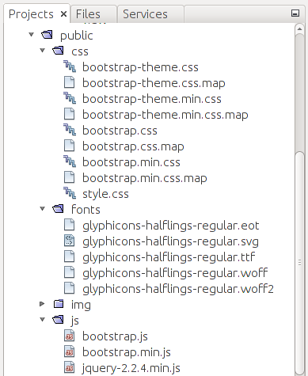
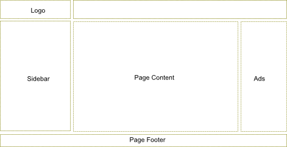
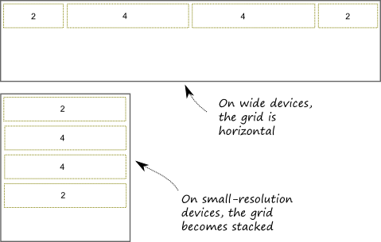
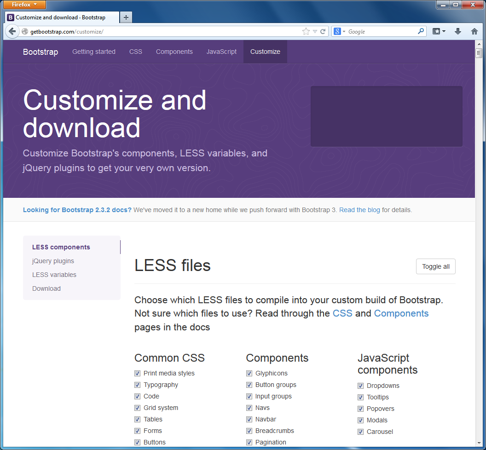

# Appendix C. Introduction to Twitter Bootstrap

Twitter Bootstrap (shortly, Bootstrap) is a popular CSS framework allowing to make
your web site professionally looking and visually appealing, even if you don't have
advanced designer skills. In this appendix, you can find some introductory information
about Bootstrap and its usage examples.

## Overview of Bootstrap Files

The source code of Bootstrap framework's components is spread across many CSS files.
It is known that downloading multiple small files is typically slower
than downloading a single large file. For this reason, Bootstrap CSS stylesheets are
"concatenated" with the special tool and distributed in a form of a single
file named *bootstrap.css*.

However, this *bootstrap.css* file has a disadvantage: it contains many characters
(white space characters, new line characters, comments, etc.) unneeded for code execution,
wasting network bandwidth when downloading the file, thus increasing page load time.
To fix this problem, the *minification* is used.

The minification is the process of removing all unnecessary characters from the
source code without changing its functionality. The minified Bootstrap file is
called *bootstrap.min.css*.

> It is generally recommended to use the minified file, especially in
> production environment, because it reduces the page load time. However,
> if you plan to dig into Bootstrap code to understand how it works, you better
> use the usual (non-minified) file, or even download the original source files
> (not concatenated ones).

Let's look in more details at the files stored inside
the *APP_DIR/public* directory and its subdirectories (figure C.1).

The *css* directory contains the CSS stylesheets:

* The *bootstrap.css* and *bootstrap.min.css* files are the usual and minified versions
  of Bootstrap, respectively.

* The *bootstrap-theme.css* is the optional Bootstrap theme file for a "visually
  enhanced experience". The *bootstrap-theme.min.css* is its minified version.

* The *style.css* file is the stylesheet that can be used and extended by you
  to define your own CSS rules which will be applied on top of Bootstrap rules.
  This way you can customize the appearance of your web application.

* You may also notice various files with .map extension,
  which is the MAP [^map] files that can be used for debugging the CSS code.

[^map]: After the concatenation and minification, the CSS code is difficult to read and debug.
        A MAP file (source map) allows to restore the minified file back to its usual state.

The *fonts* directory contains several files (e.g. *glyphicons-halflings-regular.svg*) needed
by Bootstrap for rendering icons. These icons (also called Glyphicons) can be used to enhance the
appearance of the buttons and dropdown menus.

The *APP_DIR/public/js* subdirectory contains JavaScript extensions of the Bootstrap framework. They
are implemented as jQuery plugins:

* The *bootstrap.js* is the file containing the JavaScript code of the Bootstrap extensions.
  The *bootstrap.min.js* file is its minified version.

* Because Bootstrap extensions are implemented as jQuery plugins, they require the latest version of
  jQuery library to be present. Thus, the *js* directory includes
  the jQuery library file *jquery-2.2.4.min.js*.

## Grid System

In most websites, content is required to be organized in a table-like structure having rows
and columns. In figure C.2, you can see an example layout of a typical website: it has
the header block with a logo, the sidebar at the left, page content area in the middle, the ads bar at the right,
and the footer at the bottom of the page. These blocks are arranged in a grid, although
grid cells have unequal width (some cells can span several columns).

Bootstrap provides a simple layout grid system to make it easy to
arrange content on your pages in rows and columns.

Each row consists of up to 12 columns [^cols] (figure C.3). Column width is flexible
and depends on the width of the grid container element. Column height may vary
depending on the height of the content of the cell. The space between columns is 30 pixels (15 pixels
padding at both sides of the column).

[^cols]: You are not required to put exactly 12 columns in a row, there may be fewer columns.
         If you have fewer columns, the space to the right of the last column will be empty.

Columns can be spanned, so a single cell takes the space of several columns.
For example, in figure C.3, the upper grid row consists of 12 columns,
and each cell spans a single column. In the bottom row,
the first cell spans 2 columns, the second and the third ones span 4 columns each, and the fourth
cell spans 2 columns (in total we have 12 columns).

Q> **Why does Bootstrap's grid consist of only 12 columns?**
Q>
Q> Probably because 12 columns are enough for most websites. If you have more fine-grained grid with
Q> lots of columns, it would be more difficult to compute column spans without the calculator.
Q> Fortunately, Bootstrap allows for customizing the count of columns per row, so you can have as many
Q> columns as you wish.

### Defining the Grid

To arrange elements in a grid on your web page, you start from defining the
container by adding a `
` element having the `.container` CSS class.
To add a new row to the grid, use a `
` element having the `.row`
CSS class, as shown in the example below:

~~~text

  

  ...
  

~~~

To add columns, you use `
` elements with CSS class names varying from `.col-md-1`
to `.col-md-12`. The number in the class name specifies how many columns each grid cell
will span:

~~~text

  

    
Cell 1

    
Cell 2

    
Cell 3

  

~~~

In the example above, we have three cells. The first cell has a width of 1 (it
uses the `.col-md-1` class), the second cell spans 5 grid columns (class `.col-md-5`)
and the third cell spans 6 columns (class `.col-md-6`).

As another example, let's define the layout that we saw in figure C.2.
The layout has the header (logo spans 3 columns), the main content area (spans 7 columns),
the sidebar (spans 3 columns), the advertisements bar (2 columns) and the footer. To produce
this layout, we can use the following HTML code:

~~~text

  <!-- Header -->
  

    
Logo

    

  

  <!-- Body-->
  

    
Sidebar

    
Page Content

    
Ads

  

  <!-- Footer -->
  

    
Page Footer

  

~~~

### Offsetting Columns

In real web pages, sometimes the grid needs to contain "empty holes". You can define
such holes by offsetting cells to the right with the
help of CSS classes named from `.col-md-offset-1` to `.col-md-offset-12`. The number in the
class name specifies how many columns should be skipped.

For example, look at figure C.4:

The grid above has three cells, the latter two cells are offsetted to the right,
making empty holes. To define the grid like in figure C.4, you can use the following
HTML code:

~~~text

  

    
Cell 1

    
Cell 2

    
Cell 3

  

~~~

### Nesting Grids

You can create complex page layouts by nesting grids (for example, look at figure C.5).
To nest your content, you add a new `
` element containing `.row` class, and set of
`.col-md-*` columns within an existing `.col-md-*` column.

To produce the grid as shown in figure C.5, you can use the following HTML code:

~~~text

  

    
Cell 1

    

      <!-- Nested grid -->
      

        
Cell 21

        
Cell 22

      

      

        
Cell 23

        
Cell 24

      

    

    
Cell 3

  

~~~

In the example above, we defined the grid consisting of three cells (denoted by gray color):
the first cell spanning 2 columns, the second cell spanning 8 columns and the third cell spanning
2 columns. Then we put the nested grid rows inside of the second cell. Because the parent cell
spans 8 columns, the child grid consists of 8 columns, too.

### "Mobile First" Concept

Twitter Bootstrap is designed to support different devices varying from wide
displays to tablets and mobile phones. By this reason, the layout grid is adapted
to different screen resolutions.

> This is also called the *responsiveness*, or the "mobile first" concept.
> Bootstrap is mobile-first, which means your website will be viewable
> and usable on any-sized screen. However, this does not free you of painstaking
> preparation and planning the layout.

This adaptation is performed in two ways. The first way is that the column width
within the grid is flexible. For example, if you increase the size of the browser
window, the grid will be scaled accordingly to fill the whole space.

But what will happen if your web page is too wide for the display? To see the hidden part,
the site visitor will need to scroll it to the right. For mobile phones and other low-resolution
devices this is not a good approach. Instead, it would be better for the grid to
become "stacked" below some screen width. When the grid is stacked, its rows are transformed,
making cells to be positioned one below another (see figure C.6 for example).

To better control when the grid becomes "stacked", Bootstrap provides you with additional
CSS classes: `.col-xs-1` to `col-xs-12` (the "xs" abbreviation means "extra-small" devices, or phones),
`.col-sm-1` to `.col-sm-12` ("sm" stands for "small devices", or tablets), and `.col-lg-1` to `.col-lg-12`
(large devices, or wide displays). These classes can be used together with the `.col-md-1` -- `.col-md-12`
classes, that we already used (the "md" abbreviation means "medium devices", or desktops).

For example, `.col-md-*` classes define the grid which will become "stacked" when the screen is
below 992 pixels wide, and horizontal for wider screens. The `.col-sm-*` can be used to make the
grid "stacked" below 768 pixel screen width, and horizontal above this point. The `.col-xs-*`
class makes the grid always horizontal, not depending on the screen width.

Table C.1 provides the summary of available grid classes and their breakdown page width.

| *Class name*                   | *Breakdown width*                                             |
|--------------------------------|---------------------------------------------------------------|
| `.col-xs-*`                     | <768px                                                       |
| `.col-sm-*`                     | >=768px                                                      |
| `.col-md-*`                     | >=992px                                                      |
| `.col-lg-*`                     | >=1200px                                                     |

Table C.1. CSS classes for defining layout grid

> Bootstrap's grid system greatly simplifies the positioning of elements
> on a web page. However, using the grid system is not mandatory. For example,
> sometimes you may need a much more complex layout, and the simple grid system will be
> insufficient. In such a case, you can create and use your custom layout by using
> `<table>` or `
` HTML elements.

## Bootstrap's Interface Components

In this section, we will give a summary on useful interface components provided by Twitter
Bootstrap. We plan to use some of these components in our further examples, and this section
should give an idea of how you can use these widgets in your own websites.

### Navigation Bar

Navigation bar is usually positioned on top of your website and contains the links to main
pages, like *Home*, *Download*, *Support*, *About*, etc. Twitter Bootstrap
provides a nice visual style for the navbar (see figure C.7 for example):

As you can see from the figure above, a navbar typically has the header (brand name
of your site can be placed here) and the links to main pages.
To put a navbar on your page, you use the following HTML code:

~~~text
<nav class="navbar navbar-default" role="navigation">
  

    <a class="navbar-brand" href="#">Hello World</a>
  

  <ul class="nav navbar-nav">
    <li><a href="#">Home</a></li>
    <li><a href="#">Download</a></li>
    <li><a href="#">Support</a></li>
    <li><a href="#">About</a></li>
  </ul>
</nav>
~~~

In line 1 above, we used the `<nav>` element, which contains all the navigation
bar information. The associated CSS class `.navbar` is defined by Bootstrap and
provides the base navigation bar's appearance. The `.navbar-default` CSS class
specifies the "default" theme for the navigation bar.

The optional `role` [attribute](http://www.w3.org/TR/xhtml-role/) is an HTML
attribute allowing to annotate the page elements with machine-extractable
semantic information about the purpose of an element. In this example,
the attribute tells that the `<nav>` element is used for navigation.

In lines 2-4, we define the navbar header area, which contains the *Hello World*
hyperlink. The brand hyperlink typically points to the main page of your site. The hyperlink
has the `.navbar-brand` class that visually enhances the text.

In lines 5-10, we specify the navigation links for the *Home*, *Download*, *Support* and *About*
pages. These links are organized inside an `<ul>` unordered list element. The element has
CSS classes `.nav` and `.navbar-nav` that place list items in line and provide the hover item state.

#### Dropdown Menu

With Bootstrap navigation bar, it is possible to use the dropdown menu as a
navigation item. For example, if the *Support* section of your site can be
subdivided into *Documentation* and *Help* pages, these can be implemented as
a dropdown menu (see figure C.8).

You define the dropdown menu by replacing the *Support* list item from the previous example
in the following way:

~~~text
<li class="dropdown">
  <a href="#" class="dropdown-toggle" data-toggle="dropdown">
     Support <b class="caret"></b>
  </a>
  <ul class="dropdown-menu">
    <li><a href="#">Documentation</a></li>
    <li><a href="#">Help</a></li>
  </ul>
</li>
~~~

In the code above, we use the `<li>` element with CSS class `.dropdown` that indicates
the dropdown menu (line 1). In lines 2-4, the `<a>` element defines the hyperlink to show
when the menu is hidden (the *Support* text is shown followed by the triangle caret).

When the site user clicks the hyperlink, the dropdown menu (lines 5-8) appears. The `<ul>`
unordered list element with class `.dropdown-menu` defines its visual appearance. The dropdown
menu contains two items: the *Documentation* and *Help* hyperlinks.

#### Collapsible Navbar

As with the grid system, the navbar component supports different types of screen resolutions.
On low-resolution devices, the navbar can be collapsed, as shown in figure C.9.

As you can see, in the collapsed mode, only the navbar header is displayed, and the three horizontal
bars at the right denote the Toggle button. Clicking the button would expand the hidden navbar items.

You define the collapsible navigation bar as shown in the example below:

~~~text
<nav class="navbar navbar-default" role="navigation">
  <!-- Brand and toggle get grouped for better mobile display -->
  

    <button type="button" class="navbar-toggle" data-toggle="collapse"
            data-target=".navbar-ex1-collapse">
      Toggle navigation
      
      
      
    </button>
    <a class="navbar-brand" href="#">Hello World</a>
  

  <!-- Collect the nav links, forms, and other content for toggling -->
  

    <ul class="nav navbar-nav">
      <li><a href="#">Home</a></li>
      <li><a href="#">Download</a></li>
      <li class="dropdown">
        <a href="#" class="dropdown-toggle" data-toggle="dropdown">
          Support <b class="caret"></b>
        </a>
        <ul class="dropdown-menu">
          <li><a href="#">Documentation</a></li>
          <li><a href="#">Help</a></li>
        </ul>
      </li>
      <li><a href="#">About</a></li>
    </ul>
  
<!-- /.navbar-collapse -->
</nav>
~~~

Above in lines 3-12, we define the navbar header which will be displayed
independently on screen resolution. The header contains the Toggle button with three
horizontal bars and description text "Toggle navigation".

The collapsible part of the menu can be seen in lines 15-30. In this area, we put
our navigation links and the dropdown menu items.

#### Inverse Navbar Style

The navigation bar can be displayed using two standard "themes": the *default* theme (we saw it above),
and the *inverse* theme. The inverse theme makes the navbar elements be displayed in dark colors
(figure C.10). You probably saw such an inverse navbar in the Laminas Skeleton Application demo.

The inverse theme is defined by simply replacing the `.navbar-default` class of the `<nav>`
element by the `.navbar-inverse` class:

~~~text
<nav class="navbar navbar-inverse" role="navigation">
  ...
</nav>
~~~

### Breadcrumbs

Breadcrumbs is a useful interface component which can be used together with the navbar
to give the site visitor an idea of his current location within the site (figure C.11).

In the figure above, we have an example breadcrumbs for the documentation system of our site.
Because the documentation pages can have deep nesting level, the breadcrumbs tell the user
which page he is visiting right now so the user will not get lost and will be able to
return to the page he visited previously, and to the upper-level pages.

To define the breadcrumbs, you use the ordered list `<ol>` element with the `.breadcrumb`
CSS class (see an example below):

~~~text
<ol class="breadcrumb">
  <li><a href="#">Home</a></li>
  <li><a href="#">Support</a></li>
  <li class="active">Documentation</li>
</ol>
~~~

### Pagination

The pagination component is useful when you have a long list of items for display.
Such a long list, if displayed on a single page, would require the user to scroll the page
down several times to see the bottom of the list. To improve user experience, you would break the output into
pages, and use the pagination component for navigation between the pages (figure C.12):

To define the pagination like in figure above, use the following HTML code:

~~~text
<ul class="pagination">
  <li><a href="#">&laquo; Newest</a></li>
  <li><a href="#">&lt; Newer</a></li>
  <li><a href="#">1</a></li>
  <li><a href="#">2</a></li>
  <li><a href="#">3</a></li>
  <li><a href="#">4</a></li>
  <li><a href="#">5</a></li>
  <li><a href="#">Older &gt;</a></li>
  <li><a href="#">Oldest &raquo</a></li>
</ul>
~~~

### Buttons & Glyphicons

Twitter Bootstrap provides a nice visual style for button elements (figure C.13).

To create the buttons like in the figure above, use the following HTML code:

~~~text

  <button type="button" class="btn btn-primary">Save</button>
  <button type="button" class="btn btn-default">Cancel</button>

~~~

In the code above, we use the `.btn` CSS class to assign the button its
visual style. Additionally, we use the `.btn-primary` class for the *Save*
button (which is typically the primary button on a form), or the `btn-default`
class for a usual non-primary button *Cancel*.

To better express the meaning of a button, Bootstrap provides you with several
additional button classes: `.btn-success` (for buttons applying some change on the page),
`.btn-info` (for informational buttons), `.btn-warning` (for buttons that may have an undesired
effect), and `.btn-danger` (for buttons that may lead to irreversible consequences).
For an example of using these button styles, look at the code below:

~~~text

  <button type="button" class="btn btn-default">Default</button>
  <button type="button" class="btn btn-primary">Primary</button>
  <button type="button" class="btn btn-success">Success</button>
  <button type="button" class="btn btn-info">Info</button>
  <button type="button" class="btn btn-warning">Warning</button>
  <button type="button" class="btn btn-danger">Danger</button>

~~~

Figure C.14 shows the resulting button appearance:

Bootstrap includes 180 icons (called Glyphicons) that you can use together with your buttons,
dropdown menus, navigation links, etc. To add an icon on a button,
you can use the code like the one below:

~~~text

  <button type="button" class="btn btn-default">
       Create
  </button>
  <button type="button" class="btn btn-default">
       Edit
  </button>
  <button type="button" class="btn btn-default">
       Delete
  </button>

~~~

In the code above, we defined a simple toolbar containing three buttons:
*Create*, *Edit* and *Delete*. We placed an icon on each button
with the help of `` element. The `` element should have two classes:
the `.glyphicon` class is common for all icons; the second class represents the icon name.
In the example above, we used `.glyphicon-plus` class for the *Create* button,
the `.glyphicon-pencil` for `Edit` button, and `.glyphicon-remove` for *Delete* button.
The result of our work is presented in figure C.15.

You can vary button sizes by specifying the `.btn-lg` class for large buttons, `btn-sm` for small
buttons, or `.btn-xs` class for extra-small buttons. For example, in figure C.16, a large *Download*
button is presented.

To define such a button, you can use the following HTML code:

~~~text
<button type="button" class="btn btn-success btn-lg">
   Download
</button>
~~~

## Customizing Bootstrap

To finish the introduction to Twitter Bootstrap, we will describe about how to modify
some aspects of Bootstrap framework. You can customize the Bootstrap look and feel using the
[Customize](http://getbootstrap.com/customize/) page of the Bootstrap website (figure C.17).

On the Customize page you can choose which Bootstrap source files to include into the "concatenated"
resulting file *bootstrap.css*. If you don't need some functionality, you can exclude it from the
resulting file, thus reducing the network traffic and page load time.
You can also remove some unused JavaScript code components from the resulting *bootstrap.js* file.

Additionally, you can choose different CSS parameters like background color, base text color and font family,
and so on. There are more than a hundred customizable parameters available.

> CSS customization is possible, because Bootstrap source files are stored in LESS [^less]
> format, which allows to define variable parameters (like `@bodyBackground` or `@textColor`).
> Once the parameters are defined, the LESS files are compiled into usual CSS files, minified
> and made available for downloading.

When you have finished with tuning parameters, you can scroll the
*Customize* page down and press the *Compile and Download*
button. As a result, the *bootstrap.zip* archive will be downloaded,
which contains all the customized Bootstrap files (both usual and minified
CSS and JS files and glyphicons fonts).

[^less]: LESS is a dynamic stylesheet language extending standard CSS with features
         like variables, mixins (embedding all the properties of a CSS class into another CSS class),
         code block nesting, arithmetic operations, and functions.

## Summary

Twitter Bootstrap is a CSS framework developed to make designing your
web pages easier. It provides the default nice-looking style for typography,
tables, forms, buttons, images and so on, so you can create a professionally
looking page in a minute.

The grid system provided by the Bootstrap allows to arrange elements
on your web page in a grid with rows and columns. The grid adapts to
different screen resolutions, making your page equally well-readable on mobile phones,
tablets, desktops and wide screens.

Twitter Bootstrap also provides useful web interface components like
dropdown menus, navigation bars, breadcrumbs, etc. These components
are made interactive by the JavaScript extensions bundled with the
framework.

Bootstrap is shipped with Laminas Skeleton Application, so you
can start using it out of the box or, alternatively, you can download the newest
version of Bootstrap from the project's page and customize it as you wish.
