# Collecting User Input with Forms

In this chapter, you will become familiar with using web forms for gathering data
entered by website users. In Laminas Framework, functionality
for working with forms is mainly spread across four components: the @`Laminas\Form` component,
which allows you to build forms and contains the view helpers for rendering form elements;
the @`Laminas\Filter`, @`Laminas\Validator` and @`Laminas\InputFilter` components which allow you to filter
and validate user input.

|--------------------------------|---------------------------------------------------------------|
| *Component*                    | *Description*                                                 |
|--------------------------------|---------------------------------------------------------------|
| @`Laminas\Form`                    | Contains base form model classes.                             |
|--------------------------------|---------------------------------------------------------------|
| @`Laminas\Filter`                  | Contains various filters classes.                             |
|--------------------------------|---------------------------------------------------------------|
| @`Laminas\Validator`               | Implements various validator classes.                         |
|--------------------------------|---------------------------------------------------------------|
| @`Laminas\InputFilter`             | Implements a container for filters/validators.                |
|--------------------------------|---------------------------------------------------------------|
| @`Laminas\Mail`                    | Contains E-mail sending functionality.                        |
|--------------------------------|---------------------------------------------------------------|

## Get the Form Demo Sample from GitHub

We will demonstrate form usage on the *Form Demo* sample web application
bundled with the book. This sample is a complete web site you can install
and see the working forms in action.

To download the *Form Demo* application, visit
[this page](https://github.com/olegkrivtsov/using-laminas-book-samples)
and click the *Clone or Download* button to download the code as a ZIP archive.
When the download is complete, unpack the archive to a directory of your choosing.

Then navigate to the `formdemo` directory which contains the complete
source code of the *Form Demo* web application:

~~~text
/using-laminas-book-samples
  /formdemo
  ...
~~~

> To install the example, you can either edit your default virtual host file
> or create a new one. After editing the file, restart the Apache HTTP Server
> and open the web site in your web browser. For additional information on
> Apache virtual hosts, you can refer to [Appendix A. Configuring Web Development Environment](#devenv).

## About HTML Forms

Form functionality provided by Laminas Framework internally uses HTML forms. Because
of that, we start with a brief introduction to HTML forms topic.

In HTML, forms are enclosed with `<form>` and `</form>` tags. A form typically
consists of fields: text input fields, check boxes, radio buttons, submit buttons,
hidden fields and so on. HTML provides several tags intended for defining form
fields:

* `<input>` - specifies an input field where the user can enter
   some data (field appearance and behavior depends on the field type);
* `<textarea>` - multi-line text area which can contain an
   unlimited number of characters;
* `<button>` - a clickable button[^button];
* `<select>` - a dropdown list;
* `<option>` - used inside the `<select>` element for defining the
   available options in a dropdown list.

[^button]: The `<button>` field is analogous to `<input type="button">`, however it
           provides additional capabilities, like specifying a graphical icon on the button.

In table 7.1, you can find examples of HTML form field definitions. Figure 7.1 contains
corresponding field visualizations (except the "hidden" field type, which has no visual representation).

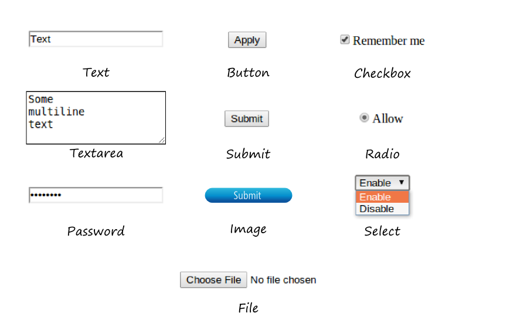

{title="Table 7.1. Standard HTML form fields"}
|--------------------------------|---------------------------------------------------------------|
| *Field*                        | *Definition*                                                  |
|--------------------------------|---------------------------------------------------------------|
| Text input field               | `<input type="text">`                                       |
|--------------------------------|---------------------------------------------------------------|
| Text area                      | `<textarea rows=4></textarea>`                                |
|--------------------------------|---------------------------------------------------------------|
| Password                       | `<input type="password">`                                   |
|--------------------------------|---------------------------------------------------------------|
| Button                         | `<input type="button" value="Apply">` or                     |
|                                | `<button type="button">Apply</button>`                        |
|--------------------------------|---------------------------------------------------------------|
| Submit button                  | `<input type="submit" value="Submit">`                      |
|--------------------------------|---------------------------------------------------------------|
| Image (graphical submit button)| `<input type="image" src="button.jpg">`                     |
|--------------------------------|---------------------------------------------------------------|
| Reset button                   | `<input type="reset" value="Reset">`                         |
|--------------------------------|---------------------------------------------------------------|
| Checkbox                       | `<input type="checkbox">Remember me</input>`                  |
|--------------------------------|---------------------------------------------------------------|
| Radio                          | `<input type="radio" value="Radio">Allow</input>`             |
|--------------------------------|---------------------------------------------------------------|
| Select                         | `<select><option>Enable</option><option>Disable</option></select>` |
|--------------------------------|---------------------------------------------------------------|
| File                           | `<input type="file">`                                       |
|--------------------------------|---------------------------------------------------------------|
| Hidden field                   | `<input type="hidden">`                                     |
|--------------------------------|---------------------------------------------------------------|

HTML5 introduced several new form field types (listed in table 7.2); figure 7.2 contains corresponding
field visualizations.

HTML5 fields provide more convenient ways for entering the most frequently used data types:
numbers, dates, E-mails, URLs, etc. Additionally, on form submit, the web browser
validates that the user entered data is in a correct format, and if not the browser will
prevent form submission and ask the user to correct the input error.

{title="Table 7.2. HTML5 form fields"}
|--------------------------------|---------------------------------------------------------------|
| *Field*                        | *Definition*                                                  |
|--------------------------------|---------------------------------------------------------------|
| Color picker                   | `<input type="color">`                                      |
|--------------------------------|---------------------------------------------------------------|
| Date                           | `<input type="date">`                                       |
|--------------------------------|---------------------------------------------------------------|
| Date-time (with time zone)     | `<input type="datetime">`                                   |
|--------------------------------|---------------------------------------------------------------|
| Date-time (without time zone)  | `<input type="datetime-local">`                             |
|--------------------------------|---------------------------------------------------------------|
| E-mail address                 | `<input type="email">`                                      |
|--------------------------------|---------------------------------------------------------------|
| Number                         | `<input type="number">`                                     |
|--------------------------------|---------------------------------------------------------------|
| Time                           | `<input type="time">`                                       |
|--------------------------------|---------------------------------------------------------------|
| Month                          | `<input type="month">`                                      |
|--------------------------------|---------------------------------------------------------------|
| Week                           | `<input type="week">`                                       |
|--------------------------------|---------------------------------------------------------------|
| URL                            | `<input type="url">`                                        |
|--------------------------------|---------------------------------------------------------------|
| Range (slider)                 | `<input type="range">`                                      |
|--------------------------------|---------------------------------------------------------------|
| Search field                   | `<input type="search" name="googlesearch">`                 |
|--------------------------------|---------------------------------------------------------------|
| Telephone number               | `<input type="tel">`                                        |
|--------------------------------|---------------------------------------------------------------|

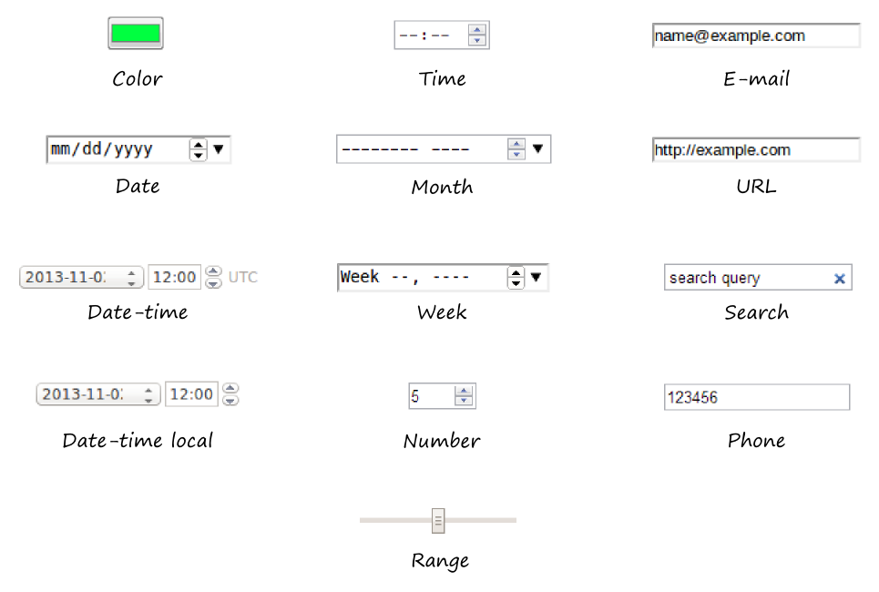

### Fieldsets

You can group related form fields with the help of the `<fieldset>` tag, as shown in the
example below. The optional `<legend>` tag allows you to define the caption for the group.

~~~html
<fieldset>
  <legend>Choose a payment method:</legend>
  <input type="radio" name="payment" value="paypal">PayPal</input>
  <input type="radio" name="payment" value="card">Credit Card</input>
</fieldset>
~~~

The HTML markup presented above will generate the group as in figure 7.3:

### Example: "Contact Us" Form

An example of a typical HTML form is presented below:

~~~html
<form name="contact-form" action="/contactus" method="post">
  <label for="email">E-mail</label>
  <input name="email" type="text">
   
  <label for="subject">Subject</label>
  <input name="subject" type="text">
   
  <label for="body">Message</label>
  <textarea name="body" class="form-control" rows="6"></textarea>
   
  <input name="submit" type="submit" value="Submit">
</form>
~~~

In the example above, we have the feedback form which allows the
user to enter his E-mail address, message subject, and text, and then submit them to the server. The
form definition begins with the `<form>` tag (line 1).

The `<form>` tag contains several important attributes:

* the `name` attribute specifies the name of the form ("contact-form").
* the `action` attribute defines the URL of the server-side script which is
  responsible for processing the submitted form ("/contactus").
* the `method` attribute defines the method (either GET or POST) to use for delivering
  form data. In this example, we use the POST method (recommended).

In line 3, we define a text input field with the help of the `<input>` element. The `name` attribute
specifies the name of the field ("email"). The `type` attribute
specifies the purpose of the element (the type "text" means the input field is intended for
entering text).

In line 2, we have the `<label>` element which represents the label for the E-mail
text input field (the corresponding input field's name is determined by the `for`
attribute of the `<label>` element).

In lines 5-6, by analogy, we have the "Subject" input field and its label.

In line 9, we have the text area field which is suited well for entering
multi-line text. The height of the text area (6 rows) is defined by the `rows`
attribute.

In line 11, we have the submit button (input element with "submit" type).
The `value` attribute allows you to set the title text for the button ("Submit").
By clicking this button, the user will send the form data to the server.

Line break ` ` elements are used in lines 4, 7 and 10 to position
form controls one below another (otherwise they would be positioned in
one line).

To see what this form looks like, you can put its HTML markup code in a `.html` file
and open the file in your browser. You will see the form visualization
as in figure 7.4.

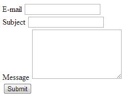

If you enter some data in the feedback form and click the *Submit* button, the web browser will
send an HTTP request to the URL you specified in the `action` attribute of the form.
The HTTP request will contain the data you entered.

### GET and POST Methods

HTML forms support GET and POST methods for submitting the data to server. These
methods have important technical differences.

When using POST method for submitting the form, the data is
sent in HTTP request body. For example, when you press the *Submit* button on the
feedback form, an HTTP request will look like the example below:

~~~text
POST http://localhost/contactus HTTP/1.1
Host: localhost
Connection: keep-alive
Content-Length: 76
Accept: text/html,application/xhtml+xml,application/xml
Origin: null
User-Agent: Mozilla/5.0 (Windows NT 6.1; WOW64)
Content-Type: application/x-www-form-urlencoded

email=name%40example.com&subject=Example+Subject&body=Hello%21&submit=Submit
~~~

Above, you can see that the form data is transmitted in request body (line 10). Form fields
are concatenated in a single string and then URL-encoded to replace unsafe characters with allowed
characters from the ASCII table.

In comparison, when you set the GET method for the form, an HTTP request will look
like the example below:

~~~text
GET http://localhost/contactus?email=name%40example.com&subject=Example+Subject&body=Hello%21&submit=Submit HTTP/1.1
Host: localhost
Connection: keep-alive
Accept: text/html,application/xhtml+xml,application/xml
User-Agent: Mozilla/5.0 (Windows NT 6.1; WOW64)
Accept-Encoding: gzip,deflate,sdch

~~~

In the example above, you can see that the form data is concatenated, URL-encoded and sent
as part of the HTTP request's URL (line 1), which makes the URL long and harder to read.
Since the form data is sent inside the URL, this makes it easily visible to site visitors.

In most cases, you will use the POST method for delivering form data in the
request body, because the user doesn't need to see the data in the browser's
navigation bar (especially when submitting passwords or other sensitive data).

W> Please note that submitting form data using the POST method does not protect your
W> sensitive data (like passwords, credit card numbers, etc.) from being stolen. To
W> protect such data, you'll have to direct your HTTP traffic to an [SSL](http://en.wikipedia.org/wiki/Secure_Sockets_Layer) tunnel
W> (SSL stands for Secure Sockets Layer). Protected SSL connections are distinguished by
W> using the *https://* schema in web page URLs. To enable SSL for your Apache HTTP
W> server, you will need to obtain an SSL certificate from a trusted provider
W> (like [VeriSign](http://www.verisign.com/)) and install it on your server.

## Styling HTML Forms with Twitter Bootstrap

In laminas-based web sites, we use the Twitter Bootstrap CSS Framework that provides default
CSS rules for styling forms and form fields. To apply the CSS rules to a form field
(like `<input>`, `<textarea>`, etc.), you should assign it the `.form-control` CSS class. Additionally,
when using labels together with input fields, put the label-input pairs inside of `
` elements
with the `.form-group` CSS class. For submit buttons, you can use the `.btn` CSS class plus a theme
class like `.btn-default`, `.btn-primary`, etc.

Below, we provide the modified example of the feedback form
which uses the Bootstrap styling:

~~~html
<h1>Contact Us</h1>

    Please fill out the following form to contact us.
    We appreciate your feedback.

<form name="contact-form" action="/contactus" method="post">

  

    <label for="email">Your E-mail</label>
    <input name="email" type="text" class="form-control"
           placeholder="name@example.com">
  

  

    <label for="subject">Subject</label>
    <input name="subject" type="text" class="form-control"
           placeholder="Type subject here">
  

  

    <label for="body">Message Body</label>
    <textarea name="body" class="form-control" rows="6"
              placeholder="Type message text here"></textarea>
  

  <input name="submit" type="submit"
         class="btn btn-primary" value="Submit">
</form>
~~~

The visualization of the form is presented in figure 7.5.

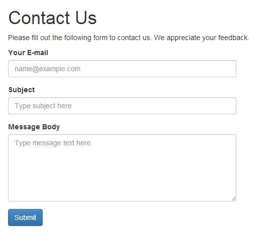

Because Twitter Bootstrap is designed to support mobile phones, tablets, and
desktops, it makes the form fields as wide as the size of the screen. This may
make your form too wide and hard to understand. To limit form width,
you can use the Bootstrap-provided grid, like in the example below:

~~~html

  

    <form>
      ...
    </form>
  

~~~

In the HTML markup above, we put a form inside of the 6-column-width grid cell,
which makes the form half the width of the screen.

## Installing Laminas form components

To use forms in an MVC web application, you need to install at least the
`laminas/laminas-mvc-form` Composer metapackage:

~~~
php composer.phar require laminas/laminas-mvc-form
~~~

When you install this metapackage, there will be installed all necessary
components implementing forms in Laminas: @`Laminas\Form`, @`Laminas\InputFilter`, @`Laminas\Filter`, @`Laminas\Validator`,
and probably others.

## Retrieving Form Data in a Controller's Action

The website user typically works with the form in the following order:

* First, a controller's action is executed rendering the web page
  containing the form prompting the site user for input.
  Once the user fills the form fields, they click the *Submit* button,
  and this generates an HTTP request and sends the data to the server.
* Second, in your controller's action method, you can
  extract the submitted data from POST (and/or GET) variables,
  and display the page with the results of the form processing.

Typically these two web pages are handled by *the same* controller action.

In the following example, we will show how you can create a controller action
for displaying the feedback form and retrieving the data submitted by the user.
To start, add the *contact-us.phtml* view template in the *application/index/* directory under
the module's *view/* directory (see figure 7.6 for example).

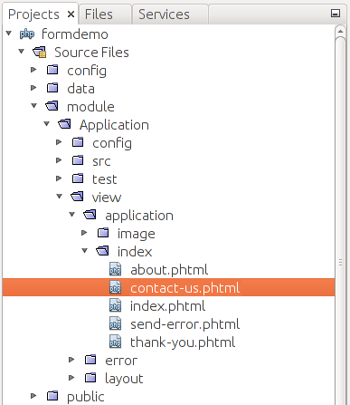

Put the HTML markup code of the feedback form from the previous section into the view
template file.

Then, add the `contactUsAction()` action method to the `IndexController` class. In the action method, we
want to extract raw data from the feedback form submitted by the site user:

~~~php
<?php
namespace Application\Controller;

// ...

class IndexController extends AbstractActionController
{
  // This action displays the feedback form
  public function contactUsAction()
  {
    // Check if user has submitted the form
    if($this->getRequest()->isPost()) {

	  // Retrieve form data from POST variables
	  $data = $this->params()->fromPost();

	  // ... Do something with the data ...
	  var_dump($data);
    }

    // Pass form variable to view
    return new ViewModel([
          'form' => $form
       ]);
  }
}
~~~

In the code above, we define the `contactUsAction()` action method in the
`IndexController` class (line 9).

Then, in line 12, we check whether the request is a POST request (checking
the starting line of the HTTP request). Typically, the form uses the POST method
for submitting the data. For this reason, we can detect if the form is submitted or not
by checking the starting line of the HTTP request.

In line 15 we retrieve the raw data submitted by the user. We extract all the POST variables
with the help of the @`Params` controller plugin. The data is returned in the form of an array and
saved into the `$data` variable.

Finally, we have to add a literal route to make a short and memorable URL
for the *Contact Us* page. Add the following `contactus` key to the routing configuration in the
*module.config.php* file:

~~~php
<?php
return [
  // ...
  'router' => [
    'routes' => [
      // Add the following routing rule for the "Contact Us" page
      'contactus' => [
        'type' => Literal::class,
          'options' => [
             'route'    => '/contactus',
             'defaults' => [
               'controller' => Controller\IndexController::class,
               'action'     => 'contactUs',
             ],
           ],
         ],
       ],
    ],
  ],
  // ...
];

~~~

Now, if you type the "http://localhost/contactus" URL in your web browser's navigation bar,
you should see the page as in figure 7.7.

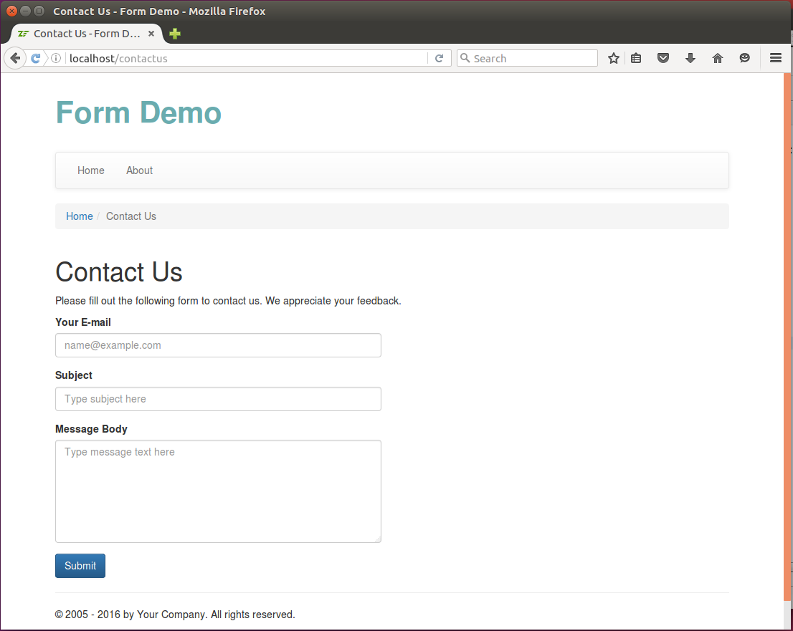

Enter an E-mail, subject, and body text and
click the *Submit* button on the form. The data will be sent to the server, and finally extracted
in the `IndexController::contactUsAction()` method.

Below, an example of the `$data` array (produced with the `var_dump()`
PHP function) is shown. As you can see, the array contains a key for each form field,
including the "submit" field.

~~~php
array (size=4)
    'email' => string 'name@example.com' (length=16)
    'subject' => string 'Happy New Year!' (length=15)
    'body' => string 'Dear Support, I'd like to thank you for the
              excellent quality of your support service and wish you
              a Happy New Year!' (length=118)
    'submit' => string 'Submit' (length=6)
~~~

## Forms and Model-View-Controller

In the previous section, we've considered a very simple form usage case: we prepared the
view template with form HTML markup and a controller action responsible for displaying the
form and dumping raw user input to the screen. However, using raw user input in real-life
applications has a disadvantage in that we do not check user-submitted data
for possible errors and/or malicious code. Here we will discuss how to perform such validation.

In a laminas-based web site that uses the Model-View-Controller pattern, form functionality
is usually separated into *form models* responsible for field definition, filtering and
validation; and *form presentation* (view) which is typically implemented with the help
of special view helpers.

The functionality allowing to create form models, add filtering and validation rules and
use view helpers, is schematically shown in figure 7.8. As you can see from the figure, the
standard HTML forms functionality is used as a base.

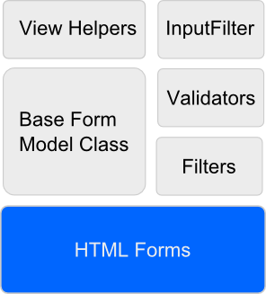

The MVC approach to working with forms has the following advantages:

* You are able to reuse your form model in different controller's actions.
* By using the view helpers, you can (partly) avoid the boring work of preparing HTML markup
  for rendering the form and its possible validation errors.
* You are able to create one or several visual representations for the same form model.
* By encapsulating the form validation logic in a single form model class you
  have fewer places in your code where you need to check user input, thus you
  improve your site security.

### A Typical Form Usage Workflow

Generally speaking, you instantiate a form model inside of your controller's
action method, then you retrieve the user-submitted data from PHP variables,
and pass it to the form model for validation.
Form view helpers are used in a view template for generating HTML markup of
the form. This typical workflow is illustrated by figure 7.9.

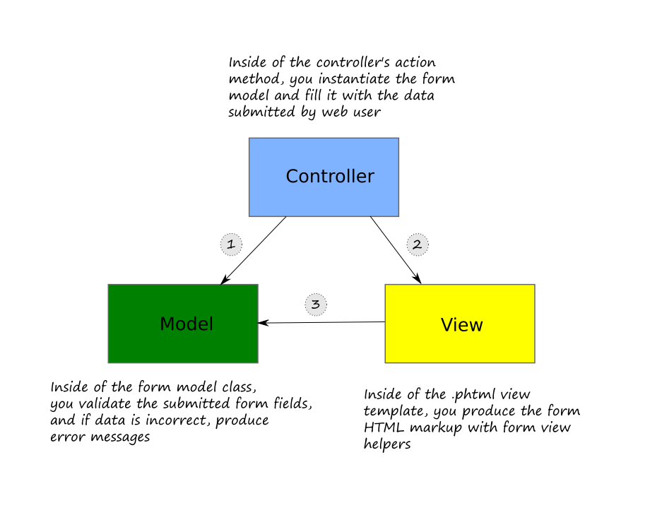

Arrows in figure 7.9 denote the direction of the actions:

1. First, inside of the controller's action method, you retrieve the
   data submitted by the site user from GET, POST (and possibly other) PHP
   variables. Then you create an instance of the form model and pass it
   the user-submitted data. The form model's work is to check (validate) the
   data for correctness, and if something is wrong, produce error message(s)
   for any invalid form field.

2. Secondly, you pass the form model to the `.phtml` view template for
   rendering (with the help of the @`ViewModel`[Laminas\View\Model\ViewModel] variable container). The
   view template then will be able to access the form model and call its
   methods.

3. And finally, the view template uses the form model and the view helpers
   provided by Laminas Framework to render the form fields (and to display
   possible validation error messages produced at the validation stage).
   As a result, the HTML markup of the form is produced.

In the following sections, we will discuss these in more detail.

## A Form Model

A form model is usually a PHP class which creates a number of *fields*.
The base class for all form models is the @`Form`[Laminas\Form\Form] class defined in the @`Laminas\Form`
component.

Fields in a form model can optionally be grouped into *fieldsets*. Moreover, the form model
itself can be considered as a fieldset. This fact is reflected in form class inheritance
(figure 7.10).

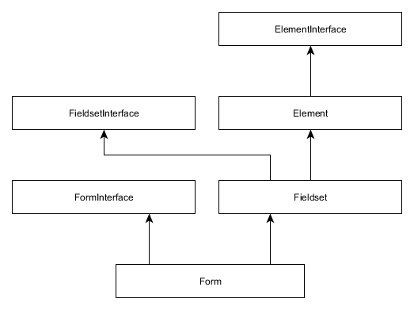

As you can see from the figure, the @`Form`[Laminas\Form\Form] class extends the @`Fieldset` class.
The @`Fieldset` class, in turn, is derived from the @`Element` class which represents a single
form field and its attributes.

> This class inheritance may look strange at first sight, but everything becomes logical
> if you remember that the @`Form`[Laminas\Form\Form] class inherits methods for adding form fields from the @`Fieldset`
> class, and that it inherits methods for setting form attributes from the @`Element` class.

Below, we provide a stub model class for the feedback form from our previous examples:

~~~php
<?php
namespace Application\Form;

use Laminas\Form\Form;

// A feedback form model
class ContactForm extends Form
{
  // Constructor.
  public function __construct()
  {
    // Define form name
    parent::__construct('contact-form');

    // Set POST method for this form
    $this->setAttribute('method', 'post');

    // (Optionally) set action for this form
    $this->setAttribute('action', '/contactus');

    // Create the form fields here ...
  }
}
~~~

As you can see, form models of the web site's `Application` module
(by convention) belong to `Application\Form` namespace (line 2).

In line 7, we define the `ContactForm` form model class which extends the @`Form`[Laminas\Form\Form] base class.

In line 10, we define the constructor method for the class. Because we derive our form
model from the base @`Form`[Laminas\Form\Form] class, we have to call the parent class' constructor to initialize
it (line 13). The parent class' constructor accepts an optional argument allowing it to set the form's name
('contact-form').

We can also set form data delivery method (POST) by using the `setAttribute()`
method provided by the base class (line 16). The `setAttribute()` takes two parameters:
the first one is the name of the attribute to set, and the second one is the value of the
attribute.

You also can set the form's "action" attribute (line 19) with the `setAttribute()` method, analogous to the way
you did with the "method" attribute. Actually, as you will see later, setting the form's "action" attribute is optional.

> Setting the "action" attribute for the form is optional, because empty
> form action forces the browser to submit form data to the URL of the
> current page. This is sufficient in most scenarios, because usually
> you use the single controller action for both displaying the form
> and processing its data.

Form fields are typically created inside of the form model's constructor
(look at line 21). In the next section, we will learn which form fields
are available and how to add them to the form model.

## Form Elements

In a form model, an input field is typically paired with the text label (`<label>` and `<input>` tags are
used together). Such a pair is also called a form model's *element*.

Analogous to an HTML form field, a form model's element may contain the name and other (optional)
attributes (e.g. "id", "class", etc.) Additionally, you may set *options* to an element;
the options mostly allow you to specify the text and attributes for the element's label.

All form model's elements are inherited from the base class @`Element` which also belongs
to the @`Laminas\Form` component. The `Element` base class implements the @`ElementInterface` interface.
The class inheritance diagram is shown in figure 7.11.

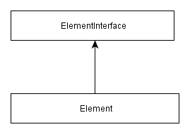

Concrete form element classes extend the @`Element` base class. They are listed in tables 7.3 - 7.7.
These classes live in the @`Laminas\Form\Element`[Laminas\Form] namespace.

{title="Table 7.3. Form elements compatible with HTML 4"}
|--------------------------------|---------------------------------------------------------------|
| *Class name*                   | *Description*                                                 |
|--------------------------------|---------------------------------------------------------------|
| @`Button`                       | Button.                                                       |
|--------------------------------|---------------------------------------------------------------|
| @`Checkbox`[Laminas\Form\Element\Checkbox]                     | Check box.                                                    |
|--------------------------------|---------------------------------------------------------------|
| @`File`[Laminas\Form\Element\File]                         | File field.                                                   |
|--------------------------------|---------------------------------------------------------------|
| @`Hidden`                       | Hidden field.                                                 |
|--------------------------------|---------------------------------------------------------------|
| @`Image`[Laminas\Form\Element\Image]                        | Image field.                                                  |
|--------------------------------|---------------------------------------------------------------|
| @`Password`[Laminas\Form\Element\Password]                     | Password field.                                               |
|--------------------------------|---------------------------------------------------------------|
| @`Radio`                        | Radio button.                                                 |
|--------------------------------|---------------------------------------------------------------|
| @`Select`[Laminas\Form\Element\Select]                       | Dropdown list.                                                |
|--------------------------------|---------------------------------------------------------------|
| @`Submit`                       | Submit button.                                                |
|--------------------------------|---------------------------------------------------------------|
| @`Text`[Laminas\Form\Element\Text]                         | General-purpose text input field.                             |
|--------------------------------|---------------------------------------------------------------|
| @`Textarea`                     | Multi-line text area.                                         |
|--------------------------------|---------------------------------------------------------------|

{title="Table 7.4. Form elements compatible with HTML 5"}
|--------------------------------|---------------------------------------------------------------|
| *Class name*                   | *Description*                                                 |
|--------------------------------|---------------------------------------------------------------|
| @`Color`                        | Color picker.                                                 |
|--------------------------------|---------------------------------------------------------------|
| @`Date`[Laminas\Form\Element\Date]                         | Date picker.                                                  |
|--------------------------------|---------------------------------------------------------------|
| @`DateTime`[Laminas\Form\Element\DateTime]                     | Date & time (with time zone).                                 |
|--------------------------------|---------------------------------------------------------------|
| @`DateTimeLocal`                | Date & time (without time zone).                              |
|--------------------------------|---------------------------------------------------------------|
| @`Email`                        | E-mail field.                                                 |
|--------------------------------|---------------------------------------------------------------|
| @`Month`                        | Month input field.                                            |
|--------------------------------|---------------------------------------------------------------|
| @`Number`[Laminas\Form\Element\Number]                       | A text input field accepting numbers.                         |
|--------------------------------|---------------------------------------------------------------|
| @`Time`[Laminas\Form\Element\Time]                         | Text input field for entering time.                           |
|--------------------------------|---------------------------------------------------------------|
| @`Url`[Laminas\Form\Element\Url]                          | Text input field for entering an URL.                         |
|--------------------------------|---------------------------------------------------------------|
| @`Week`                         | Text input field for entering days of week.                   |
|--------------------------------|---------------------------------------------------------------|
| @`Range`[Laminas\Form\Element\Range]                        | Range field (slider).                                         |
|--------------------------------|---------------------------------------------------------------|

{title="Table 7.5. Compound fields"}
|--------------------------------|---------------------------------------------------------------|
| *Class name*                   | *Description*                                                 |
|--------------------------------|---------------------------------------------------------------|
| @`MultiCheckbox`                | A group of related check boxes.                               |
|--------------------------------|---------------------------------------------------------------|
| @`DateTimeSelect`[Laminas\Form\Element\DateTimeSelect]               | Date & time select.                                           |
|--------------------------------|---------------------------------------------------------------|
| @`DateSelect`[Laminas\Form\Element\DateSelect]                   | Date select.                                                  |
|--------------------------------|---------------------------------------------------------------|
| @`MonthSelect`[Laminas\Form\Element\MonthSelect]                  | Month select.                                                 |
|--------------------------------|---------------------------------------------------------------|

{title="Table 7.6. Security Form Elements"}
|--------------------------------|---------------------------------------------------------------|
| *Class name*                   | *Description*                                                 |
|--------------------------------|---------------------------------------------------------------|
| @`Captcha`                      | Human check image.                                            |
|--------------------------------|---------------------------------------------------------------|
| @`Csrf`[Laminas\Form\Element\Csrf]                         | Cross-site request forgery prevention.                        |
|--------------------------------|---------------------------------------------------------------|

{title="Table 7.7. Other Form Elements"}
|--------------------------------|---------------------------------------------------------------|
| *Class name*                   | *Description*                                                 |
|--------------------------------|---------------------------------------------------------------|
| @`Collection`[Laminas\Form\Element\Collection]                   | Element collection.                                           |
|--------------------------------|---------------------------------------------------------------|

In the tables above, you can see that the laminas-provided form elements have direct mapping on HTML4
and HTML5 input fields (discussed in the beginning of this chapter).

For your convenience, Laminas also provides several "compound" fields. The
@`MultiCheckbox` field is a field which is composed of a group of typical checkboxes related to
each other. The @`DateTimeSelect`[Laminas\Form\Element\DateTimeSelect], @`DateSelect`[Laminas\Form\Element\DateSelect], and @`MonthSelect`[Laminas\Form\Element\MonthSelect] elements are analogous to corresponding
HTML5 elements, but simulate them with the usual select fields. These input fields have an advantage in that they
are supported by all web browsers, unlike the corresponding HTML5 fields. The visual representation of
these elements can be seen in figure 7.12.

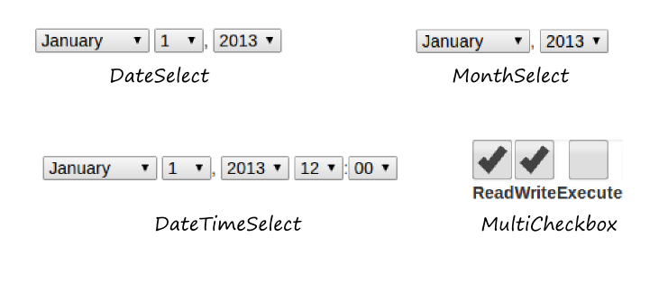

Additionally, Laminas provides "security" form fields @`Captcha`[Laminas\Form\Element\Captcha] and @`Csrf`[Laminas\Form\Element\Csrf] which
can be used on a form for enhancing the security. The @`Captcha`[Laminas\Form\Element\Captcha] element is a graphical element (image)
that is placed on a form for checking if the site user is a human or a robot. The @`Csrf`[Laminas\Form\Element\Csrf] element has
no visual representation and is used for
prevention of hacker attacks related to cross-site request forgery [^csrf].

[^csrf]: Cross-site request forgery (CSRF) is a type of malicious exploit of
         a website whereby unauthorized commands are transmitted from a user
         that the website trusts.

There is another special form element called @`Collection`. This element is analogous to fieldset,
because it allows you to group related form elements. But, it is designed for adding form elements dynamically by binding
an array of objects to the form.

### Adding Elements to a Form Model

The methods inherited by the @`Form`[Laminas\Form\Form] base class from the @`Fieldset` class are used to
add elements (and fieldsets) to the form model. These methods are summarized in the table 7.8.

{title="Table 7.8. Methods provided by the Fieldset class"}
|----------------------------------|---------------------------------------------------------------|
| *Method name*                    | *Description*                                                 |
|----------------------------------|---------------------------------------------------------------|
| `add($elementOrFieldset, $flags)`| Attaches an element (or fieldset).                            |
|----------------------------------|---------------------------------------------------------------|
| `has($elementOrFieldset)`        | Checks whether certain element is attached.                   |
|----------------------------------|---------------------------------------------------------------|
| `get($elementOrFieldset)`        | Retrieves the given element (or fieldset) by name.            |
|----------------------------------|---------------------------------------------------------------|
| `getElements()`                  | Retrieves all attached elements.                              |
|----------------------------------|---------------------------------------------------------------|
| `getFieldsets()`                 | Retrieves all attached fieldsets.                             |
|----------------------------------|---------------------------------------------------------------|
| `count()`                        | Return the count of attached elements/fieldsets.              |
|----------------------------------|---------------------------------------------------------------|
| `remove($elementOrFieldset)`     | Removes the element (or fieldset).                            |
|----------------------------------|---------------------------------------------------------------|

Particularly, we are interested in the `add()` method which is used to attach
an element to a form. The `add()` method takes two arguments: the first one (named `$elementOrFieldset`)
is an element to insert, and the second one (named `$flags`) is the optional flags.

The `$elementOrFieldset` parameter may either be an instance of an
@`Element`-derived class (or the @`Fieldset` class), or an array describing the element that
should be created.

The optional `$flags` argument is an array which may contain a combination of the following keys: `name`
(allows you to set the element's name) and `priority` (allows to specify the zero-based
index in the list of elements to insert the element to). If the priority flag is not
specified, the element will be inserted at the end of the list of the form model's elements.

Below, we provide two code examples illustrating the possible ways of adding
elements to a form.

### Method 1: Passing an Instance of an Element

The following code fragment creates an instance of the @`Laminas\Form\Element\Text` class
and adds the element to the form model:

~~~php
<?php
namespace Application\Form;

// Define an alias for the class name
use Laminas\Form\Form;
use Laminas\Form\Element\Text;

// A feedback form model
class ContactForm extends Form
{
  // Constructor.
  public function __construct()
  {
    // Create the form fields here ...
    $element = new Text(
                'subject',            // Name of the element
                [                     // Array of options
                 'label'=> 'Subject'  // Text label
                ]);
    $element->setAttribute('id', 'subject');

    // Add the "subject" field to the form
    $this->add($element);
  }
}
~~~

In the code above, we've created an instance of the @`Laminas\Form\Element\Text` class (line 15). The
class constructor takes two parameters: the element's name ("subject") and an array of options
(here we specify the text label "Subject").

Additionally, you may configure the element using the methods provided by the @`Element` base class.
For example, in line 20, we set the "id" attribute with the `setAttribute()` method. For your reference,
the (most important) methods of the @`Element` base class which can be used for
configuring a form element are presented in table 7.9.

{title="Table 7.9. Methods provided by the Element class"}
|----------------------------------|---------------------------------------------------------------|
| *Method name*                    | *Description*                                                 |
|----------------------------------|---------------------------------------------------------------|
| `setName($name)`                 | Sets element's name.                                          |
|----------------------------------|---------------------------------------------------------------|
| `getName()`                      | Retrieves element's name.                                     |
|----------------------------------|---------------------------------------------------------------|
| `setOptions($options)`           | Sets options.                                                 |
|----------------------------------|---------------------------------------------------------------|
| `getOptions($options)`           | Retrieves options.                                            |
|----------------------------------|---------------------------------------------------------------|
| `getOption($option)`             | Retrieves the given option.                                   |
|----------------------------------|---------------------------------------------------------------|
| `setAttribute($key, $value)`     | Sets a single element attribute.                               |
|----------------------------------|---------------------------------------------------------------|
| `getAttribute($key)`             | Retrieves a single element attribute.                          |
|----------------------------------|---------------------------------------------------------------|
| `removeAttribute($key)`          | Removes an attribute.                                         |
|----------------------------------|---------------------------------------------------------------|
| `hasAttribute($key)`             | Checks whether such an attribute presents.                    |
|----------------------------------|---------------------------------------------------------------|
| `setAttributes($arrayOrTraversable)`| Sets a group of attributes.                                |
|----------------------------------|---------------------------------------------------------------|
| `getAttributes()`                | Retrieves all attributes at once.                              |
|----------------------------------|---------------------------------------------------------------|
| `clearAttributes()`              | Removes all attributes at once.                               |
|----------------------------------|---------------------------------------------------------------|
| `setValue()`                     | Sets the element value.                                         |
|----------------------------------|---------------------------------------------------------------|
| `getValue()`                     | Retrieves the element value.                                    |
|----------------------------------|---------------------------------------------------------------|
| `setLabel()`                     | Sets the label used for this element.                           |
|----------------------------------|---------------------------------------------------------------|
| `getLabel()`                     | Retrieves the label string used for this element.              |
|----------------------------------|---------------------------------------------------------------|
| `setLabelAttributes()`           | Sets the attributes to use with the label.                     |
|----------------------------------|---------------------------------------------------------------|
| `getLabelAttributes()`           | Gets the attributes to use with the label.                    |
|----------------------------------|---------------------------------------------------------------|
| `setLabelOptions()`              | Sets label specific options.                                  |
|----------------------------------|---------------------------------------------------------------|
| `getLabelOptions()`              | Retrieves label specific options.                             |
|----------------------------------|---------------------------------------------------------------|

### Method 2: Using Array Specification

The second example below (equivalent to the first one) shows how to use an
array specification to add an element to form. This method is preferable, because
it requires less code to write.

> When using array specification for adding an element to a form, the element will
> be instantiated and configured automatically. Internally, this is accomplished with the
> help of the @`Laminas\Form\Factory` factory class (illustrated by figure 7.13).

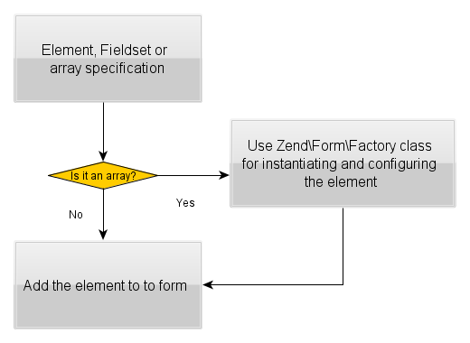

~~~php
<?php
namespace Application\Form;

// Define an alias for the class name
use Laminas\Form\Form;

// A feedback form model
class ContactForm extends Form
{
  // Constructor.
  public function __construct()
  {
    // Add "subject" field
    $this->add([
      'type'  => 'text',        // Element type
      'name' => 'subject',      // Field name
      'attributes' => [         // Array of attributes
        'id'  => 'subject',
      ],
      'options' => [            // Array of options
         'label' => 'Subject',  // Text label
      ],
    ]);
  }
}
~~~

In line 14 above, we call the form model's `add()` method to add the element to form.
We pass the element specification to the `add()` method in the form of an array. The array
has the following typical keys:

* the `type` key (line 15) defines the class name to use for instantiation of the element. Here you
  can use either the fully qualified class name (e.g. `Text::class`) or its short alias [^alias] (e.g. "text").

* the `name` key (line 16) defines the name for the field ("subject").

* the `attributes` key (line 17) defines the list of HTML attributes to set (here we set the "id" attribute).

* the `options` array (line 18) allows you to specify the text label for the element.

[^alias]: If you are confused where we take element aliases from, than you should
          know that they are defined inside of the @`Laminas\Form\FormElementManager\FormElementManagerTrait` class.

## Example: Creating the Contact Form Model

Now that we know how to set the form name, action, and method attributes and how to add
fields (elements) to the form, let's create the complete model class for the feedback form that
we used in our previous examples.

As we know, form model classes for the `Application` module live
inside the `Application\Form` namespace. So, we have to create the
*ContactForm.php* file inside of the *Form* directory under the
*Application* module's source directory (figure 7.14).

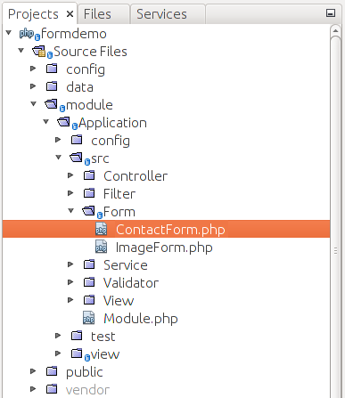

We will have two methods in our form class:

* `__construct()` constructor will define the form name and method (POST), and
  initialize the form by adding its elements;
* `addElements()` private method will contain the actual code for
  adding form elements and will be called by the constructor.

> We put the field creation logic into the `addElements()` private
> method to better structure the form model's code.

The code of the `ContactForm` class is presented below:

~~~php
<?php
namespace Application\Form;

use Laminas\Form\Form;

/**
 * This form is used to collect user feedback data like user E-mail,
 * message subject and text.
 */
class ContactForm extends Form
{
  // Constructor.
  public function __construct()
  {
    // Define form name
    parent::__construct('contact-form');

    // Set POST method for this form
    $this->setAttribute('method', 'post');

    // Add form elements
    $this->addElements();
  }

  // This method adds elements to form (input fields and
  // submit button).
  private function addElements()
  {
    // Add "email" field
    $this->add([
	        'type'  => 'text',
            'name' => 'email',
            'attributes' => [
                'id' => 'email'
            ],
            'options' => [
                'label' => 'Your E-mail',
            ],
        ]);

    // Add "subject" field
    $this->add([
            'type'  => 'text',
            'name' => 'subject',
            'attributes' => [
              'id' => 'subject'
            ],
            'options' => [
                'label' => 'Subject',
            ],
        ]);

    // Add "body" field
    $this->add([
            'type'  => 'text',
            'name' => 'body',
            'attributes' => [
			  'id' => 'body'
            ],
            'options' => [
                'label' => 'Message Body',
            ],
        ]);

    // Add the submit button
    $this->add([
            'type'  => 'submit',
            'name' => 'submit',
            'attributes' => [
                'value' => 'Submit',
            ],
        ]);
    }
}
~~~

In line 10 above, we define the `ContactForm` class which extends the
@`Form`[Laminas\Form\Form] base class.

In lines 13-23, we have the constructor method. It calls the base class'
constructor (line 16) and passes the form name as its argument ("contact-form").
In line 19, the base class' `setAttribute()` method is called allowing you to set the method
name for the form (we set the POST method).

In line 22, the `addElements()` private method is called, which does the actual work of
adding elements to the form. The code of the `addElements()` is located in lines 27-73.
To add elements to the form, we call the `add()` method provided by the base class.
This method accepts the single argument -- an array containing configuration for an
element. We add four fields: the `email`, the `subject`, the `body` and the `submit` field.

In figure 7.15, you can see a schematic graphical representation of the form model
we have created.

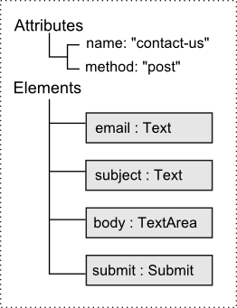

## Adding Form Filtering and Validation Rules

Form validation is the procedure of filtering and checking the data passed to the server
during the form submission. For example, for our feedback form, we want to perform
the following checks:

* We want to test that the E-mail address, message subject, and body fields are always
  present (because these fields are *required*).
* We want to ensure that the user entered a valid E-mail address like *name@example.com*.
* Users may add white space characters to the beginning and/or the end of the E-mail
  address, so we would like to filter such characters out (perform the string trimming
  operation).
* It would be useful to check for minimum and maximum allowed length of the message subject and
  body text.
* For the message subject, we would like to filter out (strip) the new line characters and HTML tags [^html].
* We also want to strip HTML tags from the message body.

[^html]: There may be malicious users inserting HTML code in the message. If you open
         such code in your browser, you may see some undesired content. To avoid
         this, we need to replace HTML tags in message subject and text.

The requirements above are called *filtering and validation rules*. Those rules can be
divided into two categories: filters and validators.

The *filters* transform the user-entered data to fix possible errors
or to ensure the data conforms to a certain format. Filters are typically applied first,
validators are applied in the last turn.

*Validators* check whether the data is acceptable or not. If all data is correct,
the form is considered valid and the data can be safely used by the business logic layer.
If a certain field is invalid, a validator raises an error flag. In that case, the form is
typically shown to the user again, and the user is asked to correct any input errors and resend
the form to server.

Q> **What happens if I don't add a validation rule for a certain form field?**
Q>
Q> If you do not add a validation rule then the user-submitted field value
Q> will not be checked, leaving a hole in your site's security. It is recommended
Q> to always add a validation rule per each form field entered by user and add as many
Q> checks per each field as needed to keep your form secure.

### Input Filter

In Laminas, you store the filtering and validation rules with the help of the @`InputFilter`[Laminas\InputFilter\InputFilter] class.
The @`InputFilter`[Laminas\InputFilter\InputFilter] class is defined in the @`Laminas\InputFilter` component.
The input filter is a container for so called *inputs*. Typically, you add an input
per each form model's field you have.

> An input may consist of filters and/or validators and some additional information.
> For example, an input may contain the flag telling if the field is required or if its value may
> be missing from HTTP request.

Analogous to adding a form model's fields, there are two possible ways of adding
inputs to the input filter container: either via passing an instance of an input
class as the argument of its `add()` method, or via passing the array specification [^inputfactory].
In the next section, we will describe the latter method (it is preferable,
because it requires less code to write).

[^inputfactory]: In the latter (array specification) case, the input will be
                 automatically created with the help of the @`Laminas\InputFilter\Factory` class.

### Adding Inputs to Input Filter

To add an input to the input filter, you use its `add()` method, which takes the single
argument - an array specification of the input in the following form:

~~~php
[
  'name'     => '<name>',
  'type'     => '<type>',
  'required' => <required>,
  'filters'  => [
     // Add filters configuration here ...
  ],
  'validators' => [
     // Add validators configuration here ...
  ]
]
~~~

In the above array, we have the following keys:

* The `name` key (line 2) defines the name of the input. The name should be
  the same as the name of the form model's field. If the name of the input doesn't
  match the name of the corresponding form model's field, the validation rule
  won't be applied to the field.

* The `type` key (line 3) defines the class name of the input. This key is optional.
  By default (when this key is omitted), the @`Laminas\InputFilter\Input` class is used.
  Available input classes are shown in figure 7.16. In figure 7.16, the @`Input`[Laminas\InputFilter\Input] class
  is designed to be used with regular scalar values, @`ArrayInput` is used
  for filtering/validating array values, and @`FileInput` is used for checking uploaded files.

* The `required` key (line 4) tells whether the form field is required or optional. If the
  field is required, the site user will have to fill it in; otherwise he will
  receive a validation error.

* the `filters` (line 5) and `validators` (line 8) keys may contain the configuration for zero,
  one, or several filters and/or validators applied to the form model's field.

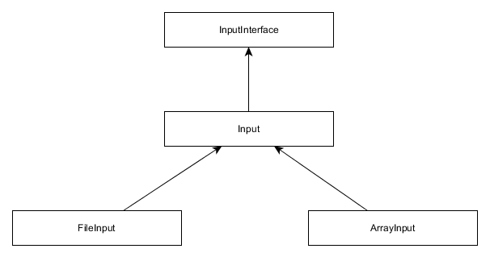

#### Filter Configuration

A typical filter configuration is presented below:

~~~php
[
  'name' => '<filter_name>',
  'priority' => <priority>,
  'options' => [
    // Filter options go here ...
  ]
],
~~~

The `name` key (line 2) is the name for the filter. This may be either
a fully qualified filter class name (e.g. `StringTrim::class`) or an alias (e.g. @`StringTrim`).

The optional `priority` key (line 3) defines filter priority in the list of filters. The priority
must be an integer number. The filters with the highest priority will be applied first. By default,
the `FilterChain::DEFAULT_PRIORITY` constant (value 1000) is assigned.

The `options` array (line 4) is specific to a certain filter and may contain
parameters for configuring the filter.

#### Validator Configuration

A typical validator configuration is presented below:

~~~php
[
  'name' => '<validator_name>',
  'break_chain_on_failure' => <flag>,
  'options' => [
    // Validator options go here ...
  ]
],
~~~

The `name` key (line 2) is the name for the validator. This may be either
a fully qualified validator class name (e.g. `EmailAddress::class`) or an alias
(e.g. @`EmailAddress`).

The `break_chain_on_failure` optional key (line 3) defines the behavior in
case the validator check fails. If this equals to `true`, subsequent validators
in the list will not be executed; otherwise every validator in the list will be executed
without depending on the result of other validators.

The `options` array (line 4) is specific to certain validator class and may contain
parameters for configuring the validator.

### Creating Input Filter for the Contact Form

Now that you have a general idea on know how to define the input filter container
and populate it with filters and validators for each form field, let's complete
our `ContactForm` form model class. Below, we add the `addInputFilter()`
private method, which defines the filtering/validation rules and stores them in input filter container:

~~~php
<?php
// ...
use Laminas\InputFilter\InputFilter;

class ContactForm extends Form
{
  public function __construct()
  {
    // ... call this method to add filtering/validation rules
    $this->addInputFilter();
  }

  // ...

  // This method creates input filter (used for form filtering/validation).
  private function addInputFilter()
  {
    // Get the default input filter attached to form model.
    $inputFilter = $this->getInputFilter();

    $inputFilter->add([
        'name'     => 'email',
        'required' => true,
        'filters'  => [
           ['name' => 'StringTrim'],
        ],
        'validators' => [
           [
            'name' => 'EmailAddress',
            'options' => [
              'allow' => \Laminas\Validator\Hostname::ALLOW_DNS,
              'useMxCheck' => false,
            ],
          ],
        ],
      ]
    );

    $inputFilter->add([
        'name'     => 'subject',
        'required' => true,
        'filters'  => [
           ['name' => 'StringTrim'],
           ['name' => 'StripTags'],
           ['name' => 'StripNewlines'],
        ],
        'validators' => [
           [
            'name' => 'StringLength',
              'options' => [
                'min' => 1,
                'max' => 128
              ],
           ],
        ],
      ]
    );

    $inputFilter->add([
        'name'     => 'body',
        'required' => true,
        'filters'  => [
          ['name' => 'StripTags'],
        ],
        'validators' => [
          [
            'name' => 'StringLength',
            'options' => [
              'min' => 1,
              'max' => 4096
            ],
          ],
        ],
      ]
    );
  }
}
~~~

As you can see from the code above, first we declare the alias for the
@`Laminas\InputFilter\InputFilter` class (line 3).

In the form model's constructor (line 10), we call the `addInputFilter()` method
which we define in lines 16-76.

The `addInputFilter()` method's goal is to add filtering/
validation rules to the `InputFilter` container (lines 21-75). For inserting filtering/validation rules into the
input filter container, we use the `add()` method provided by the `InputFilter` class, which takes the array specification
of an input to create.

We add three inputs (per each field of our form model, except its submit button):

* For the `email` field, we set the `required` flag to `true` to make filling this
  field mandatory. We use the @`StringTrim` filter to remove white spaces from the beginning
  and the end of the E-mail address; and the @`EmailAddress` validator for checking the
  user-entered E-mail address for correctness. We configure the @`EmailAddress` validator
  to allow domain names as E-mail addresses (the `\Laminas\Validator\Hostname::ALLOW_DNS` flag)
  and disable MX record checking (set `useMxCheck` option to `false`).

* For the `subject` field, by analogy, we make it required, and use the @`StringTrim` filter
  to remove white spaces from the beginning and the end. Additionally, we use the @`StripNewlines`
  and @`StripTags` filters to filter out the new line characters and HTML tags, respectively.
  We constrain subject string length to be between 1 and 128 characters in length by using the
  @`StringLength` validator.

* For the `body` field, we require it to be mandatory, and we use the @`StripTags` filter
  to strip HTML tags from E-mail text. We also use the @`StringLength` validator to
  constrain E-mail text to be between 1 and 4096 characters in length.

In figure 7.17, you can find the schematic graphical representation of the input
filter we've created.

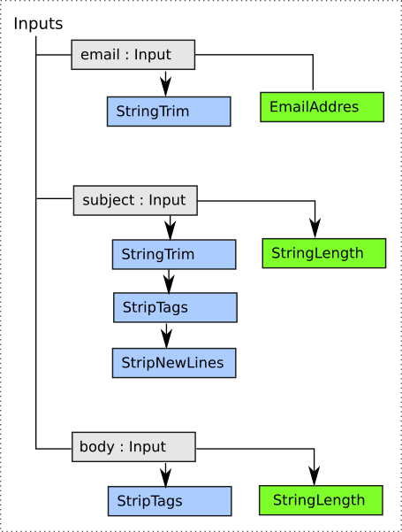

> Above, we briefly described how to create an input filter for the form model.
> For detailed information about the above mentioned (and other) filters and validators and their
> usage examples, please refer to [Transforming Input Data with Filters](#filters) and
[Checking Input Data with Validators](#validators).

## Using the Form in a Controller's Action

When the form model class is ready, you finally can use the form in a
controller's action method.

As you might already know, the way the site user works with form is typically
an iterative process (schematically illustrated by figure 7.18):

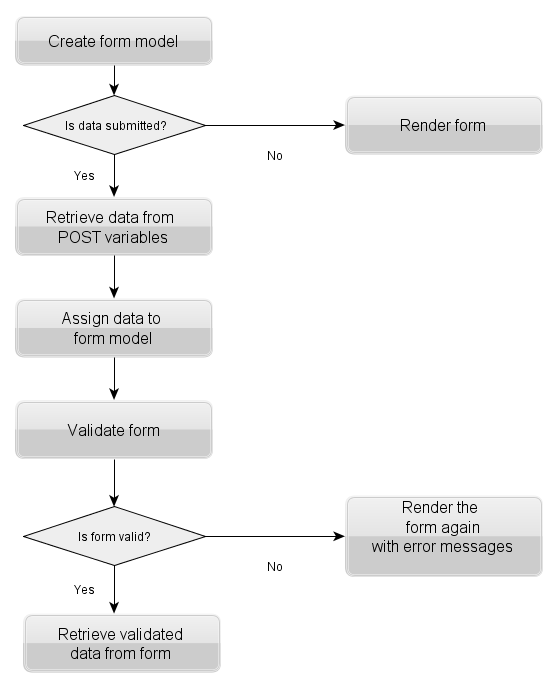

 * First, you display the form and its fields on a web page, prompting user
   for input. Once the user fills the form fields, he clicks the *Submit* button
   and sends the data to server.
 * Next, your controller extracts the submitted
   data and asks the form model to validate it. If there were input errors, you
   display the form again, asking the user to correct input errors. If the data
   is correct, you process the data with your business logic layer and (usually)
   redirect the user to another web page.

The @`Form`[Laminas\Form\Form] base class provides several methods for accomplishing these (see table 7.11).

{title="Table 7.11. Methods provided by the Form base class"}
|--------------------------------|---------------------------------------------------------------|
| *Method name*                  | *Description*                                                 |
|--------------------------------|---------------------------------------------------------------|
| `setData($data)`               | Sets form data for validation.                                |
|----------------------------------|---------------------------------------------------------------|
| `getData($flag)`               | Retrieves the validated data.                                 |
|----------------------------------|---------------------------------------------------------------|
| `isValid()`                    | Validates the form.                                           |
|----------------------------------|---------------------------------------------------------------|
| `hasValidated()`               | Check if the form has been validated.                         |
|----------------------------------|---------------------------------------------------------------|
| `getMessages($elementName = null)`| Returns a list of validation failure messages, if any,     |
|                                | for a single element or for all form elements.                |
|--------------------------------|---------------------------------------------------------------|

So, a generic form usage workflow is the following:

* Check whether the form data has been submitted, and if not, display the form on the web page.

* If the data has been submitted by site user, the raw data
  is retrieved from `POST` (and/or `GET` ) variables in the form of an array.

* The data is assigned to the form model's fields using the form's `setData()` method.

* The filtering and validation is performed using the form's `isValid()` method
  (this results in executing the input filter attached to the form).
  If a certain field(s) is/are invalid, display the form again and ask the user to correct their input.

* As soon as the data has been filtered/validated you retrieve the data from the
  form model using the `getData()` method and can pass the data to other models
  or use it any other way.

The code example below illustrates how to implement this typical workflow in
your controller's action method:

~~~php
<?php
namespace Application\Controller;

use Application\Form\ContactForm;
// ...

class IndexController extends AbstractActionController
{
  // This action displays the feedback form
  public function contactUsAction()
  {
    // Create Contact Us form
    $form = new ContactForm();

    // Check if user has submitted the form
    if($this->getRequest()->isPost())
    {
      // Fill in the form with POST data
      $data = $this->params()->fromPost();
      $form->setData($data);

      // Validate form
      if($form->isValid()) {

        // Get filtered and validated data
        $data = $form->getData();

        // ... Do something with the validated data ...

        // Redirect to "Thank You" page
        return $this->redirect()->toRoute('application', ['action'=>'thankYou']);
      }
    }

    // Pass form variable to view
    return new ViewModel([
          'form' => $form
       ]);
  }
}
~~~

In the code above, we define the `contactUsAction()` action method in the
`IndexController` class (line 10). In the action method, we create an instance
of the `ContactForm` class (line 13).

Then, in line 16, we check whether the request is a POST request (checking
the starting line of HTTP request).

In line 19 we retrieve the raw data submitted by the user. We extract all the POST variables
with the help of the @`Params` controller plugin. The data is returned in the form of an array and
saved into the `$data` variable.

The data submitted by the user may contain mistakes and should be filtered and validated
before further usage. To do that, in line 20 we set the data to the form model with the
`setData()` method provided by the `Form` base class. We validate form data with the
`isValid()` method (line 23), which returns `true` upon successful validation.
If the validation succeeds, we retrieve the validated data using the `getData()`
method (line 26) and then can pass the data to our business logic layer.

Once we have used the validated data, in line 31, we redirect the web user to the
*Thank You* page. The redirect is performed with the @`Redirect` controller plugin.
The @`Redirect` plugin's `toRoute()` method takes two parameters: the first parameter is the
name of the route ("application"), and the second one is the array of parameters
to pass to the router. These identify the web page where you redirect the user.

> We will prepare the controller's action and view template for the *Thank You*
> page a little bit later.

In line 37, we pass the form model through the `$form` variable to the view template. The view template
will access this variable and will use it for rendering the form (and possible
validation errors).

### Passing Form Data to a Model

To give you a real-life example of how you can use the validated data of the feedback form,
in this section we will create a simple `MailSender` model [^service] class which
can be used for sending an E-mail message to an E-mail address. When the user submits the form,
we will validate the form data and pass the validated data to the `MailSender` model and ask
it to send the E-mail message to the recipient.

[^service]: In DDD terms, the `MailSender` can be related to service models, because its goal
            is to manipulate data, not to store data.

> Reading this section is optional and intended mostly for beginners. You may skip it
> and refer directly to the next section *Form Presentation*.

The `MailSender` model will internally use the @`Laminas\Mail` component. The @`Laminas\Mail` component
is a component provided by Laminas Framework and designed to give you the convenient functionality
for composing mail messages (the @`Laminas\Mail\Message` class) and several classes implementing available
transports for sending mail (in this example, we will use the @`Laminas\Mail\Transport\Sendmail` class which
uses the *sendmail* program for delivering E-mails).

> Install the @`Laminas\Mail` component with Composer by typing the following command:
>
> `php composer.phar require laminas/laminas-mail`

> The [sendmail](http://www.sendmail.com/sm/open_source/) program is a free open-source mail transfer agent for Linux/Unix operating systems.
> It accepts messages that a PHP script passes to it, deciding based upon the message header which
> delivery method it should use, and then passes the message through the SMTP protocol to the
> appropriate mail server (like Google Mail) for delivery to the recipient.

Start with creating the *MailSender.php* file under the *Service* directory under the module's
source directory (see figure 7.19 for example).

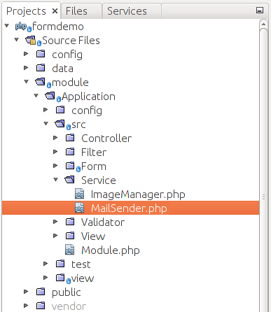

The following is the code that should be put into the *MailSender.php* file:

~~~php
<?php
namespace Application\Service;

use Laminas\Mail;
use Laminas\Mail\Message;
use Laminas\Mail\Transport\Sendmail;

// This class is used to deliver an E-mail message to recipient.
class MailSender
{
  // Sends the mail message.
  public function sendMail($sender, $recipient, $subject, $text)
  {
    $result = false;
    try {

      // Create E-mail message
      $mail = new Message();
      $mail->setFrom($sender);
      $mail->addTo($recipient);
      $mail->setSubject($subject);
      $mail->setBody($text);

      // Send E-mail message
      $transport = new Sendmail('-f'.$sender);
      $transport->send($mail);
      $result = true;
    } catch(\Exception $e) {
      $result = false;
    }

    // Return status
    return $result;
  }
}
~~~

In the code above, we define the `Application\Service` namespace (line 2), because
the `MailSender` class can be related to service models (its goal is to manipulate
data, not to store it).

In lines 4-6, we declare the aliases for the @`Mail`, @`Message`[Laminas\Mail\Message] and @`Laminas\Mail\Transport\Sendmail`
classes provided by the @`Laminas\Mail` component.

In lines 9-35, we define the `MailSender` class. The class has the single method
`sendMail()` (line 12), which takes four arguments: sender's E-mail address, recipient's E-mail address,
message subject and, finally, message body text.

In line 18, we create an instance of the @`Message`[Laminas\Mail\Message] class. We use the methods provided
by this class for composing the message (set its subject, body etc.) in lines 19-22.

In line 25, we create an instance of the @`Sendmail` class, which uses the *sendmail*
program to pass the message to the appropriate mail server (see lines 25-26). Since the classes
provided by the @`Laminas\Mail` component may throw an exception on failure, we enclose the
block of code with the `try`-`catch` exception handler.

The `sendMail()` method will return `true` if the E-mail message sent successfully; otherwise
it will return `false` (line 33).

> Configuring mail system for your web server is a rather complex task. It typically
> requires installing sendmail and configuring the server's MX DNS record to use certain
> mail server (either local mail server, e.g. [Postfix](http://www.postfix.org/),
> or remote server, like Google Mail).
> Because of the complexity of the topic, it is not discussed in this book. You can find
> additional information on configuring mail for your particular system online.

Now, register the `MailSender` service in your `module.config.php` file as follows:

~~~php
return [
    //...
    'service_manager' => [
        'factories' => [
            Service\MailSender::class => InvokableFactory::class,
        ],
    ],

    //...
];
~~~

Later, you can instantiate the `MailSender` model in your `IndexController::contactUsAction()`
method and pass it the validated form data.

> Because we use the `MailSender` service in our controller, this service is a *dependency* for the controller.
> So, we will need to create a factory for the controller and *inject* the dependency into controller's constructor.
> Looks complex at the first sight, but as you improve your skills, you will find this is rather simple and greatly
> improves the structure of your code.

Let's create the factory for the `IndexController` (put it into the `Factory` subdirectory under the `Controller` subdirectory).
You can see that the only work of the factory class is creating the controller and passing it the dependency.

~~~php
<?php
namespace Application\Controller\Factory;

use Interop\Container\ContainerInterface;
use Laminas\ServiceManager\Factory\FactoryInterface;
use Application\Service\MailSender;
use Application\Controller\IndexController;

class IndexControllerFactory
{
    public function __invoke(ContainerInterface $container,
                             $requestedName, array $options = null)
    {
        $mailSender = $container->get(MailSender::class);

        // Instantiate the controller and inject dependencies
        return new IndexController($mailSender);
    }
}
~~~

Modify the `module.config.php` file to use the custom factory we have just created:

~~~php
return [
    //...
    'controllers' => [
        'factories' => [
            Controller\IndexController::class => Controller\Factory\IndexControllerFactory::class,
        ],
    ],

    //...
];
~~~

Next, add the constructor, the `contactUsAction()`, `thankYouAction()` and `sendErrorAction()`
methods to the controller. Below, the complete code is presented:

~~~php
<?php
// ...
use Application\Service\MailSender;

class IndexController extends AbstractActionController
{
  private $mailSender;

  public function __construct($mailSender)
  {
    $this->mailSender = $mailSender;
  }

  public function contactUsAction()
  {
    // Create Contact Us form
    $form = new ContactForm();

    // Check if user has submitted the form
    if($this->getRequest()->isPost()) {

      // Fill in the form with POST data
      $data = $this->params()->fromPost();

      $form->setData($data);

      // Validate form
      if($form->isValid()) {

        // Get filtered and validated data
        $data = $form->getData();
        $email = $data['email'];
        $subject = $data['subject'];
        $body = $data['body'];

        // Send E-mail
        if(!$this->mailSender->sendMail('no-reply@example.com', $email,
                        $subject, $body)) {
          // In case of error, redirect to "Error Sending Email" page
          return $this->redirect()->toRoute('application',
                        ['action'=>'sendError']);
        }

        // Redirect to "Thank You" page
        return $this->redirect()->toRoute('application',
                        ['action'=>'thankYou']);
      }
    }

    // Pass form variable to view
    return new ViewModel([
      'form' => $form
    ]);
  }

  // This action displays the Thank You page. The user is redirected to this
  // page on successful mail delivery.
  public function thankYouAction()
  {
    return new ViewModel();
  }

  // This action displays the Send Error page. The user is redirected to this
  // page on mail delivery error.
  public function sendErrorAction()
  {
    return new ViewModel();
  }
}
~~~

As you can see from the code above, we do the following:

* In line 3, we declare an alias for `Application\Service\MailSender` class.
  This will allow you to refer to the model class by its short name.

* In lines 32-34, after we've validated the form, we extract the validated
  field values into the `$email`, `$subject` and `$body` PHP variables.

* In line 37, we call the `sendMail()` method of the `MailSender` service and pass it four parameters:
  the sender's address (here we use "no-reply@example.com", but you can replace
  this with the address of your *sendmail*); the recipient's E-mail address,
  the E-mail subject and body.

* If mail has been sent successfully (if the `sendMail()` method returned `true`), we
  redirect the user to the *Thank You* page (line 45). On failure (if `sendMail()`
  method returned `false`), we redirect the user to the *Send Error* page (line 40).

* In lines 58-61, we have the `thankYouAction()` method which displays the
  *Thank You* page. This page is shown if the E-mail message is sent successfully.

* In line 65-68, we have the `sendErrorAction()` method which shows the
  *Error Sending Email* page. This page is shown on E-mail delivery failure.

## Form Presentation

When your controller's action is ready, all you have to do is prepare the `.phtml`
view template file to display your form on a web page. In the view template, you need
to define the markup using `<form>`, `<label>`, `<input>`, and possibly other HTML tags.

Additionally, you will have to display error messages if the form validation
failed. Because this work is rather boring, Laminas Framework provides you
with special view helpers intended for rendering the form.

> For simple forms (which do not show error messages), you can use raw HTML tags
> for rendering the form and ignore laminas-provided form view helpers.
> But, form view helpers are really unavoidable
> when rendering complex forms that may display validation errors and/or add
> fields dynamically.

### Preparing the Form Model for Rendering

Before rendering, it is required that you call the `prepare()` method on the form model's
instance (see table 7.12). If you forget to call this method, there may be undesired
effects.

{title="Table 7.12. Methods provided by the Form base class"}
|--------------------------------|---------------------------------------------------------------|
| *Method name*                  | *Description*                                                 |
|--------------------------------|---------------------------------------------------------------|
| `prepare()`                    | Ensures the form state is ready for use.                      |
|--------------------------------|---------------------------------------------------------------|

The `prepare()` method does the following form model preparations:

  * It calls the input filter container attached to the form model,
    to ensure validation error messages are available;
  * It prepares any elements and/or fieldsets that require preparation [^wrapping].

[^wrapping]: Typically, this results in wrapping field names with the form/fieldset name
             (for example, the "email" field's name will become "contact-form[email]")
             which technically results in a more convenient field grouping in a HTTP
             request body.

## Standard Form View Helpers

Standard form view helpers provided by Laminas are shown in tables 7.13 - 7.16 below. These classes
live in the @`Laminas\Form\View\Helper`[Laminas\Form] namespace. As you can see from the table,
the view helpers can be divided into the following categories:

* *Generic form view helpers.* These classes are designed to render the
  whole form (@`Form`[Laminas\Form\View\Helper\Form] helper) or its single element (@`FormElement` helper)
  and possible validation errors (@`FormElementErrors` helper).

* *View helpers for rendering HTML fields of certain types.* These allow you to generate HTML
  markup for concrete form fields (e.g. @`FormButton`, @`FormRadio`, etc.)
  and a text label (@`FormLabel`).

* *View helpers for rendering form fields introduced in HTML5.* These are
  analogous to the view helpers from the previous category, but intended for
  rendering HTML5 fields (e.g. @`FormDate`, @`FormUrl`, etc.)

* *Other view helpers.* In this category, we can put the view helper classes designed for rendering
  laminas-specific fields, like @`FormMultiCheckbox`, @`FormCaptcha`, etc.

{title="Table 7.13. View helpers designed for using with forms"}
|----------------------------------|---------------------------------------------------------------|
| *Method name*                    | *Description*                                                 |
|----------------------------------|---------------------------------------------------------------|
| *Generic helpers*                |                                                               |
|----------------------------------|---------------------------------------------------------------|
| @`Form`[Laminas\Form\View\Helper\Form]                           | Renders the entire form and all its elements.                 |
|----------------------------------|---------------------------------------------------------------|
| @`FormElement`                    | Renders a generic form element.                               |
|----------------------------------|---------------------------------------------------------------|
| @`FormElementErrors`              | Renders validation errors for a form element.                 |
|----------------------------------|---------------------------------------------------------------|
| @`FormRow`                        | Renders the label, the field and validation errors.           |
|----------------------------------|---------------------------------------------------------------|

{title="Table 7.14. HTML 4 field helpers"}
|----------------------------------|---------------------------------------------------------------|
| *Method name*                    | *Description*                                                 |
|----------------------------------|---------------------------------------------------------------|
| @`FormButton`                     | Renders the `<button>` form field.                            |
|----------------------------------|---------------------------------------------------------------|
| @`FormCheckbox`                   | Renders the `<input type="checkbox">` field.                  |
|----------------------------------|---------------------------------------------------------------|
| @`FormFile`                       | Renders the `<input type="file">` form field.                 |
|----------------------------------|---------------------------------------------------------------|
| @`FormHidden`                     | Renders the `<input type="hidden">` form field.               |
|----------------------------------|---------------------------------------------------------------|
| @`FormInput`                      | Renders an `<input>` form field.                              |
|----------------------------------|---------------------------------------------------------------|
| @`FormImage`                      | Renders the `<input type="image">` form field.                |
|----------------------------------|---------------------------------------------------------------|
| @`FormLabel`                      | Renders the `<label>` tag.                                    |
|----------------------------------|---------------------------------------------------------------|
| @`FormPassword`                   | Renders the `<input type="password">` form field.             |
|----------------------------------|---------------------------------------------------------------|
| @`FormRadio`                      | Renders the `<input type="radio">` form field.                |
|----------------------------------|---------------------------------------------------------------|
| @`FormReset`                      | Renders the `<input type="reset">` form field.                |
|----------------------------------|---------------------------------------------------------------|
| @`FormSelect`                     | Renders the `<select>` dropdown field.                        |
|----------------------------------|---------------------------------------------------------------|
| @`FormSubmit`                     | Renders the `<input type="submit">` form field.               |
|----------------------------------|---------------------------------------------------------------|
| @`FormText`                       | Renders the `<input type="text">` form field.                 |
|----------------------------------|---------------------------------------------------------------|
| @`FormTextarea`                   | Renders the `<textarea>` multi-line text field.               |
|----------------------------------|---------------------------------------------------------------|

{title="Table 7.15. HTML 5 field helpers"}
|----------------------------------|---------------------------------------------------------------|
| *Method name*                    | *Description*                                                 |
|----------------------------------|---------------------------------------------------------------|
| @`FormColor`                      | Renders the `<input type="color">` HTML5 form field.          |
|----------------------------------|---------------------------------------------------------------|
| @`FormDate`                       | Renders the `<input type="date">` HTML5 form field.           |
|----------------------------------|---------------------------------------------------------------|
| @`FormDateTime`                   | Renders the `<input type="date">` HTML5 form field.           |
|----------------------------------|---------------------------------------------------------------|
| @`FormDateTimeLocal`              | Renders the `<input type="datetime-local">` HTML5 form field. |
|----------------------------------|---------------------------------------------------------------|
| @`FormEmail`                      | Renders the `<input type="email">` HTML5 form field.          |
|----------------------------------|---------------------------------------------------------------|
| @`FormMonth`                      | Renders the `<input type="month">` HTML5 form field.          |
|----------------------------------|---------------------------------------------------------------|
| @`FormNumber`                     | Renders the `<input type="number">` HTML5 form field.         |
|----------------------------------|---------------------------------------------------------------|
| @`FormRange`                      | Renders the `<input type="range">` HTML5 form field.          |
|----------------------------------|---------------------------------------------------------------|
| @`FormTel`                        | Renders the `<input type="tel">` HTML5 form field.            |
|----------------------------------|---------------------------------------------------------------|
| @`FormTime`                       | Renders the `<input type="time">` HTML5 form field.           |
|----------------------------------|---------------------------------------------------------------|
| @`FormUrl`                        | Renders the `<input type="url">` HTML5 form field.            |
|----------------------------------|---------------------------------------------------------------|
| @`FormWeek`                       | Renders the `<input type="week">` HTML5 form field.           |
|----------------------------------|---------------------------------------------------------------|

{title="Table 7.16. Other helpers"}
|----------------------------------|---------------------------------------------------------------|
| *Method name*                    | *Description*                                                 |
|----------------------------------|---------------------------------------------------------------|
| @`FormCaptcha`                    | Renders the CAPTCHA security field.                           |
|----------------------------------|---------------------------------------------------------------|
| @`FormDateSelect`                 | Renders the date select field.                                |
|----------------------------------|---------------------------------------------------------------|
| @`FormDateTimeSelect`             | Renders the datetime select field.                            |
|----------------------------------|---------------------------------------------------------------|
| @`FormMonthSelect`                | Renders the month select field.                               |
|----------------------------------|---------------------------------------------------------------|
| @`FormMultiCheckbox`              | Renders the multi checkbox field.                             |
|----------------------------------|---------------------------------------------------------------|
| @`FormCollection`                 | Renders the collection of elements.                           |
|----------------------------------|---------------------------------------------------------------|

In the next sections, we will provide an overview of several frequently used form view helpers
and their usage examples.

### Rendering a Form Element

You can render a form field with the @`FormElement` view helper. It is designed to be as flexible
as possible and recognize as many field types as possible. So, with this view helper
you are able to produce HTML markup for text fields, buttons, dropdown lists and so on.

The methods provided by this view helper are listed in table 7.17.

{title="Table 7.17. Methods provided by the FormElement view helper"}
|----------------------------------|---------------------------------------------------------------|
| *Method name*                    | *Description*                                                 |
|----------------------------------|---------------------------------------------------------------|
| `render($element)`               | PHP magic method which renders the given form field.          |
|----------------------------------|---------------------------------------------------------------|
| `__invoke($element)`             | PHP magic method which renders the given form field           |
|                                  | (the effect is the same as `render()`).                       |
|----------------------------------|---------------------------------------------------------------|

As you can see, there are two methods doing the same thing:

  * The `render()` method produces the HTML markup for the
    form field. It accepts the single argument -- the instance of the element to render. You can
    retrieve the form element with the form model's `get()` method (see example below).
  * The `__invoke()` method is a convenience wrapper which results in less code to write.

~~~php
<?php
// We assume that the form model is stored in $form variable.
// Render the E-mail field with the render() method.
echo $this->formElement()->render($form->get('email')); ?>

// The same, but with __invoke
echo $this->formElement($form->get('email'));
~~~

When executed, the code above will generate the HTML code as follows:

~~~html
<input type="text" name="email" id="email" value="">
~~~

> Typically, there is no need to call view helpers for concrete HTML (or HTML5)
> fields (e.g. @`FormText`, @`FormSubmit`, etc.)
> Instead, you can use the generic @`FormElement` view helper which determines the
> field type automatically and produces the needed HTML code.

### Rendering an Element's Validation Errors

The @`FormElementErrors` view helper class allows you to produce HTML markup for
field validation errors (if present). If there are no validation errors for
certain element, this view helper does not produce any output.

An example of using the @`FormElementErrors` view helper is presented below:

~~~php
<?php
// We assume that the form model is stored in $form variable.
// Render validation errors for the E-mail field.
echo $this->formElementErrors($form->get('email'));
~~~

If there were any validation errors, this code will generate the unordered list
of errors using the `<ul>` HTML tag, and the list will contain as many items as
there are errors for certain field. An example of such list for the E-mail field
of our feedback form is presented below:

~~~html
<ul>
  <li>&#039;hostname&#039; is not a valid hostname for the email address</li>
  <li>The input does not match the expected structure for a DNS hostname</li>
  <li>The input appears to be a local network name but local network names are not allowed</li>
</ul>
~~~

### Rendering an Element's Label

The @`FormLabel` helper allows you to render the text label for an element:

~~~php
<?php
// We assume that the form model is stored in $form variable.
// Render text label for the E-mail field.
echo $this->formLabel($form->get('email'));
~~~

When executed, the code above will generate the HTML code as follows:

~~~html
<label for="email">Your E-mail</label>
~~~

### Rendering a Form Row

The @`FormRow` view helper is designed to simplify the rendering of a form field,
it's label, and validation errors. With this class, you are able to render these
in a single step. This helper is flexibly configurable, so you can apply a different
decoration to the form row. The methods of this view helper class are listed in table 7.18.

{title="Table 7.18. Methods provided by the FormRow view helper"}
|----------------------------------------|---------------------------------------------------------|
| *Method name*                          | *Description*                                           |
|----------------------------------------|---------------------------------------------------------|
| `render($element)`                     | Renders the form row.                                   |
|----------------------------------------|---------------------------------------------------------|
| `__invoke($element, $labelPosition, $renderErrors, $partial)` | Renders the form row (convenience wrapper). |
|----------------------------------------|---------------------------------------------------------|
| `setInputErrorClass($inputErrorClass)` | Sets input error CSS class.                             |
|----------------------------------------|---------------------------------------------------------|
| `setLabelAttributes($labelAttributes)` | Sets label attributes.                                  |
|----------------------------------------|---------------------------------------------------------|
| `setLabelPosition($labelPosition)`     | Sets label position (before or after the field).        |
|----------------------------------------|---------------------------------------------------------|
| `setRenderErrors($renderErrors)`       | Set if the errors are rendered by this helper.          |
|----------------------------------------|---------------------------------------------------------|
| `setPartial($partial)`                 | Set a partial view script to use for rendering the row. |
|----------------------------------------|---------------------------------------------------------|

An example of using the @`FormRow` view helper is presented below:

~~~php
<?php
// We assume that the form model is stored in $form variable.
// Render the E-mail field, its label and (possible) validation errors.
echo $this->formRow($form->get('email'));
~~~

When executed, the code above will generate the HTML code as follows:

~~~html
<label for="email">Your E-mail</label>
<input type="text" name="email" id="email">
<ul>
  <li>&#039;hostname&#039; is not a valid hostname for the email address</li>
  <li>The input does not match the expected structure for a DNS hostname</li>
  <li>The input appears to be a local network name but local network names
      are not allowed</li>
</ul>
~~~

### Rendering the Entire Form

The @`Form`[Laminas\Form\View\Helper\Form] view helper allows you to render the opening `<form>` tag and its attributes;
and the closing `</form>` tag. But its major purpose is to render the entire form and
all of its fields with a single line of code. Public methods of the `Form`[Laminas\Form\View\Helper\Form] view helper
class are summarized in table 7.19.

{title="Table 7.19. Methods provided by the Form view helper"}
|----------------------------------|---------------------------------------------------------------|
| *Method name*                    | *Description*                                                 |
|----------------------------------|---------------------------------------------------------------|
| `render($form)`                  | Renders the entire form and all its elements.                 |
|----------------------------------|---------------------------------------------------------------|
| `__invoke($form)`                | PHP magic method which renders the entire form and all its    |
|                                  | elements (the effect is the same as `render()`).              |
|----------------------------------|---------------------------------------------------------------|
| `openTag($form)`                 | Renders the opening `<form>` tag.                             |
|----------------------------------|---------------------------------------------------------------|
| `closeTag()`                     | Renders the closing `</form>` tag.                            |
|----------------------------------|---------------------------------------------------------------|

You can render the whole form with the help of the @`Form`[Laminas\Form\Form]'s `render()` method as follows:

~~~php
// We assume that the form model is stored in $form variable

// Render the whole form
echo $this->form()->render($form);
~~~

The same effect can be achieved with the `__invoke` magic method (see example below):

~~~php
// The same, but with `__invoke`
echo $this->form($form);
~~~

## Example: Creating the View Template for the Contact Form

Now we are ready to define the presentation for our feedback form.
If you remember, earlier we added the *contact-us.phtml*
view template in *application/index/* directory under the module's
*view/* directory. Replace the code in that file with the following:

~~~php
<?php
$form = $this->form;
$form->prepare();
?>

<?= $this->form()->openTag($form); ?>

<?= $this->formLabel($form->get('email')); ?>
<?= $this->formElement($form->get('email')); ?>
<?= $this->formElementErrors($form->get('email')); ?>

<?= $this->formLabel($form->get('subject')); ?>
<?= $this->formElement($form->get('subject')); ?>
<?= $this->formElementErrors($form->get('subject')); ?>

<?= $this->formLabel($form->get('body')); ?>
<?= $this->formElement($form->get('body')); ?>
<?= $this->formElementErrors($form->get('body')); ?>

<?= $this->formElement($form->get('submit')); ?>

<?= $this->form()->closeTag(); ?>
~~~

As you can see from the code above, we do the following things to render the form:

* In line 2, we access the `$form` variable passed from the controller's action.

* In line 3, we call the @`Form`[Laminas\Form\Form]'s `prepare()` method to prepare the form for rendering.
  Please note that calling this method is very important. If you forget to do that,
  there may be some undesired rendering problems.

* In line 6, we call the `openTag()` method of the @`Form`[Laminas\Form\View\Helper\Form] view helper. Its purpose is
  to render the opening `<form>` tag and its attributes. The method takes a single
  argument -- an instance of the form model. Paired closing `</form>` tag
  is rendered in line 22 with the help of the `closeTag()` method of the @`Form`[Laminas\Form\View\Helper\Form] view
  helper.

* In lines 8-10, we render the E-mail field's label, the text field itself and (possible)
  validation errors with the help of the @`FormLabel`, @`FormElement` and @`FormElementErrors`
  view helpers. Those helpers take the instance of the form model's element as a single argument. We
  get an instance of the element with the `get()` method provided by the @`Form`[Laminas\Form\Form] base class.

* In lines 12-14, by analogy, we render the Subject field, its label and validation errors.

* And in lines 16-18, we render the label, the field and the validation errors for the
  body text area field.

* In line 20, we render the *Submit* button.

When the view template renderer evaluates this code, it will produce the HTML output like below:

~~~html
<form action="/contact" method="post" name="contact-form">
  <label for="email">Your E-mail</label>
  <input type="text" name="email" id="email" value="">

  <label for="subject">Subject</label>
  <input name="subject" type="text" id="subject" value="">

  <label for="body">Message Body</label>
  <textarea name="body" id="body"></textarea>

  <input name="submit" type="submit" value="Submit">
</form>
~~~

> In the code above, we mostly used the @`FormElement`, @`FormElementErrors`
> and @`FormLabel` view helpers. You may use the generic @`FormRow` or @`Form`[Laminas\Form\View\Helper\Form] view
> helpers if you want to reduce the amount of code to write, but this
> may result in less control of form decoration.

If certain fields have validation errors, those errors will be
outputted below the field in the form of the `<ul>` unordered HTML list.
For example, if you enter the "123@hostname" into E-mail form field,
you would receive the following validation errors:

~~~html
<label for="email">Your E-mail</label>
<input type="text" name="email" value="123@hostname">
<ul>
  <li>&#039;hostname&#039; is not a valid hostname for the email address</li>
  <li>The input does not match the expected structure for a DNS hostname</li>
  <li>The input appears to be a local network name but local network names
      are not allowed</li>
</ul>
~~~

### Applying the Bootstrap CSS Styles to Form

The HTML markup above is missing CSS styling. What we want to achieve is to use
Twitter Bootstrap CSS classes to give the form a nice, professional-looking
appearance. To add Bootstrap styling to the form, you have to modify the code in the *.phtml*
file to make it look like below:

~~~php
<?php
$form = $this->form;
$form->prepare();

$form->get('email')->setAttributes([
  'class'=>'form-control',
  'placeholder'=>'name@example.com'
  ]);

$form->get('subject')->setAttributes([
  'class'=>'form-control',
  'placeholder'=>'Type subject here'
  ]);

$form->get('body')->setAttributes([
  'class'=>'form-control',
  'rows'=>6,
  'placeholder'=>'Type message text here'
  ]);

$form->get('submit')->setAttributes(['class'=>'btn btn-primary']);
?>

<h1>Contact Us</h1>

  Please fill out the following form to contact us.
  We appreciate your feedback.

  

    <?= $this->form()->openTag($form); ?>

    

      <?= $this->formLabel($form->get('email')); ?>
      <?= $this->formElement($form->get('email')); ?>
      <?= $this->formElementErrors($form->get('email')); ?>
    

    

      <?= $this->formLabel($form->get('subject')); ?>
      <?= $this->formElement($form->get('subject')); ?>
      <?= $this->formElementErrors($form->get('subject')); ?>
    

    

      <?= $this->formLabel($form->get('body')); ?>
      <?= $this->formElement($form->get('body')); ?>
      <?= $this->formElementErrors($form->get('body')); ?>
    

    <?= $this->formElement($form->get('submit')); ?>

    <?= $this->form()->closeTag(); ?>
  

~~~

In the code above, we added the `.form-control` CSS class to every
input field in the form. We did that with the `setAttribute()` method (see lines 5, 10 and 15).
With that method, we also added the "placeholder" attribute to define the
nice-looking placeholder text when a field is empty. For the "body" field,
we added the "rows" attribute defining the height of the field (6 rows).

For the form's *Submit* button, we use the `.btn` and `.btn-primary`
CSS classes (see line 21).

We also put label-input pairs inside of `
` elements with `.form-group`
CSS class (lines 35, 41, 47).

We put a form inside of the 6-column-width grid cell, which makes the form half
the width of the screen (look at lines 31-32).

> Sometimes it is impossible to use Twitter Bootstrap styling with standard Laminas form view helpers.
> For example, standard view helpers @`FormCheckbox` and @`FormRadio` can't be tweaked to support
> Bootstrap styles. Fortunately, there is a third-party module [neilime/zf2-twb-bundle](https://github.com/neilime/zf2-twb-bundle)
> that you can install with Composer (do not be confused with module's name - it supports Laminas as well). This module provides convenient view helpers for rendering Laminas forms
> and applying Bootstrap styling to them. It works transparently, so once you installed the module, standard Laminas form view helpers
> become replaced with module-provided form view helpers, so you don't need to change your view template code.

### Styling the Validation Errors List

The error messages on your form, by default, look like a typical unordered list (`<ul>`). To
give them a nice visual appearance, we add a couple of CSS rules to the *style.css* file
in *APP_DIR/public* directory:

~~~css
form ul {
  list-style-type: none;
  padding: 0px;
  margin: 0px 5px;
}

form ul li {
  color: red;
}
~~~

The CSS rules above will remove bullets from the list and make
validation error messages appear in red.

### Adding the "Thank You" & "Error Sending Email" Pages

The last small thing we will do is preparing the view templates
for the "Thank You" and "Error Sending Email" pages.

Add the *thank-you.phtml* view template in *application/index/* directory under
the module's *view/* directory. Put the following HTML markup into the view template file:

~~~html
<h1>Thank You!</h1>

  

    We will respond to the E-mail address you have provided.
  

~~~

Next, add the *send-error.phtml* view template file.
The HTML markup for the *Error Sending Email* page is presented below:

~~~html
<h1>Error Sending Email!</h1>

  

    Sorry, but we had an unexpected problem when trying to deliver
    your message. Please try again later.
  

~~~

### Results

Congratulations! Now, if you open the "http://localhost/contactus"
URL in your web browser, you should see a page like that shown in figure 7.20.

{width=80%}
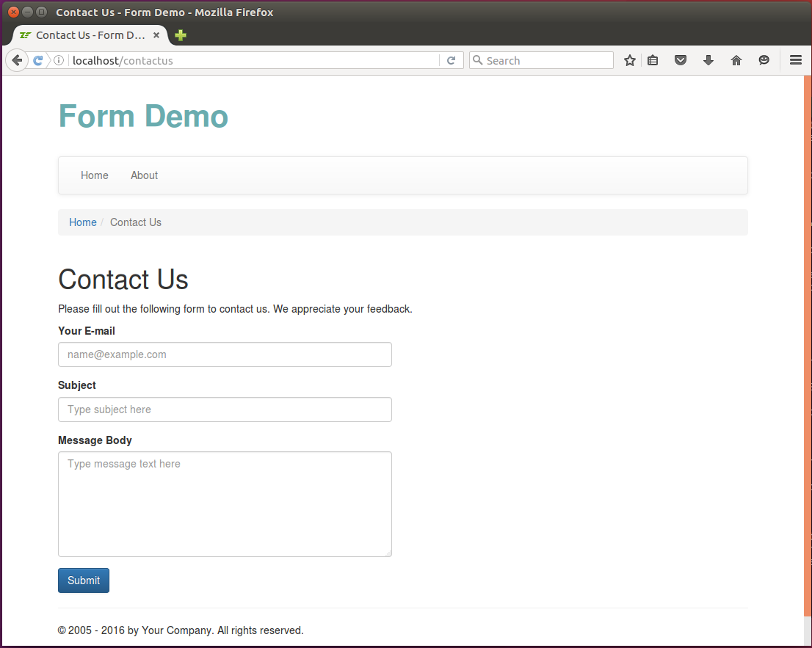

If you enter some invalid data in the form and click the Submit button, you should
see the validation errors (figure 7.21).

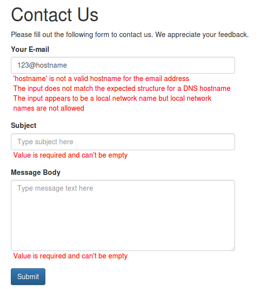

Entering the correct E-mail, subject and message text and submitting the
form results in sending the message and displaying the *Thank You* page (see figure 7.22).

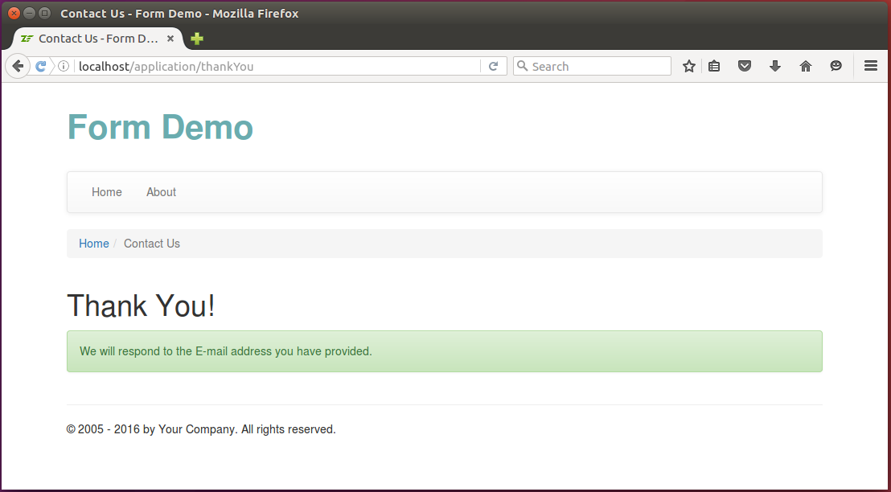

On a sending failure, you will see the *Error Sending Email* page (see figure 7.23 for example):

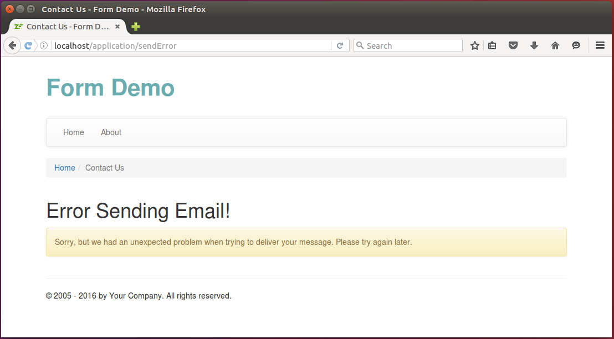

> You can see the *Contact Us* form in action in the *Form Demo* sample
> application bundled with this book.

## Summary

Forms are the way of collecting user-entered data on web pages. A form usually
consists of elements (input field + label pairs). Elements can optionally be
grouped into fieldsets.

In an MVC-based web site, form functionality is separated into form models
responsible for element definition and validation, and form presentation
implemented with the help of special view helpers.

To create a form model, you write a class deriving from the @`Form`[Laminas\Form\Form] base class.
The form model is initialized by adding its elements with the help of the base
class-provided methods.

To submit form data to the server, the user clicks the *Submit* button, then the data
is sent as part of a HTTP request. Once the user submits the form, you can extract the
form data in your controller and ask the form model to validate it.

For checking and filtering the user-entered data, filters and validators
are utilized. You use the @`InputFilter`[Laminas\InputFilter\InputFilter] class which is the container for validation
rules.

If there are input errors, you display the form again, asking the user to correct the
input errors. If the data is correct, you process the data with your business logic layer.
