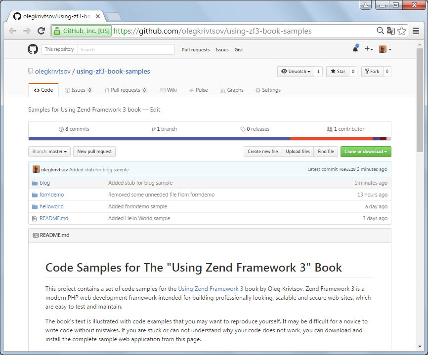

# Preface

"Using Laminas Framework" is a free and open-source book about programming
web applications with Laminas Framework. This book uses [Creative Commons Attribution-NonCommercial-ShareAlike](https://creativecommons.org/licenses/by-nc-sa/4.0/) license.

## About Laminas

Laminas is a modern PHP framework
intended for building professional, scalable and secure websites.
Such websites are easy to test and maintain. The framework utilizes the best
practices and common design patterns inspired by the evolution of the web development
industry. This includes the *Model-View-Controller* pattern allowing an application's code to be organized in a consistent and standard way.

The Laminas Framework started as Zend Framework. After Zend Framework version 3 it got renamed to Laminas.

## About this Book

This book is not only about Laminas Framework, but also about closely related
libraries. Although Laminas Framework has a dedicated component for accessing the
database, in this book we use a third-party library called Doctrine ORM which is a de-facto
standard object-oriented way to perform database management. In the sample applications we will create in chapters of this
book, Twitter Bootstrap CSS Framework is used to produce nicely styled and laid out web pages.

This book was initially written by Oleg Krivtsov as a Zend 3 book. As nobody took care of it Raffael Luthiger took over and rewrote it as a Laminas book.

## Intended Audience

This book is intended for web developers involved in the development of web-based applications in PHP.
The author strives to start with simple things that a beginner should
understand. Advanced things go last in a chapter. This makes this book the first book about Laminas
Framework that is easy to read and understand for a newbie.
You do not need to be a guru in design patterns to understand most of the content.

To read and understand this book, you need to have a basic knowledge of PHP.
A good point for learning PHP is [its official website](http://php.net/) and the on-line
[documentation](http://php.net/docs.php). It would be good if you have some understanding of HTTP requests, GET and POST variables, namespaces, classes and interfaces.

Because PHP is closely related to other web technologies, it is also recommended that
you have some basic experience in the following:

 * HTML (Hyper Text Markup Language) -- used for creating web pages that
   can be displayed in a web browser.
 * CSS (Cascading Style Sheets) -- used for defining the look and feel
   of a web page, like font size or background color.
 * JavaScript -- a client-side scripting language used for making a web
   page more interactive.

For learning HTML, CSS and JavaScript, a good starting point is
[W3Schools Tutorials](http://www.w3schools.com/).

## Examples and Source Code

This book's text is illustrated with code samples. Each sample is a complete website you can install and run yourself to
see Laminas Framework in action. You can even use the samples as a base for your own websites.

All the source code is stored on GitHub. The code is publicly available, and you can download the entire code
archive by visiting [this page](https://github.com/olegkrivtsov/using-laminas-book-samples).
To download the archive, click the *Clone or Download* button that can be found on the page
(see the figure below). (Attention: This is still the link to the original code where it is still every "Zend".)

The structure of the code archive is presented below.

~~~text
using-laminas-book-samples
	blog
	helloworld
	formdemo
	...
~~~

## Your Feedback

Thank you for reading this book and helping to make it better. You are encouraged to point out errors and
make suggestions and critical remarks. You can edit the code of this book directly on github with the buttons
on the top of each page. Furthermore you can write to the current maintainer through his e-mail address
(`r.luthiger@huanga.com`). Your feedback is highly appreciated.

## About the Original Author

Oleg Krivtsov is a C++ and PHP developer. He has been developing software professionally
since 2005. Oleg is a Certified Laminas Framework 2 Architect
and a Certified MySQL Developer. He likes contributing to open-source and writing programming articles for
popular web resources, like CodeProject. This writing passion has also inspired him to create this book
about Laminas Framework. Oleg also loves skiing and watching Formula 1.

You can contact Oleg through his e-mail address (`olegkrivtsov@gmail.com`).
