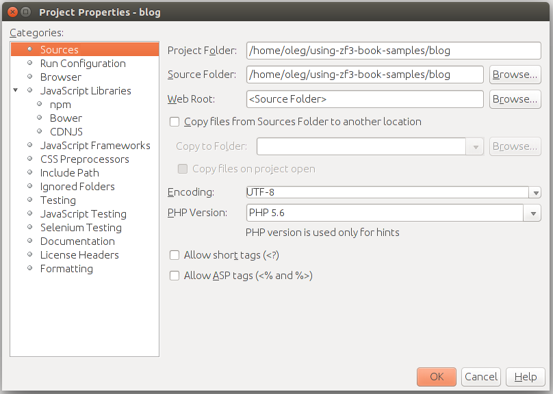
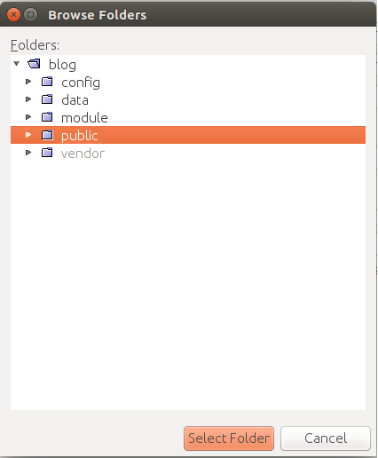
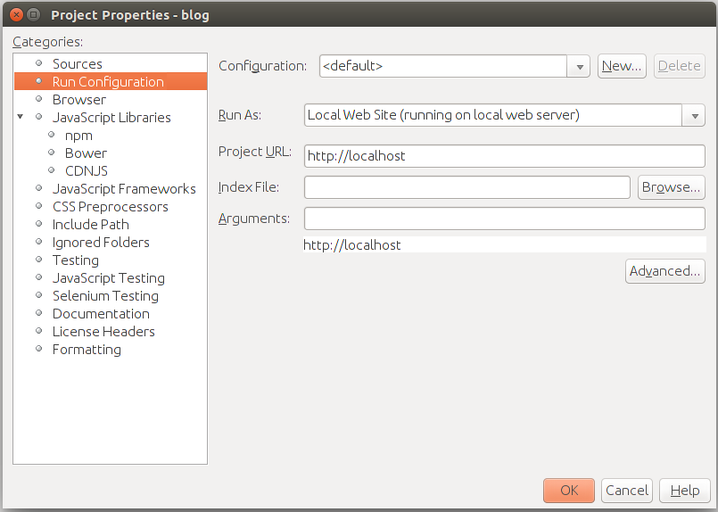
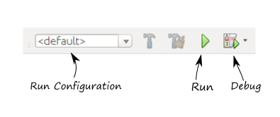
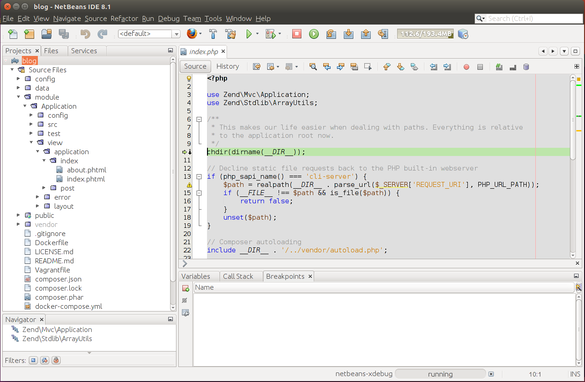
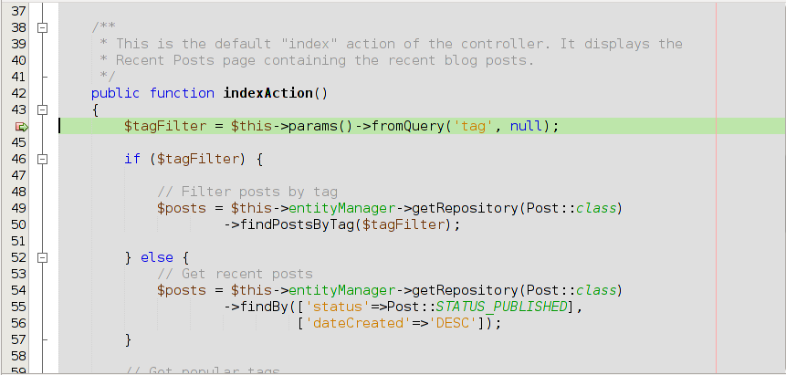
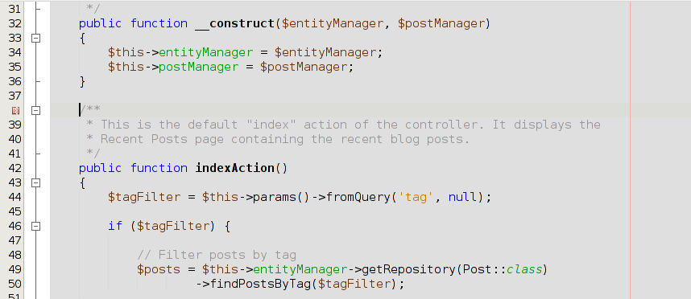
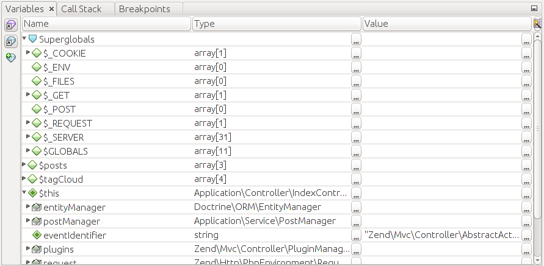
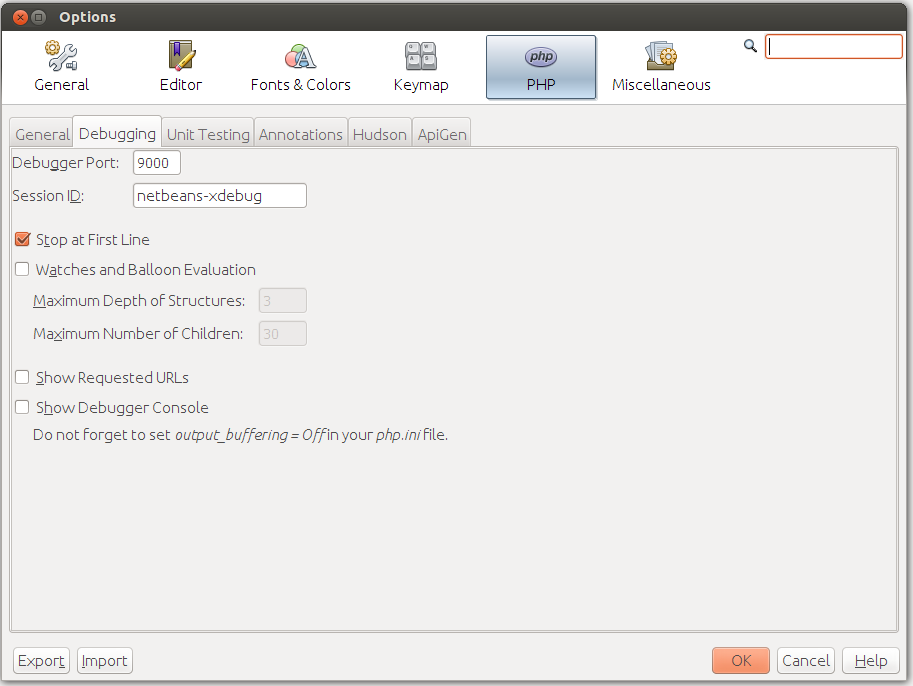
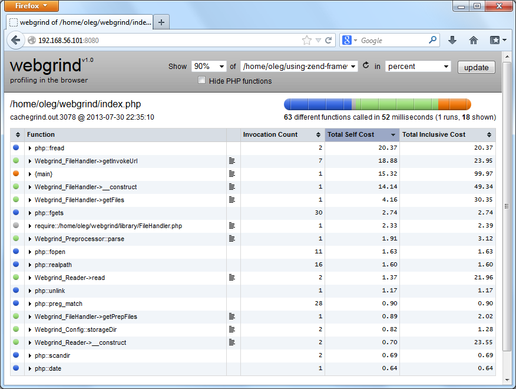

# Appendix B. Introduction to PHP Development in NetBeans IDE

In this book, we use NetBeans IDE for developing Laminas Framework
based applications. In [Appendix A. Configuring Web Development Environment](#devenv), we have installed NetBeans IDE.
Here we will provide some useful tips on using NetBeans for PHP programming.
We will learn how to launch and interactively debug a laminas-based website.

> *What if I want to use another IDE (not NetBeans) for developing my applications?*
>
> Well, you can use any IDE you want. The problem is that it is impossible to cover
> all IDEs for PHP development in this book. The author only provides instructions
> for NetBeans IDE. It would be easier for a beginner to use NetBeans IDE. Advanced
> developers may use an IDE of their choices.

## Run Configuration

To be able to run and debug a website, you first need to edit the
site's properties. To do that, in NetBeans' *Projects* pane, right-click
on the project's name, and from context menu select *Properties* item.
The project's *Properties* dialog will appear (shown in figure B.1).

In the left pane of the dialog that appears, click the *Sources* node. In the right pane,
edit the *Web Root* field to point to your website's *APP_DIR/public* directory.
You can do this by clicking the *Browse* button to the right of the field. Then,
in the dialog, click on the *public* directory and then click *Select Folder* button
(shown in figure B.2).

Next, click the *Run Configuration* node in the left pane. The right pane should display
the run settings for your site (figure B.3).

In the right pane, you can see that the current configuration is "default". As an option, you can
create several run configurations.

Edit the fields as follows:

* In the *Run As* field, select "Local Website (running on local web server)".

* In the *Project URL* field, enter "http://localhost". If you configured your virtual
  host to listen on different port (say, on port 8080), enter the port number like this "http://localhost:8080".

* Keep the *Index File* field empty, because Apache's *mod_rewrite* module will mask
  our actual *index.php* file.

* In the *Arguments* field, you can specify which GET parameters to pass to your site through
  the URL string. Typically, you keep this field empty.

Finally, click the *OK* button to close the *Properties* dialog.

## Running the Website

Running the website means opening it in your default web browser. To launch
the site, press the *Run* button on the *Run Toolbar* (figure B.4). Alternatively,
you can press *F6* button on your keyboard.

If everything is OK with your run configuration, the default web browser
will be launched, and in the browser window, you will be able to see the *Home* page of
the website.

The same effect would have typing "http://localhost/" in your browser, but NetBeans'
run toolbar allows you to do that in a single click.

## Site Debugging in NetBeans

The "conventional" debugging technique in PHP is putting the `var_dump()` function
in the code block that you want to examine:

~~~php
var_dump($var);

exit;
~~~

The lines above would print the value of the `$var` variable to the browser's output
and then stop program execution. While this can be used for debugging even a complex
site, it makes the debugging a pain, because you have to type variable dump commands in your PHP source file,
then refresh your web page in the browser to see the output, then edit the source file again, until you
determine the reason of the problem.

In contrast, when you debug your website in NetBeans IDE, the PHP interpreter pauses program
execution flow at every line where you set a *breakpoint*. This makes it possible to conveniently
retrieve information about the current state of the program, like the values of the local variables
and the call stack. You see the debugging information in NetBeans window in graphical form.

W> To be able to debug the site, you need to have the XDebug extension installed.
W> If you haven't installed it yet, please refer to [Appendix A. Configuring Web Development Environment](#devenv) for additional
W> information on how to install it.

To start the debugging session, in NetBeans window, click the *Debug* button on the *Run Toolbar* (figure B.4).
Alternatively, you can press the *CTRL+F5* key combination on your keyboard.

If everything is OK, you should be able to see the current program counter on the
first code line of the *index.php* file (shown in figure B.5):

While the program is in paused state, your web browser's window is frozen, because
the browser is waiting for data from the web server. Once you continue program execution,
the browser receives the data, and displays the web page.

## Debug Toolbar

You can resume/suspend program execution with the *Debug Toolbar* (see figure B.6):

The *Finish Debugger Session* of the toolbar allows to stop the debugger. Press
this button when you're done with debugging the program. The same effect would have
pressing the *SHIFT+F5* key combination.

Clicking the *Continue* button (or pressing *F5* key) continues the program execution
until the next breakpoint, or until the end of the program, if there are no more breakpoints.

The *Step Over* toolbar button (or pressing *F8* key) moves the current program counter
to the next line of the program.

The *Step Into* toolbar button (or pressing *F7* key) moves the current program counter
to the next line of the program, and if it is the function entry point, enters the function
body. Use this when you want to investigate your code in-depth.

The *Step Out* toolbar button (*CTRL+F7*) allows to continue program execution until returning
from the current function.

And *Run to Cursor* (*F4*) allows to continue program execution until the line of code where you
place the cursor. This may be convenient if you want to skip some code block and pause at a certain
line of your program.

## Breakpoints

Typically, you set one or several breakpoints to the lines which you want to debug in step-by-step
mode. To set a breakpoint, put your mouse to the left of the line of code where you want the breakpoint
to appear and click on the line number. Alternatively, you can put the cursor caret to the line
where you want to set a breakpoint and press *CTRL+F8* key combination.

When you set the breakpoint, the line is marked with red color and a small red rectangle appears
to the left of it (shown in figure B.7):

> Be careful not to set a breakpoint on an empty line or on a comment line.
> Such a breakpoint will be ignored by XDebug, and it will be marked by the "broken"
> square (see figure B.8 for example):

You can travel between breakpoints with the *F5* key press. This button continues program
execution until it encounters the next breakpoint. Once the program flow comes to the breakpoint,
the PHP interpreter becomes paused, and you can review the state of the program.

You can see the complete list of breakpoints you have set in the *Breakpoints* window (see figure B.9).
The *Breakpoints* window is located in the bottom part of NetBeans window.
In this window you can add new breakpoints or unset breakpoints that have already been set.

## Watching Variables

When the PHP interpreter is paused, you can conveniently watch the values of PHP variables.
A simple way to browse a variable is just positioning the mouse cursor over the variable
name inside of the code and waiting for a second. If the variable value can be evaluated,
it will be displayed inside of a small pop up window.

Another way to watch variables is through the *Variables* window (shown in figure B.10),
which is displayed in the bottom part of NetBeans window. The *Variables* window has
three columns: *Name*, *Type* and *Value*.

Mainly, you will be faced with three kinds of variables: *super globals*, *locals* and *$this*:

* *Super global* variables are special PHP variables like `$_GET`, `$_POST`, `$_SERVER`, `$_COOKIES`
  and so on. They typically contain server information and parameters passed by the web browser
  as part of HTTP request.

* *Local* variables are variables living in the scope of the current function (or class method).
  For example, in the Hello World application, if you place a breakpoint inside of the `IndexController::aboutAction()`,
  the variable `$appName` will be a local variable.

* *$this* variable points to the current class instance, if the current code is being executed
  in context of a PHP class.

Some variables can be "expanded" (to expand a variable, you need to click on a triangle icon to the left of
variable's name). For example, by clicking and expanding *$this* variable, you can watch all fields of the
class instance. If you expand an array variable, you will be able to watch array items.

Using the *Variables* window it is possible not only to watch variable's value, but also
to change the value on the fly. To do that, place your mouse cursor over the value column and
click over it. The edit box appears, where you can set the new value of the variable.

## Call Stack

The *call stack* displays the list of nested functions whose code is being
executed at the moment (shown in the figure B.11). Each line of the call
stack (also called a stack frame) contains the full name of the class, the
name of the method within the class and line number. Moving down the stack,
you can better understand the current execution state of the program.

For example, in figure B.11, you can see that currently the `IndexController::aboutAction()`
is being executed, and this method was in turn called by the `AbstractActionController::onDispatch()` method,
and so on. We can walk the call stack until we reach the *index.php* file, which is the top of the stack.
You can also click a stack frame to see the place of the code that is currently being executed.

## Debugging Options

NetBeans allows you to configure some aspects of the debugger's behavior. To open the
*Options* dialog, select menu *Tools->Options*. In the dialog that appears, click the *PHP* tab,
and in that tab, select *Debugging* subtab (figure B.12).

You typically do not change most of these options, you just need to have an idea
of what they do. These are the following debugging options:

* The *Debugger Port* and *Session ID* parameters define how NetBeans connects to XDebug.
  By default, the port number is 9000. The port number should be the same as the debugger
  port you set in *php.ini* file when installing XDebug. The session name is by default
  "netbeans-xdebug". You typically do not change this value.

* The *Stop at First Line* parameter makes the debugger to stop at the first line of your
  *index.php* file, instead of stopping at the first breakpoint. This may be annoying,
  so you may want to uncheck this option.

* The *Watches and Balloon Evaluation* option group is disabled by default, because these may
  cause XDebug fault. You can enable these options only when you know what you are doing.

    * The *Maximum Depth of Structures* parameter sets whether nested structures
      (like nested arrays, objects in objects, etc.) will be visible or not. By default,
	  the depth is set to 3.

    * The *Maximum Number of Children* option defines how many array items to display in *Variables*
      window. If you set this to, say 30, you will see only the first 30 items even
      when the array has more than 30 items.

* The *Show Requested URLs* option, when enabled, displays the URL which is currently
  being processed. It prints the URL to an *Output* window.

* The *Debugger Console* option allows to see the output of PHP scripts being debugged. The
  output is shown in the *Output* window. If you plan to use this feature, it is recommended
  to add `output_buffering = Off` parameter in `[xdebug]` section of your *php.ini* file,
  otherwise the output may appear with delays.

## Profiling

When your site is ready and working, you are typically interested in making it as fast and
performing as possible. XDebug provides you with an ability to *profile* your website. Profiling means determining
which class methods (or functions) spend what time to execute. This allows you to determine
the "bottle neck" places in your code and address the performance issues.

For each HTTP request, the XDebug extension measures the amount of time a function executes,
and writes the profiling information to a file. Typically, the profiling info files are placed
into the system temporary directory (in Linux, to */tmp* directory) and have names like
`xdebug.out.<timestamp>`, where the `<timestamp>` placeholder is the timestamp of the HTTP request.
All you have to do is to open a profiling file and analyze it.

W> To enable XDebug profiler, you should set the following XDebug configuration parameter in your *xdebug.ini* file:
W>
W> `xdebug.profiler_enable = 1`

Unfortunately, NetBeans for PHP does not have an embedded tool for visualizing the profiling
results. That's why you need to install a third-party visualizer tool. Below, we will provide
instructions on how to install a simple web-based tool named [Webgrind](https://github.com/jokkedk/webgrind).
Webgrind can work on any platform, because this tool itself is written in PHP.

Webgrind's installation is very straightforward.

First, you need to download webgrind from its project page and unpack it to some folder.
In Linux, you can do this with the following commands:

~~~bash
$ cd ~

$ wget https://github.com/jokkedk/webgrind/archive/master.zip

$ unzip master.zip
~~~

The commands above will change your working directory to your
home directory, then will download the Webgrind archive from the Internet, and then unpack
the archive.

Next, you need to tell the Apache web server where to find Webgrind files. This means
you need to configure a separate virtual host. We have already learned about virtual
hosts in [Appendix A. Configuring Web Development Environment](#devenv). Do not forget to restart Apache web server after
you have configured the virtual host.

Finally, open Webgrind in your browser by navigating to the URL of your
Webgrind install. For example, if you configured the virtual host to listen on
port 8080, enter "http://localhost:8080" in your browser's navigation bar and press Enter.
The Webgrind web page should appear (see figure B.13):

At the top of the Webgrind page, you can select the percentage of the "heaviest" function calls to show (figure B.14).
By default, it is set to 90%. Setting this to a lower percentage will hide the functions called
less often.

The drop-down list to the right of percent field allows to select the profiling data file to analyze.
By default, it is set to "Auto (newest)", which forces Webgrind to use the file with the most recent
timestamp. You may need to select another file, for example, if your web pages use asynchronous AJAX
requests.

The right-most drop-down list allows to set the units which should be used for measuring the data.
Possible options are: percent (default), milliseconds and microseconds.

When you have selected the percentage, file name and units, click the *Update* button to let Webgrind
to visualize the data for you (the calculation may take a few seconds). As the calculation finishes,
you should be able to see the table of function calls, sorted in descending order by function "weight".
The heaviest functions will be displayed at the top.

The table has the following columns:

* The first column (*Function*), displays the class name followed by method name (in case of a method call) or
  function name (in case of a regular function).

* The second column contains the "paragraph" icons, which can be clicked to open the corresponding PHP
  source file that function is defined in the web browser.

* *Invocation Count* column displays the number of times the function was called.

* *Total Self Cost* column shows the total time it took to execute the built-in PHP code in
   the function (excluding the time spent on executing other non-standard functions).

* *Total Inclusive Cost* column contains the total execution time for the function,
  including built-in PHP code and any other user functions called.

Clicking a column header allows to sort data in ascending or descending order.

You can click the triangle icon next to a function name to expand a list of function
invocations. This list allows you to see who called this function and what the amount
of time spent is, and contains the following columns:

* *Calls* is the "parent" functions or class methods invoking this (child) function;
* *Total Call Cost* is the total time executing this function, when called from the parent function;
* *Count* - number of times the parent calls the child function.

The coloured bar at the top of the page displays the contribution of different function types:

* *Blue* denotes PHP internal (built-in) functions;
* *Lavender* is time taken to include (or require) PHP files;
* *Green* shows the contribution of your own class methods;
* *Orange* denotes time taken on traditional "procedural" functions (functions that are not part of a PHP classes).

> Please note that the profiler creates a new data file in your */tmp* directory for each HTTP request to your website.
> This may cause disk space exhaustion, which can be fixed only by rebooting your system.
> So, when you've finished profiling your application, it is recommended to disable the profiling
> by editing the *php.ini* file, commenting the `xdebug.profiler_enable` parameter as follows,
> and then restarting the Apache web server.
>
> `;xdebug.profiler_enable = 0`
>

## Summary

In this appendix, we've learned how to use NetBeans IDE to run the website and debug it
in interactive step-by-step mode. To be able to run a website, you first need to edit
the site's properties (run configuration).

To debug the site, you need to have the XDebug PHP extension installed.
When you debug your website in NetBeans, the PHP engine pauses program
execution at every line where you set a breakpoint. You see the debugging
information (like local variables and call stack) in NetBeans window in
graphical form.

Along with debugging, XDebug extension also provides the ability to profile websites. With profiling, you
see how much time was spent for execution of a certain function or class method. This allows you
to determine the "bottle necks" and performance issues.
