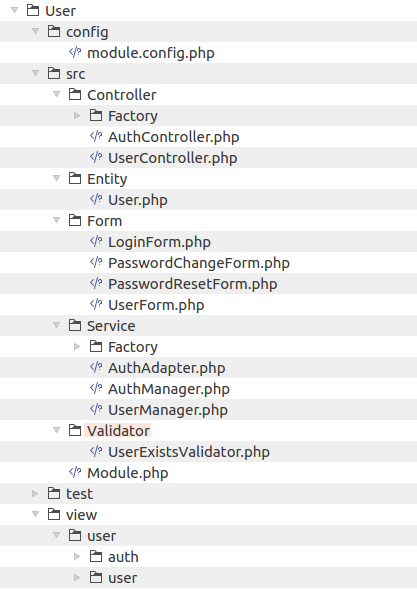
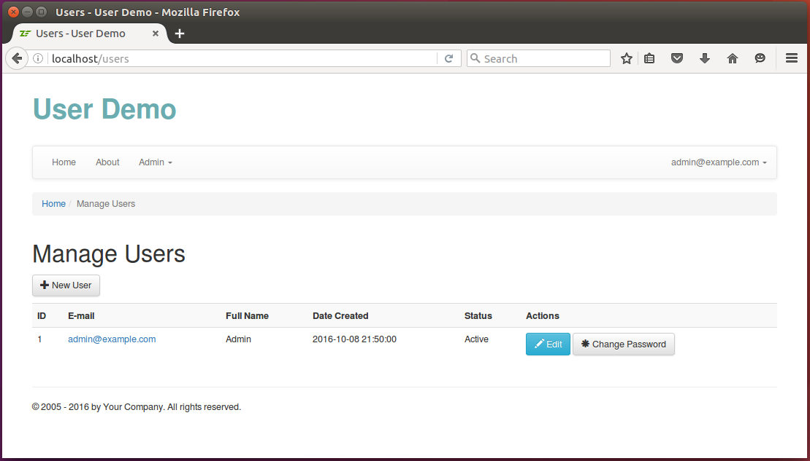
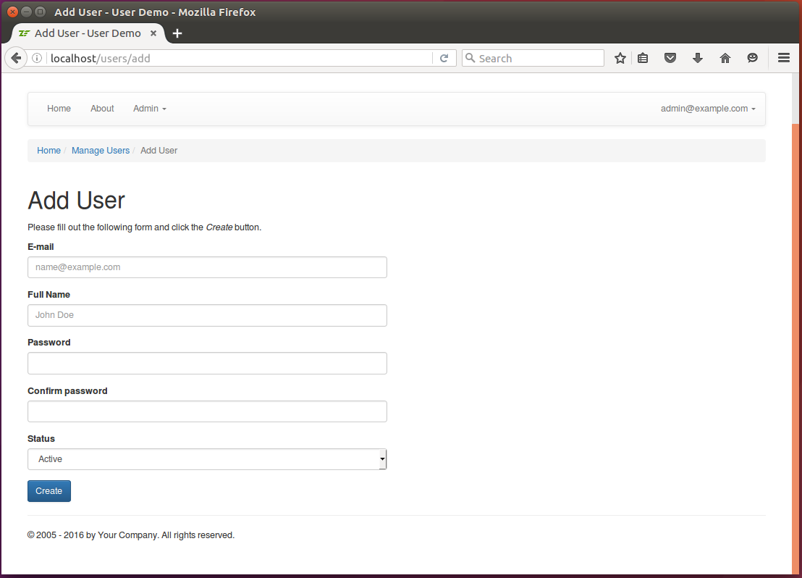
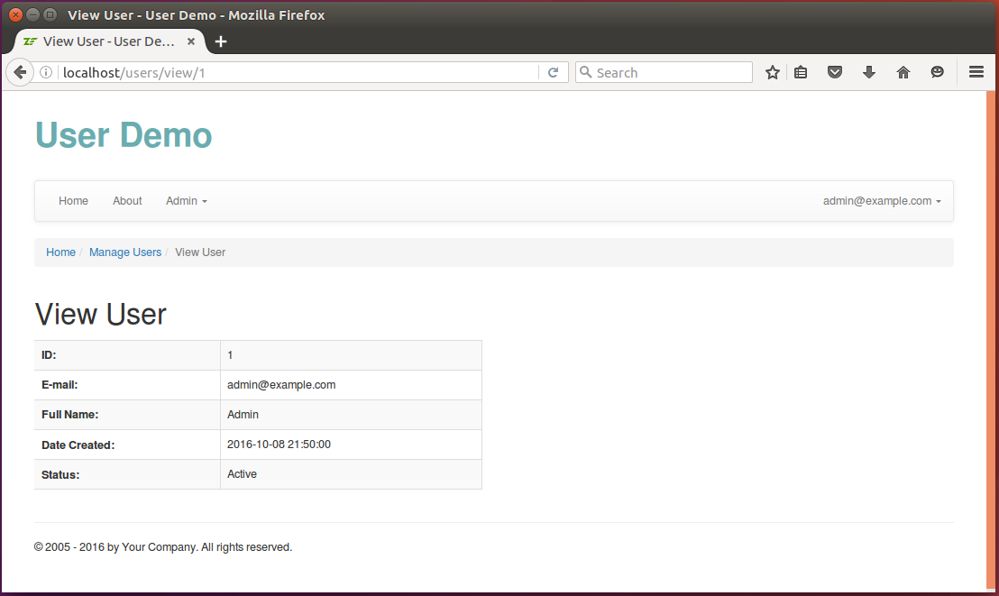
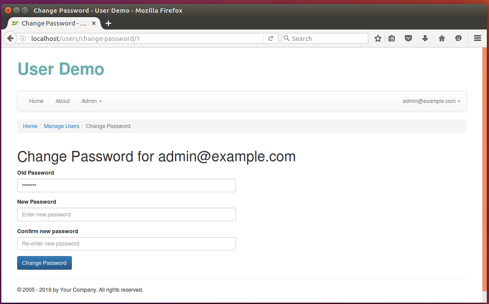
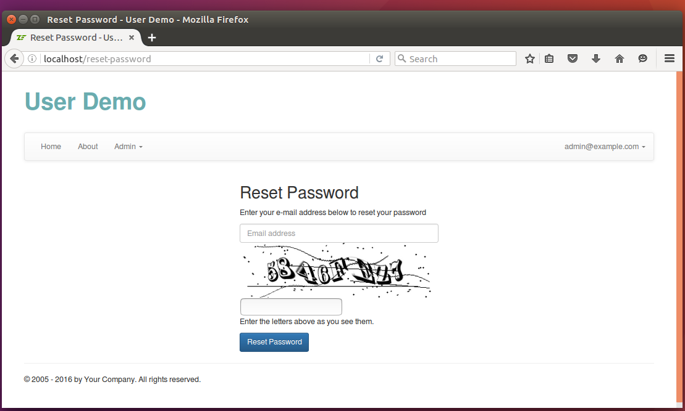
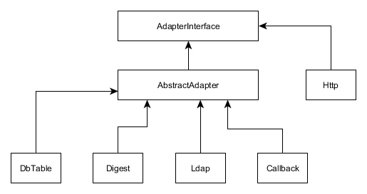
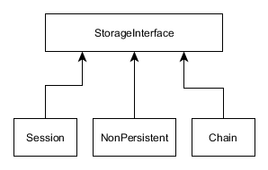
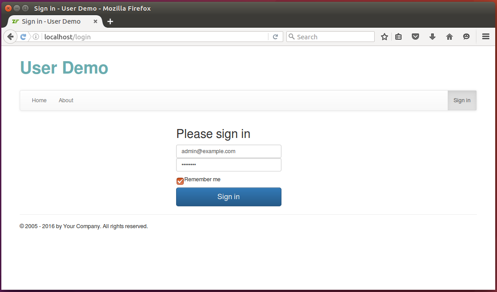
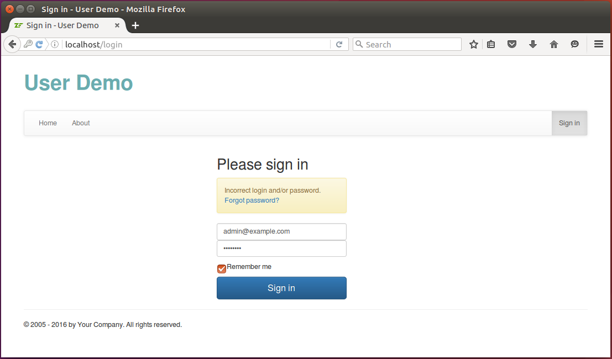

# User Management, Authentication and Access Filtering

Most websites on the Internet allow their visitors to register on the site and create a profile. After that, the
visitor can log in and have a personalized experience. For example, in a E-commerce
website, a registered user can buy goods, manage their shopping cart and make a payment with a credit card.

In this chapter, you will learn how to implement user authentication with login and password in a Laminas website.
We will show how to manage users (add, edit, view and change/reset password) in your web application and store users' passwords in the database
securely. You will also learn how to implement an access filter and allow certain pages to be accessed by authenticated users only.

Since you already know a lot about Laminas from reading previous chapters, in this chapter we will
omit discussing some obvious things and concentrate on *conceptual* moments only. It is recommended that you refer to
the *User Demo* sample bundle with this book, which is a complete website that you can run and see everything in action.
All code discussed in this chapter is part of this sample application.

Laminas components covered in this chapter:

|--------------------------------|---------------------------------------------------------------|
| *Component*                    | *Description*                                                 |
|--------------------------------|---------------------------------------------------------------|
| @`Laminas\Authentication`          | Provides user authentication feature.                         |
|--------------------------------|---------------------------------------------------------------|
| @`Laminas\Crypt`                   | Provides functionality for password encryption.               |
|--------------------------------|---------------------------------------------------------------|
| @`Laminas\Math`                    | Provides functionality for generating secure random tokens.   |
|--------------------------------|---------------------------------------------------------------|

## Get User Demo Sample from GitHub

For demonstration, in this chapter, we will create a real-life *User Demo* website
that shows how to:

  * Create a new module named *User*. This module will contain the functionality for user authentication and user management.
  * Create `User` entity.
  * Implement storing users' passwords in a database securely.
  * Implement user authentication (with login and password).
  * Implement an access filter to provide access to certain pages to authenticated users only.
  * Implement user management UI that allows adding, editing, and viewing a user, and changing user's password.
  * Implement main menu items differently based on whether the current user is logged in or not.

To download the *User Demo* application, visit [this page](https://github.com/olegkrivtsov/using-laminas-book-samples)
and click the *Clone or Download* button to download the code as a ZIP archive.
When download is complete, unpack the archive to some directory.

Then navigate to the `userdemo` directory containing the
source code of the *User Demo* web application:

~~~text
/using-laminas-book-samples
  /userdemo
  ...
~~~

The *User Demo* is a website which can be installed on your machine.

> Detailed instructions on how to install the *User Demo* sample can be found in *README.md* file located in the sample directory.

## Creating the User Module

In the *User Demo* sample, we create a new module called *User* and add all functionality
related to user management and authentication to that module. If you are new
to the concept of modules, refer to chapter [Creating a New Module](#modules).

The *User* module will have very few dependencies on other
modules of the website. The idea behind the *User* module is to give you a reusable unit that you can use in your own web
application, without any changes or with some modifications.

> Ideally, you will be able to use the *User* module in your own website without any changes. But, in real-life
> websites, you'll probably have to add some fields to the `user` table, modify the user creation workflow, or
> modify the access filtering algorithm. It this case, you'll have to customize the code of the *User* module
> to feet your needs.

The *User* module will have the following structure (see figure 16.1 below):



Let's briefly describe what classes we will have inside module's directory.

We will have two controllers:

  * The *UserController* will contain functionality for managing users (adding, editing, changing password, etc.)
  * The *AuthController* will implement user authentication functionality (login/logout).

There will be one Doctrine entity:

  * The *User* entity will be used to store information about the user in database (email, full name, password, etc).

We will have four forms used to collect data:

  * The *LoginForm* will be used to collect data for authentication (login and password).
  * The *PasswordChangeForm* will be used to collect data for changing or resetting user's password.
  * The *PasswordResetForm* will be used to collect the E-mail of the person who forgot his/her password and wishes to reset the password.
  * The *UserForm* will be used to collect data about the user (email, full name, password, etc).

We will have several services:

  * The *AuthAdapter* service will implement the authentication algorithm. It will check if the user login (E-mail address)
    and password are correct. For performing that, it will retrieve the user information from a database.
  * The *AuthManager* service will perform actual authentication (login/logout). It will also implement
    the access filter allowing or denying unauthenticated users access to certain web pages.
  * The *UserManager* will contain business logic of managing users (adding, editing, changing password).

Most controllers and services will be instantiated with factories. You can find the factory classes under the
*Factory* subdirectories.

Inside the *view* directory, we will have several view templates which will render HTML markup of the web pages
present in the user interface exposed by our module.

As usual, inside the *config* directory, we will have the *module.config.php* file that will contain routes and registration for our controllers and
services. It will also contain the *access_filter* key defining which pages will be accessible to an
unauthenticated user (this key will be read by *AuthManager* service).

As you can see, the *User* module is a typical Laminas module with the structure conforming to the MVC pattern.

## Setting Up the Database

We will need to set up a sample "userdemo" database. The database will have a single table named `user` for
storing data associated with users of our website (see figure 16.2 below).


The `user` table contains the following fields:

  * the `id` is an auto-incremented integer field (primary key).
  * the `email` is a string field containing user's E-mail address. Each user will have a unique E-mail address, so this field is a unique key, too.
  * the `full_name` string field will contain the full name of a user (like "John Doe").
  * the `status` integer field will contain user's status (either "active" or "retired"). Retired users are not allowed to log in.
  * the `date_created` contains date and time when the user was created.
  * the `pwd_reset_token` and `pwd_reset_token_creation_date` fields are used for password resetting (when the user forgets his/her password and needs to reset it).

> In your own website, you will likely want to add more fields to the `user` table.
In this sample, we only define some minimum set of fields.

You can create the `user` table with the following SQL statement:

~~~
CREATE TABLE `user` (
  `id` int(11) NOT NULL AUTO_INCREMENT,
  `email` varchar(128) NOT NULL,
  `full_name` varchar(512) NOT NULL,
  `password` varchar(256) NOT NULL,
  `status` int(11) NOT NULL,
  `date_created` datetime NOT NULL,
  `pwd_reset_token` varchar(32) DEFAULT NULL,
  `pwd_reset_token_creation_date` datetime DEFAULT NULL,
  PRIMARY KEY (`id`),
  UNIQUE KEY `email_idx` (`email`)
);
~~~

You can find a migration, which creates the `user` table, in the *User Demo* sample application.

> If you are new to migrations, refer to chapter [Database Migrations](#migrations).

## Implementing User Entity

The *User Demo* sample uses Doctrine ORM for managing the database. We have already learned how to use Doctrine in
[Database Management with Doctrine ORM](#doctrine).

For storing information about users in the database, we will create the `User` entity. The `User` entity is mapped
onto the `user` database table. It is a typical Doctrine entity class.

Create the *User.php* file inside the *Entity* directory under the module's source directory. Put
the following code into that file:

~~~php
<?php
namespace User\Entity;

use Doctrine\ORM\Mapping as ORM;

/**
 * This class represents a registered user.
 * @ORM\Entity()
 * @ORM\Table(name="user")
 */
class User
{
    // User status constants.
    const STATUS_ACTIVE       = 1; // Active user.
    const STATUS_RETIRED      = 2; // Retired user.

    /**
     * @ORM\Id
     * @ORM\Column(name="id")
     * @ORM\GeneratedValue
     */
    protected $id;

    /**
     * @ORM\Column(name="email")
     */
    protected $email;

    /**
     * @ORM\Column(name="full_name")
     */
    protected $fullName;

    /**
     * @ORM\Column(name="password")
     */
    protected $password;

    /**
     * @ORM\Column(name="status")
     */
    protected $status;

    /**
     * @ORM\Column(name="date_created")
     */
    protected $dateCreated;

    /**
     * @ORM\Column(name="pwd_reset_token")
     */
    protected $passwordResetToken;

    /**
     * @ORM\Column(name="pwd_reset_token_creation_date")
     */
    protected $passwordResetTokenCreationDate;

    /**
     * Returns user ID.
     * @return integer
     */
    public function getId()
    {
        return $this->id;
    }

    /**
     * Sets user ID.
     * @param int $id
     */
    public function setId($id)
    {
        $this->id = $id;
    }

    /**
     * Returns email.
     * @return string
     */
    public function getEmail()
    {
        return $this->email;
    }

    /**
     * Sets email.
     * @param string $email
     */
    public function setEmail($email)
    {
        $this->email = $email;
    }

    /**
     * Returns full name.
     * @return string
     */
    public function getFullName()
    {
        return $this->fullName;
    }

    /**
     * Sets full name.
     * @param string $fullName
     */
    public function setFullName($fullName)
    {
        $this->fullName = $fullName;
    }

    /**
     * Returns status.
     * @return int
     */
    public function getStatus()
    {
        return $this->status;
    }

    /**
     * Returns possible statuses as array.
     * @return array
     */
    public static function getStatusList()
    {
        return [
            self::STATUS_ACTIVE => 'Active',
            self::STATUS_RETIRED => 'Retired'
        ];
    }

    /**
     * Returns user status as string.
     * @return string
     */
    public function getStatusAsString()
    {
        $list = self::getStatusList();
        if (isset($list[$this->status]))
            return $list[$this->status];

        return 'Unknown';
    }

    /**
     * Sets status.
     * @param int $status
     */
    public function setStatus($status)
    {
        $this->status = $status;
    }

    /**
     * Returns password.
     * @return string
     */
    public function getPassword()
    {
       return $this->password;
    }

    /**
     * Sets password.
     * @param string $password
     */
    public function setPassword($password)
    {
        $this->password = $password;
    }

    /**
     * Returns the date of user creation.
     * @return string
     */
    public function getDateCreated()
    {
        return $this->dateCreated;
    }

    /**
     * Sets the date when this user was created.
     * @param string $dateCreated
     */
    public function setDateCreated($dateCreated)
    {
        $this->dateCreated = $dateCreated;
    }

    /**
     * Returns password reset token.
     * @return string
     */
    public function getResetPasswordToken()
    {
        return $this->passwordResetToken;
    }

    /**
     * Sets password reset token.
     * @param string $token
     */
    public function setPasswordResetToken($token)
    {
        $this->passwordResetToken = $token;
    }

    /**
     * Returns password reset token's creation date.
     * @return string
     */
    public function getPasswordResetTokenCreationDate()
    {
        return $this->passwordResetTokenCreationDate;
    }

    /**
     * Sets password reset token's creation date.
     * @param string $date
     */
    public function setPasswordResetTokenCreationDate($date)
    {
        $this->passwordResetTokenCreationDate = $date;
    }
}
~~~

As you can see from the code above, the *User* entity is a typical Doctrine entity having
annotated properties and getter and setter methods for retrieving/setting those properties.

## Adding UserController

The `UserController` class will contain several action methods providing an administrative
user interface for managing the registered users. It will have the following actions:

  * The `indexAction()` action will display a web page containing the list of users (see figure 16.3).
    Type "http://localhost/users" in your web browser's navigation bar to access this page.
  * The `addAction()` will display a page allowing the creation of a new user (see figure 16.4).
    Type "http://localhost/users/add" in your web browser's navigation bar to access this page.
  * The `editAction()` action will display a page for updating an existing user (see figure 16.5).
    Type "http://localhost/users/edit/&lt;id&gt;" in your web browser's navigation bar to access this page.
  * The `viewAction()` will allow viewing an existing user (see figure 16.6).
    Type "http://localhost/users/view/&lt;id&gt;" in your web browser's navigation bar to access this page.
  * The `changePasswordAction()` action will give the admin the ability to change the password of an existing user (see figure 16.7).
    Type "http://localhost/users/changePassword/&lt;id&gt;" in your web browser's navigation bar to access this page.
  * The `resetPasswordAction()` action will allow a user to reset his own password (see figure 16.8).
    Type "http://localhost/reset-password" in your web browser's navigation bar to access this page.












The `UserController` controller class is designed to be as "thin" as possible. It contains only the code responsible for
checking input data, instantiating the needed models, passing input data to the models and returning the output data for
rendering in a view template. Because it is a typical controller class
and because you can see its complete code in the *User Demo* sample, we will not describe it here in more detail.

## Adding UserManager Service

The `UserController` works with the *UserManager* service, which contains all the business logic related to user management.
The service allows an admin to create and update users, change a user's password and reset a user's password. We will describe some parts of it
in more detail, omitting other obvious parts (you still can see the complete code in *User Demo* sample).

### Creating a New User & Storing Password Encrypted

The `addUser()` method of the `UserManager` allows us to add a new user. It looks as follows:

~~~php
/**
 * This method adds a new user.
 */
public function addUser($data)
{
    // Do not allow several users with the same email address.
    if($this->checkUserExists($data['email'])) {
        throw new \Exception("User with email address " .
                    $data['$email'] . " already exists");
    }

    // Create new User entity.
    $user = new User();
    $user->setEmail($data['email']);
    $user->setFullName($data['full_name']);

    // Encrypt password and store the password in encrypted state.
    $bcrypt = new Bcrypt();
    $passwordHash = $bcrypt->create($data['password']);
    $user->setPassword($passwordHash);

    $user->setStatus($data['status']);

    $currentDate = date('Y-m-d H:i:s');
    $user->setDateCreated($currentDate);

    // Add the entity to the entity manager.
    $this->entityManager->persist($user);

    // Apply changes to database.
    $this->entityManager->flush();

    return $user;
}
~~~

You can see that in this method we first check if another user with the same E-mail address
already exists (line 7), and if so we forbid creating the user by throwing an exception.

If the user with such E-mail address doesn't exist, we create a new `User` entity (line 13) and set its properties
accordingly.

What is interesting here is how we save the user's password to the database. For security reasons, we do not
save the password as is, but calculate a hash of it with the @`Bcrypt` class provided by @`Laminas\Crypt` component of
Laminas Framework (lines 18-19) .

> You can install @`Laminas\Crypt` with the following command:
>
>   `php composer.phar require laminas/laminas-crypt`
>
> The @`Laminas\Crypt` component also requires that you have `mcrypt` PHP extension installed.

W> The *Bcrypt* algorithm is a hashing algorithm that is widely used and recommended by the security community for storing user's password.
W> Encrypting password with @`Bcrypt` is considered secure nowadays. Some developers still encrypt passwords
W> with MD5 or SHA1 with salt, but this is not considered secure anymore (MD5 and SHA1 hashes can be hacked).

### Validating Encrypted Password

When a user logs in, you'll need to check if the password hash stored in the database is the same as the hash
calculated by the password entered by the visitor. You do that with the help of the `verify()` method provided
by the @`Bcrypt` class, as follows:

~~~php
/**
 * Checks that the given password is correct.
 */
public function validatePassword($user, $password)
{
    $bcrypt = new Bcrypt();
    $passwordHash = $user->getPassword();

    if ($bcrypt->verify($password, $passwordHash)) {
        return true;
    }

    return false;
}
~~~

### Creating Admin User

The next important thing to note in `UserManager` is how we create the Admin user.

> The Admin user is an initial user that is created automatically when there are not existing users
> in the database and allows you to login for the first time.

~~~php
/**
 * This method checks if at least one user presents, and if not, creates
 * 'Admin' user with email 'admin@example.com' and password 'Secur1ty'.
 */
public function createAdminUserIfNotExists()
{
    $user = $this->entityManager->getRepository(User::class)->findOneBy([]);
    if ($user==null) {
        $user = new User();
        $user->setEmail('admin@example.com');
        $user->setFullName('Admin');
        $bcrypt = new Bcrypt();
        $passwordHash = $bcrypt->create('Secur1ty');
        $user->setPassword($passwordHash);
        $user->setStatus(User::STATUS_ACTIVE);
        $user->setDateCreated(date('Y-m-d H:i:s'));

        $this->entityManager->persist($user);
        $this->entityManager->flush();
    }
}
~~~

We set the Admin user's email to `admin@example.com` and password to `Secur1ty`, so you can login for the first
time with these credentials.

### Resetting User Password

Sometimes users forget their password. If that happens, you'll need to let the user *reset* the password - to
securely change the password. Password resetting works as follows:

  * A random *password reset token* is generated and its hash is saved to database.
  * The password reset token is sent to user's email address as part of an E-mail message.
  * The user checks his mailbox and clicks the password reset link in the E-mail message.
  * The website validates the password reset token and checks it hasn't expired.
  * The user is directed to the form allowing him to enter new password.

> You typically do not store raw password reset tokens in database. Instead, you store a *hash* of the token. This is done for security reasons.
> Even if some malicious hacker steals the DB, they won't be able to reset passwords of the users.

The password reset token generation algorithm is implemented inside the `generatePasswordResetToken()` method of `UserManager`.
To generate a random string, we use the @`Rand` class provided by @`Laminas\Math` component.

~~~php
/**
 * Generates a password reset token for the user. This token is then stored in database and
 * sent to the user's E-mail address. When the user clicks the link in E-mail message, he is
 * directed to the Set Password page.
 */
public function generatePasswordResetToken($user)
{
    if ($user->getStatus() != User::STATUS_ACTIVE) {
        throw new \Exception('Cannot generate password reset token for inactive user ' . $user->getEmail());
    }

    // Generate a token.
    $token = Rand::getString(32, '0123456789abcdefghijklmnopqrstuvwxyz', true);

    // Encrypt the token before storing it in DB.
    $bcrypt = new Bcrypt();
    $tokenHash = $bcrypt->create($token);

    // Save token to DB
    $user->setPasswordResetToken($tokenHash);

    // Save token creation date to DB.
    $currentDate = date('Y-m-d H:i:s');
    $user->setPasswordResetTokenCreationDate($currentDate);

    // Apply changes to DB.
    $this->entityManager->flush();

    // Send an email to user.
    $subject = 'Password Reset';

    $httpHost = isset($_SERVER['HTTP_HOST'])?$_SERVER['HTTP_HOST']:'localhost';
    $passwordResetUrl = 'http://' . $httpHost . '/set-password?token=' . $token . "&email=" . $user->getEmail();

    // Produce HTML of password reset email
    $bodyHtml = $this->viewRenderer->render(
            'user/email/reset-password-email',
            [
                'passwordResetUrl' => $passwordResetUrl,
            ]);

    $html = new MimePart($bodyHtml);
    $html->type = "text/html";

    $body = new MimeMessage();
    $body->addPart($html);

    $mail = new Mail\Message();
    $mail->setEncoding('UTF-8');
    $mail->setBody($body);
    $mail->setFrom('no-reply@example.com', 'User Demo');
    $mail->addTo($user->getEmail(), $user->getFullName());
    $mail->setSubject($subject);

    // Setup SMTP transport
    $transport = new SmtpTransport();
    $options   = new SmtpOptions($this->config['smtp']);
    $transport->setOptions($options);

    $transport->send($mail);
}
~~~

> Configuring mail system for your web server typically
> requires acquiring subscription of some mail service (like [SendGrid](https://sendgrid.com/) or [Amazon SES](https://aws.amazon.com/en/ses)).

Password reset token validation is implemented inside the `validatePasswordResetToken()` method.
We check that the token's hash is the same as we saved in database and that the token has not expired
(it expires in 1 day since creation).

~~~php
/**
 * Checks whether the given password reset token is a valid one.
 */
public function validatePasswordResetToken($email, $passwordResetToken)
{
    // Find user by email.
    $user = $this->entityManager->getRepository(User::class)
            ->findOneByEmail($email);

    if($user==null || $user->getStatus() != User::STATUS_ACTIVE) {
        return false;
    }

    // Check that token hash matches the token hash in our DB.
    $bcrypt = new Bcrypt();
    $tokenHash = $user->getPasswordResetToken();

    if (!$bcrypt->verify($passwordResetToken, $tokenHash)) {
        return false; // mismatch
    }

    // Check that token was created not too long ago.
    $tokenCreationDate = $user->getPasswordResetTokenCreationDate();
    $tokenCreationDate = strtotime($tokenCreationDate);

    $currentDate = strtotime('now');

    if ($currentDate - $tokenCreationDate > 24*60*60) {
        return false; // expired
    }

    return true;
}
~~~

And finally, the `setPasswordByToken()` allows to set new password for the user.

~~~php
/**
 * This method sets new password by password reset token.
 */
public function setNewPasswordByToken($email, $passwordResetToken, $newPassword)
{
    if (!$this->validatePasswordResetToken($email, $passwordResetToken)) {
       return false;
    }

    // Find user with the given email.
    $user = $this->entityManager->getRepository(User::class)
            ->findOneByEmail($email);

    if ($user==null || $user->getStatus() != User::STATUS_ACTIVE) {
        return false;
    }

    // Set new password for user
    $bcrypt = new Bcrypt();
    $passwordHash = $bcrypt->create($newPassword);
    $user->setPassword($passwordHash);

    // Remove password reset token
    $user->setPasswordResetToken(null);
    $user->setPasswordResetTokenCreationDate(null);

    $this->entityManager->flush();

    return true;
}
~~~

## Implementing User Authentication

*Authentication* is the process performed when a user provides his login and password and you decide whether these credentials
are correct. Authentication typically means you check your database for the given login, and if such login exists, you
check if the hash calculated by the given password matches the hash of the password stored in the database.

> You typically do not store raw passwords in database. Instead, you store a *hash* of the password. This is done for security reasons.

Once the authentication algorithm determines that the login and password are correct, it returns user *identity* - a unique
ID of the user. The identity is typically stored to session, so the visitor doesn't need to pass authentication for every
HTTP request.

In Laminas, there is a special component allowing you to implement user authentication - @`Laminas\Authentication`.
You can install this component with Composer by typing the following command:

```
php composer.phar require laminas/laminas-authentication
```

> For authentication to work, you also need to have @`Laminas\Session` component installed and session manager configured. For information
> on how to do that, refer to [Working with Sessions](#session) chapter.

### AuthenticationService

The @`Laminas\Authentication` component provides the special service class called `AuthenticationService` living
in @`Laminas\Authentication` namespace. Most useful methods of this service are shown in table 16.1 below.

{title="Table 16.1. Methods of AuthenticationService class"}
|--------------------------------|---------------------------------------------------------------|
| *Method*                       | *Description*                                                 |
|--------------------------------|---------------------------------------------------------------|
| `authenticate()`               | Performs user authentication using the adapter.               |
|--------------------------------|---------------------------------------------------------------|
| `getAdapter()`                 | Gets authentication adapter.                                  |
|--------------------------------|---------------------------------------------------------------|
| `setAdapter()`                 | Sets authentication adapter implementing the actual authentication algorithm. |
|--------------------------------|---------------------------------------------------------------|
| `getStorage()`                 | Returns storage handler.                                      |
|--------------------------------|---------------------------------------------------------------|
| `setStorage()`                 | Sets storage handler.                                         |
|--------------------------------|---------------------------------------------------------------|
| `hasIdentity()`                | Returns `true` if user identity is already stored in session. |
|--------------------------------|---------------------------------------------------------------|
| `getIdentity()`                | Retrieves user identity from session.                         |
|--------------------------------|---------------------------------------------------------------|
| `clearIdentity()`              | Removes user identity from session.                           |
|--------------------------------|---------------------------------------------------------------|

As you can see from the table, you can use the `authenticate()` method to perform user authentication.
Besides that you can use `hasIdentity()`, `getIdentity()` and `clearIdentity()` methods for testing,
retrieving and clearing user identity, respectively.

However, the @`AuthenticationService` service is very generic - it knows nothing about how
to actually match login and password against the database. It also knows nothing about how to save the user identity
to session. This design allows you to implement any suitable authentication algorithm and any suitable storage.

The @`Laminas\Authentication` component provides several *authentication adapters* implementing some standard authentication
algorithms (see figure 16.9), and several *storage handlers* allowing you to save and retrieve the user identity (see figure 16.10).





For our purposes, we can use @`Session`[Laminas\Authentication\Storage\Session] storage handler without needing to change any code. However, standard authentication
adapters are not suitable for us, because we use Doctrine ORM. We will have to write our custom authentication adapter.
Luckily, this is rather simple to do.

### Writing Authentication Adapter

An authentication adapter must implement the @`AdapterInterface`[Laminas\Authentication\Adapter\AdapterInterface] interface, which has the single method `authenticate()`.
This method should check the user email and password against the database. We will do this as follows:

  * Find the user with the given `email` (we use the E-mail address as the user's login).
  * If user with such `email` doesn't exist - return failure status.
  * Check the `status` of the user. If the user is "retired" - forbid the user to login.
  * Calculate password hash and compare it against the hash stored in database for the user found.
  * If password hash doesn't match, return failure status.
  * If password is correct, return success status.

The `authenticate()` method returns an instance of the @`Laminas\Authentication\Result` class.
The @`Result`[Laminas\Authentication\Result] class contains the authentication status, the error message and the user identity.

The adapter can also have additional methods. For example, we will add the `setEmail()` and `setPassword()` methods
that we will use to pass user email and password to the adapter.

To create the authentication adapter, add the file *AuthAdapter.php* to the *Service* directory of the module's source directory.

> In the *User Demo* sample, we create a separate module called *User* and add functionality related to authentication
> and user management to that module.

Put the following code into that file:

~~~php
<?php
namespace User\Service;

use Laminas\Authentication\Adapter\AdapterInterface;
use Laminas\Authentication\Result;
use Laminas\Crypt\Password\Bcrypt;
use User\Entity\User;

/**
 * Adapter used for authenticating user. It takes login and password on input
 * and checks the database if there is a user with such login (email) and password.
 * If such user exists, the service returns his identity (email). The identity
 * is saved to session and can be retrieved later with Identity view helper provided
 * by Laminas.
 */
class AuthAdapter implements AdapterInterface
{
    /**
     * User email.
     * @var string
     */
    private $email;

    /**
     * Password
     * @var string
     */
    private $password;

    /**
     * Entity manager.
     * @var Doctrine\ORM\EntityManager
     */
    private $entityManager;

    /**
     * Constructor.
     */
    public function __construct($entityManager)
    {
        $this->entityManager = $entityManager;
    }

    /**
     * Sets user email.
     */
    public function setEmail($email)
    {
        $this->email = $email;
    }

    /**
     * Sets password.
     */
    public function setPassword($password)
    {
        $this->password = (string)$password;
    }

    /**
     * Performs an authentication attempt.
     */
    public function authenticate()
    {
        // Check the database if there is a user with such email.
        $user = $this->entityManager->getRepository(User::class)
                ->findOneByEmail($this->email);

        // If there is no such user, return 'Identity Not Found' status.
        if ($user==null) {
            return new Result(
                Result::FAILURE_IDENTITY_NOT_FOUND,
                null,
                ['Invalid credentials.']);
        }

        // If the user with such email exists, we need to check if it is active or retired.
        // Do not allow retired users to log in.
        if ($user->getStatus()==User::STATUS_RETIRED) {
            return new Result(
                Result::FAILURE,
                null,
                ['User is retired.']);
        }

        // Now we need to calculate hash based on user-entered password and compare
        // it with the password hash stored in database.
        $bcrypt = new Bcrypt();
        $passwordHash = $user->getPassword();

        if ($bcrypt->verify($this->password, $passwordHash)) {
            // Great! The password hash matches. Return user identity (email) to be
            // saved in session for later use.
            return new Result(
                    Result::SUCCESS,
                    $this->email,
                    ['Authenticated successfully.']);
        }

        // If password check didn't pass return 'Invalid Credential' failure status.
        return new Result(
                Result::FAILURE_CREDENTIAL_INVALID,
                null,
                ['Invalid credentials.']);
    }
}
~~~

### Creating the Factory for AuthenticationService

Once we've implemented the adapter, we can actually create the @`AuthenticationService`.
Laminas's @`AuthenticationService` should be registered in the service manager before you can use it.
First of all, we will create a factory for it. Add the *AuthenticationServiceFactory.php* file under the
*Service/Factory* directory and put the following code there:

~~~php
<?php
namespace User\Service\Factory;

use Interop\Container\ContainerInterface;
use Laminas\Authentication\AuthenticationService;
use Laminas\ServiceManager\Factory\FactoryInterface;
use Laminas\Session\SessionManager;
use Laminas\Authentication\Storage\Session as SessionStorage;
use User\Service\AuthAdapter;

/**
 * The factory responsible for creating of authentication service.
 */
class AuthenticationServiceFactory implements FactoryInterface
{
    /**
     * This method creates the Laminas\Authentication\AuthenticationService service
     * and returns its instance.
     */
    public function __invoke(ContainerInterface $container,
                    $requestedName, array $options = null)
    {
        $sessionManager = $container->get(SessionManager::class);
        $authStorage = new SessionStorage('Laminas_Auth', 'session', $sessionManager);
        $authAdapter = $container->get(AuthAdapter::class);

        // Create the service and inject dependencies into its constructor.
        return new AuthenticationService($authStorage, $authAdapter);
    }
}
~~~

In the factory we do the following: First, we create an instance of the session manager (you should have
set up the session manager already) and create an instance of @`Session`[Laminas\Authentication\Storage\Session] storage handler. Then we create
an instance of `AuthAdapter`. Finally, we instantiate the @`AuthenticationService` and inject dependencies
(storage handler and adapter) into it.

Register the @`AuthenticationService` in your *module.config.php* config file as follows:

~~~php
<?php
return [
    'service_manager' => [
        'factories' => [
            \Laminas\Authentication\AuthenticationService::class
                => Service\Factory\AuthenticationServiceFactory::class,
            // ...
        ],
    ],
];
~~~

### Adding AuthController

The `AuthController` class will have two actions:

  * The `loginAction()` will allow logging in to the website (see figures 16.11 and 16.12).
    You can access this page by typing "http://localhost/login" URL into your web browser's navigation bar.

  * The `logoutAction()` will allow logging out from the website.
    You can access this page by typing "http://localhost/logout" URL into your web browser's navigation bar.





The code of the `AuthController` controller class is presented below:

~~~php
<?php

namespace User\Controller;

use Laminas\Mvc\Controller\AbstractActionController;
use Laminas\View\Model\ViewModel;
use Laminas\Authentication\Result;
use Laminas\Uri\Uri;
use User\Form\LoginForm;
use User\Entity\User;

/**
 * This controller is responsible for letting the user to log in and log out.
 */
class AuthController extends AbstractActionController
{
    /**
     * Entity manager.
     * @var Doctrine\ORM\EntityManager
     */
    private $entityManager;

    /**
     * Auth manager.
     * @var User\Service\AuthManager
     */
    private $authManager;

    /**
     * Auth service.
     * @var \Laminas\Authentication\AuthenticationService
     */
    private $authService;

    /**
     * User manager.
     * @var User\Service\UserManager
     */
    private $userManager;

    /**
     * Constructor.
     */
    public function __construct($entityManager, $authManager, $authService, $userManager)
    {
        $this->entityManager = $entityManager;
        $this->authManager = $authManager;
        $this->authService = $authService;
        $this->userManager = $userManager;
    }

    /**
     * Authenticates user given email address and password credentials.
     */
    public function loginAction()
    {
        // Retrieve the redirect URL (if passed). We will redirect the user to this
        // URL after successfull login.
        $redirectUrl = (string)$this->params()->fromQuery('redirectUrl', '');
        if (strlen($redirectUrl)>2048) {
            throw new \Exception("Too long redirectUrl argument passed");
        }

        // Check if we do not have users in database at all. If so, create
        // the 'Admin' user.
        $this->userManager->createAdminUserIfNotExists();

        // Create login form
        $form = new LoginForm();
        $form->get('redirect_url')->setValue($redirectUrl);

        // Store login status.
        $isLoginError = false;

        // Check if user has submitted the form
        if ($this->getRequest()->isPost()) {

            // Fill in the form with POST data
            $data = $this->params()->fromPost();

            $form->setData($data);

            // Validate form
            if($form->isValid()) {

                // Get filtered and validated data
                $data = $form->getData();

                // Perform login attempt.
                $result = $this->authManager->login($data['email'],
                        $data['password'], $data['remember_me']);

                // Check result.
                if ($result->getCode()==Result::SUCCESS) {

                    // Get redirect URL.
                    $redirectUrl = $this->params()->fromPost('redirect_url', '');

                    if (!empty($redirectUrl)) {
                        // The below check is to prevent possible redirect attack
                        // (if someone tries to redirect user to another domain).
                        $uri = new Uri($redirectUrl);
                        if (!$uri->isValid() || $uri->getHost()!=null)
                            throw new \Exception('Incorrect redirect URL: ' . $redirectUrl);
                    }

                    // If redirect URL is provided, redirect the user to that URL;
                    // otherwise redirect to Home page.
                    if(empty($redirectUrl)) {
                        return $this->redirect()->toRoute('home');
                    } else {
                        $this->redirect()->toUrl($redirectUrl);
                    }
                } else {
                    $isLoginError = true;
                }
            } else {
                $isLoginError = true;
            }
        }

        return new ViewModel([
            'form' => $form,
            'isLoginError' => $isLoginError,
            'redirectUrl' => $redirectUrl
        ]);
    }

    /**
     * The "logout" action performs logout operation.
     */
    public function logoutAction()
    {
        $this->authManager->logout();

        return $this->redirect()->toRoute('login');
    }
}
~~~

The `loginAction()` method accepts the `redirectUrl` GET parameter. The "redirect URL" is a convenience
feature working with the *access filter* that we will describe later in this chapter. When the site
visitor tries to access a web page, the access filter forbids access, and he/she is redirected
to the "Login" page, passing the URL of the original page as the "redirect URL". When the user logs in, he/she
is redirected back to the original page automatically, improving user experience.

### Adding View Template for Login Page

The view template (*.phtml* file) for our *Login* page looks as follows:

~~~php
<?php
$this->headTitle('Sign in');

$this->mainMenu()->setActiveItemId('login');

$form->get('email')->setAttributes([
    'class'=>'form-control',
    'placeholder'=>'Email address',
    'required' => true,
    'autofocus' => true
    ])
    ->setLabelAttributes([
        'class' => 'sr-only'
    ]);

$form->get('password')->setAttributes([
    'class'=>'form-control',
    'placeholder'=>'Password',
    'required' => true,
    ])
    ->setLabelAttributes([
        'class' => 'sr-only'
    ]);
?>

<div class="row">
    <div class="col-md-offset-4 col-md-3">
        <form class="form-signin" method="post">
            <h2 class="form-signin-heading">Please sign in</h2>
            <?php if ($isLoginError): ?>
            <div class="alert alert-warning" role="alert">
                Incorrect login and/or password.
                <a href="<?= $this->url('reset-password') ?>">Forgot password?</a>
            </div>
            <?php endif; ?>
            <?= $this->formLabel($form->get('email')); ?>
            <?= $this->formElement($form->get('email')); ?>
            <?= $this->formLabel($form->get('password')); ?>
            <?= $this->formElement($form->get('password')); ?>
            <div class="checkbox">
                <label>
                    <?= $this->formElement($form->get('remember_me')); ?> Remember me
                </label>
            </div>
            <?= $this->formElement($form->get('redirect_url')); ?>
            <?= $this->formElement($form->get('csrf')) ?>
            <button class="btn btn-lg btn-primary btn-block" type="submit">Sign in</button>
        </form>
    </div>
</div>
~~~

> The view template uses the *Sign In* page template provided by Bootstrap CSS Framework.
> You can find the original template [here](https://getbootstrap.com/examples/signin/).

### Adding AuthManager Service

The `AuthController` works with the `AuthManager` service. The main business logic behind the authentication
is implemented in the service. Let's describe the `AuthManager` in detail.

The `AuthManager` service has the following methods responsible for authentication:

  * the `login()` method
  * the `logout()` method.

The `login()` method (see below) uses the Laminas's @`AuthenticationService` and the `AuthAdapter` we wrote earlier
for performing user authentication. The method additionally accepts the `$rememberMe` argument which
extends the session cookie lifetime to 30 days.

~~~php
/**
 * Performs a login attempt. If $rememberMe argument is true, it forces the session
 * to last for one month (otherwise the session expires on one hour).
 */
public function login($email, $password, $rememberMe)
{
    // Check if user has already logged in. If so, do not allow to log in
    // twice.
    if ($this->authService->getIdentity()!=null) {
        throw new \Exception('Already logged in');
    }

    // Authenticate with login/password.
    $authAdapter = $this->authService->getAdapter();
    $authAdapter->setEmail($email);
    $authAdapter->setPassword($password);
    $result = $this->authService->authenticate();

    // If user wants to "remember him", we will make session to expire in
    // one month. By default session expires in 1 hour (as specified in our
    // config/global.php file).
    if ($result->getCode()==Result::SUCCESS && $rememberMe) {
        // Session cookie will expire in 1 month (30 days).
        $this->sessionManager->rememberMe(60*60*24*30);
    }

    return $result;
}
~~~

The `logout()` method removes the user identity from session, so the visitor becomes unauthenticated.

~~~php
/**
 * Performs user logout.
 */
public function logout()
{
    // Allow to log out only when user is logged in.
    if ($this->authService->getIdentity()==null) {
        throw new \Exception('The user is not logged in');
    }

    // Remove identity from session.
    $this->authService->clearIdentity();
}
~~~

## Access Filtering

The last thing we implement in the `User` module is the *access filter*. The access filter will be used for
restricting access to certain web pages to authenticated users only.

The access filter will work as follows:

  * When someone tries to access a web page, check the `access_filter` key of the app configuration
    and check whether this page is allowed to access by anyone or by authenticated users only.

  * If the page is allowed to be accessed by anyone, allow the visitor to see the page.

  * If the page is allowed to be accessed by authenticated users only, check if the user is authenticated or not.

  * If the user is not authenticated, redirect him to the *Login* page and ask to log in.

  * Once the user logs in, redirect him back to the original page automatically.

The access filter is designed to function in one of two modes: restrictive (default) and permissive. In restrictive mode
the filter forbids access to any page not listed under the `access_filter` key.

The `access_filter` configuration key will be located inside the *module.config.php* file and will be used
by the access filter. It will contain the list of controllers and action names, and for each
action it will either allow to anyone to see the page or allow to authenticated users only to see the page. An example structure
of the key is presented below:

~~~php
// The 'access_filter' key is used by the User module to restrict or permit
// access to certain controller actions for unauthenticated visitors.
'access_filter' => [
    'options' => [
        // The access filter can work in 'restrictive' (recommended) or 'permissive'
        // mode. In restrictive mode all controller actions must be explicitly listed
        // under the 'access_filter' config key, and access is denied to any not listed
        // action for users not logged in. In permissive mode, if an action is not listed
        // under the 'access_filter' key, access to it is permitted to anyone (even for
        // users not logged in. Restrictive mode is more secure and recommended.
        'mode' => 'restrictive'
    ],
    'controllers' => [
        Controller\IndexController::class => [
            // Allow anyone to visit "index" and "about" actions
            ['actions' => ['index', 'about'], 'allow' => '*'],
            // Allow authenticated users to visit "settings" action
            ['actions' => ['settings'], 'allow' => '@']
        ],
    ]
],
~~~

Under the `access_filter` key, we have two subkeys:

  * The `options` key can be used to define the mode in which the filter functions ("restrictive" or "permissive").
  * The `controllers` key lists the controllers and their actions, specifying the access type for each action. The asterisk
    character (*) means that everyone will be able to access the web page. The "at" character (@) means that only authenticated
    users will be able to access the page.

> The access filter implementation is very simple. It can't, for example, allow access based on username or by user role. However,
> you can easily modify and extend it as you wish. If you plan to introduce role-based access control (RBAC), refer to the
> [Role-Based Access Control](#roles) chapter.

### Adding Dispatch Event Listener

To implement access filtering, we will use an event listener. You have already become familiar with event listening
in the [Creating a New Module](#modules) chapter.

Particularly, we will listen to the *Dispatch* event. The *Dispatch* event is triggered after the *Route* event, when the
controller and action are already determined. To implement the listener, we modify the *Module.php* file of the *User* module
as follows:

~~~php
<?php
namespace User;

use Laminas\Mvc\MvcEvent;
use Laminas\Mvc\Controller\AbstractActionController;
use User\Controller\AuthController;
use User\Service\AuthManager;

class Module
{
    /**
     * This method returns the path to module.config.php file.
     */
    public function getConfig()
    {
        return include __DIR__ . '/../config/module.config.php';
    }

    /**
     * This method is called once the MVC bootstrapping is complete and allows
     * to register event listeners.
     */
    public function onBootstrap(MvcEvent $event)
    {
        // Get event manager.
        $eventManager = $event->getApplication()->getEventManager();
        $sharedEventManager = $eventManager->getSharedManager();
        // Register the event listener method.
        $sharedEventManager->attach(AbstractActionController::class,
                MvcEvent::EVENT_DISPATCH, [$this, 'onDispatch'], 100);
    }

    /**
     * Event listener method for the 'Dispatch' event. We listen to the Dispatch
     * event to call the access filter. The access filter allows to determine if
     * the current visitor is allowed to see the page or not. If he/she
     * is not authenticated and is not allowed to see the page, we redirect the user
     * to the login page.
     */
    public function onDispatch(MvcEvent $event)
    {
        // Get controller and action to which the HTTP request was dispatched.
        $controller = $event->getTarget();
        $controllerName = $event->getRouteMatch()->getParam('controller', null);
        $actionName = $event->getRouteMatch()->getParam('action', null);

        // Convert dash-style action name to camel-case.
        $actionName = str_replace('-', '', lcfirst(ucwords($actionName, '-')));

        // Get the instance of AuthManager service.
        $authManager = $event->getApplication()->getServiceManager()->get(AuthManager::class);

        // Execute the access filter on every controller except AuthController
        // (to avoid infinite redirect).
        if ($controllerName!=AuthController::class &&
            !$authManager->filterAccess($controllerName, $actionName)) {

            // Remember the URL of the page the user tried to access. We will
            // redirect the user to that URL after successful login.
            $uri = $event->getApplication()->getRequest()->getUri();
            // Make the URL relative (remove scheme, user info, host name and port)
            // to avoid redirecting to other domain by a malicious user.
            $uri->setScheme(null)
                ->setHost(null)
                ->setPort(null)
                ->setUserInfo(null);
            $redirectUrl = $uri->toString();

            // Redirect the user to the "Login" page.
            return $controller->redirect()->toRoute('login', [],
                    ['query'=>['redirectUrl'=>$redirectUrl]]);
        }
    }
}
~~~

### Implementing Access Filtering Algorithm

The `onDispatch()` event listener calls the `filterAccess()` method of `AuthManager` service to determine
if the page can be seen or not. The code of the `filterAccess()` method is presented below:

~~~php
/**
 * This is a simple access control filter. It allows vistors to visit certain pages only,
 * the rest requiring the user to be authenticated.
 *
 * This method uses the 'access_filter' key in the config file and determines
 * whenther the current visitor is allowed to access the given controller action
 * or not. It returns true if allowed; otherwise false.
 */
public function filterAccess($controllerName, $actionName)
{
    // Determine mode - 'restrictive' (default) or 'permissive'. In restrictive
    // mode all controller actions must be explicitly listed under the 'access_filter'
    // config key, and access is denied to any not listed action for unauthenticated users.
    // In permissive mode, if an action is not listed under the 'access_filter' key,
    // access to it is permitted to anyone (even for not logged in users.
    // Restrictive mode is more secure and recommended to use.
    $mode = isset($this->config['options']['mode'])?$this->config['options']['mode']:'restrictive';
    if ($mode!='restrictive' && $mode!='permissive')
        throw new \Exception('Invalid access filter mode (expected either restrictive or permissive mode');

    if (isset($this->config['controllers'][$controllerName])) {
        $items = $this->config['controllers'][$controllerName];
        foreach ($items as $item) {
            $actionList = $item['actions'];
            $allow = $item['allow'];
            if (is_array($actionList) && in_array($actionName, $actionList) ||
                $actionList=='*') {
                if ($allow=='*')
                    return true; // Anyone is allowed to see the page.
                else if ($allow=='@' && $this->authService->hasIdentity()) {
                    return true; // Only authenticated user is allowed to see the page.
                } else {
                    return false; // Access denied.
                }
            }
        }
    }

    // In restrictive mode, we forbid access for authenticated users to any
    // action not listed under 'access_filter' key (for security reasons).
    if ($mode=='restrictive' && !$this->authService->hasIdentity())
        return false;

    // Permit access to this page.
    return true;
}
~~~

### Testing Access Filter

To test the access filter, try to visit the "http://localhost/users" or "http://localhost/settings" page when you are not logged in. The access filter
will direct you to *Login* page. However, you can easily visit the "http://localhost/about" page - it is open to anyone.

## Identity Controller Plugin and View Helper

One last thing we will discuss is how to check in your website if the user is logged in
or not and retrieve the user identity. You can do that with the help of the @`Identity`[Laminas\Mvc\Plugin\Identity] controller plugin and the @`Identity`[Laminas\View\Helper\Identity] view helper.

> To use the @`Identity`[Laminas\Mvc\Plugin\Identity] plugin, you need to install `laminas/laminas-mvc-plugins` package with Composer, as follows:
>
> `php composer.phar require laminas/laminas-mvc-plugins`

In your controller action method, you can check if user is logged in with the following code:

~~~php
if ($this->identity()!=null) {
    // User is logged in

    // Retrieve user identity
    $userEmail = $this->identity();
}
~~~

In your view template, you can use @`Identity`[Laminas\View\Helper\Identity] view helper for the same purpose:

~~~php
// Echo user identity
<?= $this->escapeHtml($this->identity()) ?>
~~~

## Summary

In this chapter, we learned about user management, user authentication and access filtering.

User management means providing the UI for adding, editing, viewing users and changing their password.

Authentication is when a user provides his login and password and you decide whether these credentials
are correct. Laminas provides the special service called @`AuthenticationService` that you can use for this purpose, but
first you need to implement an authentication adapter.

Access filtering allows access to certain pages to authenticated users only. You can implement
access filtering with the help of an event listener.
